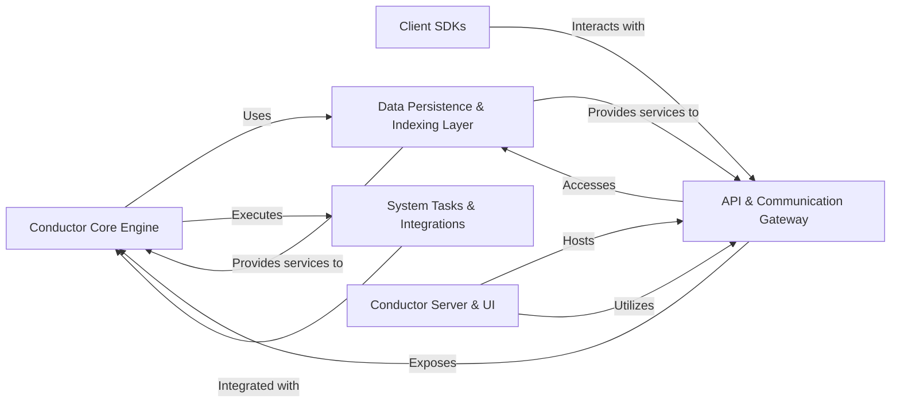

## Component Details

The `conductor` project's architecture is designed around a modular, distributed system for orchestrating workflows. Based on the Control Flow Graph (CFG) and source code analysis, the system can be effectively broken down into six fundamental components, each with distinct responsibilities and clear interactions. These components are chosen for their critical roles in the system's operation, data flow, and external interactions.

### Conductor Core Engine
This is the central nervous system of Conductor. It encapsulates the primary logic for workflow execution, task scheduling, event processing, and managing distributed concurrency and locking. It defines the fundamental data models (workflows, tasks, definitions) and orchestrates the flow of tasks, making it the brain of the entire system.

**Related Classes/Methods**:

- `core` (1:1)
- `common` (1:1)
- `redis-concurrency-limit` (1:1)
- `redis-lock` (1:1)

### API & Communication Gateway
This component provides the external interfaces for interacting with the Conductor server. It supports both RESTful HTTP APIs and high-performance gRPC services, enabling various clients and the UI to manage workflows, tasks, and metadata. It also defines the data contracts (Protocol Buffers) used by gRPC.

**Related Classes/Methods**:

- `rest` (1:1)
- `grpc` (1:1)
- `grpc-server` (1:1)
- `grpc-client` (1:1)

### Client SDKs
These are libraries designed to simplify programmatic interaction with the Conductor server for developers. They abstract away the complexities of direct API calls (both HTTP and gRPC), providing higher-level constructs for defining workflows, creating tasks, and implementing workers in various programming environments (e.g., Java, with Spring-specific integrations).

**Related Classes/Methods**:

- `client` (1:1)
- `client-spring` (1:1)
- `java-sdk` (1:1)

### Data Persistence & Indexing Layer
This crucial component handles all data storage, retrieval, and indexing for Conductor. It provides pluggable implementations for different databases (Redis, Cassandra) for workflow and task states, Elasticsearch for search and analytics, and AWS S3 for storing large workflow input/output payloads.

**Related Classes/Methods**:

- `redis-persistence` (1:1)
- `cassandra-persistence` (1:1)
- `es6-persistence` (1:1)
- `awss3-storage` (1:1)

### System Tasks & Integrations
This component provides a set of pre-built, extensible system tasks and integrations that can be incorporated directly into workflows. Examples include executing HTTP requests to external services, transforming JSON data using JQ expressions, and integrating with external message queues like AWS SQS for event-driven architectures.

**Related Classes/Methods**:

- `http-task` (1:1)
- `json-jq-task` (1:1)
- `awssqs-event-queue` (1:1)

### Conductor Server & UI
The `server` module is the main executable application that packages and runs the entire Conductor service, including its core functionalities and exposed APIs. The `ui` module provides a web-based graphical user interface for visualizing, monitoring, debugging, and managing workflows and tasks, offering essential operational visibility into the Conductor system.

**Related Classes/Methods**:

- `server` (1:1)
- `ui` (1:1)

### [FAQ](https://github.com/CodeBoarding/GeneratedOnBoardings/tree/main?tab=readme-ov-file#faq)