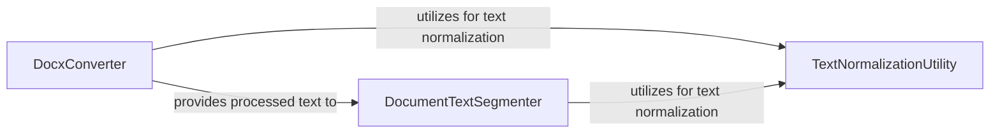

## Details

The core document processing pipeline in `contextgem` begins with the `DocxConverter`, which is responsible for ingesting and extracting content from `.docx` files. The extracted raw text is then passed to the `DocumentTextSegmenter`, which breaks down the content into manageable segments suitable for LLM processing. Both the `DocxConverter` and `DocumentTextSegmenter` rely on the `TextNormalizationUtility` to ensure data quality and consistency by cleaning and normalizing text before further processing. This sequential flow ensures that unstructured document data is transformed into a clean, segmented, and LLM-ready format.

### DocxConverter
This component serves as the primary entry point for ingesting and parsing `.docx` files. It orchestrates the extraction of raw textual content, identifies and processes various document elements (e.g., paragraphs, tables, headings), and performs initial formatting to prepare the text for subsequent stages. Its fundamental importance lies in its role as the first step in making unstructured document data accessible to the system.

**Related Classes/Methods**:

- <a href="https://github.com/shcherbak-ai/contextgem/blob/main/contextgem/public/converters/docx.py#L42-L320" target="_blank" rel="noopener noreferrer">`contextgem.public.converters.docx.DocxConverter`:42-320</a>

### DocumentTextSegmenter
Following content extraction, this component structures the raw text into logical and manageable units, such as paragraphs, sentences, or other defined segments. This segmentation is crucial for breaking down large documents into chunks that can be effectively processed by LLMs, enabling more granular analysis and precise prompt engineering. It is architecturally important for preparing text for context window management and focused information extraction.

**Related Classes/Methods**:

- <a href="https://github.com/shcherbak-ai/contextgem/blob/main/contextgem/internal/base/documents.py#L198-L253" target="_blank" rel="noopener noreferrer">`contextgem.internal.base.documents._segment_document_text`:198-253</a>

### TextNormalizationUtility
This utility component provides essential text cleaning and normalization functions. Its core responsibility is to ensure that all extracted and segmented text is free from control characters, extraneous whitespace, and other artifacts that could negatively impact LLM performance or lead to malformed prompts. Its architectural significance lies in guaranteeing data quality and consistency, which is paramount for reliable LLM interactions.

**Related Classes/Methods**:

- <a href="https://github.com/shcherbak-ai/contextgem/blob/main/contextgem/internal/utils.py#L232-L278" target="_blank" rel="noopener noreferrer">`contextgem.internal.utils._clean_text_for_llm_prompt`:232-278</a>

### [FAQ](https://github.com/CodeBoarding/GeneratedOnBoardings/tree/main?tab=readme-ov-file#faq)