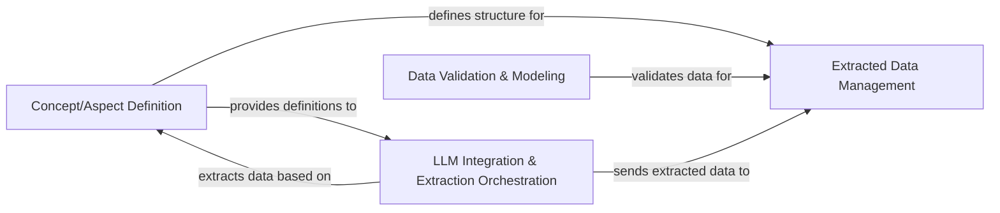

## Details

The `contextgem` information extraction subsystem is designed around a clear separation of concerns, facilitating robust and efficient data processing. At its core, the **Concept/Aspect Definition** component establishes the foundational schemas for all extractable information. These definitions are then utilized by the **LLM Integration & Extraction Orchestration** component, which manages interactions with Large Language Models to perform the actual data extraction and orchestrate the entire pipeline flow. The extracted data undergoes rigorous checks by the **Data Validation & Modeling** component to ensure integrity and adherence to predefined structures. Finally, the validated and structured information is centrally managed by the **Extracted Data Management** component, providing a unified interface for storage and retrieval. This architecture ensures a streamlined process from schema definition to validated data storage.

### Extracted Data Management [[Expand]](./Extracted_Data_Management.md)
Serves as the central repository and management interface for validated Aspects and Concepts. It provides a unified API for adding, retrieving, and removing these data types, abstracting the underlying storage mechanisms. This component is crucial for maintaining a consistent and accessible schema for information extraction.

**Related Classes/Methods**:

- <a href="https://github.com/shcherbak-ai/contextgem/blob/main/contextgem/internal/base/attrs.py" target="_blank" rel="noopener noreferrer">`contextgem.internal.base.attrs:add_aspects`</a>
- <a href="https://github.com/shcherbak-ai/contextgem/blob/main/contextgem/internal/base/attrs.py" target="_blank" rel="noopener noreferrer">`contextgem.internal.base.attrs:add_concepts`</a>
- <a href="https://github.com/shcherbak-ai/contextgem/blob/main/contextgem/internal/base/attrs.py" target="_blank" rel="noopener noreferrer">`contextgem.internal.base.attrs:get_aspect_by_name`</a>
- <a href="https://github.com/shcherbak-ai/contextgem/blob/main/contextgem/internal/base/attrs.py" target="_blank" rel="noopener noreferrer">`contextgem.internal.base.attrs:get_concept_by_name`</a>
- <a href="https://github.com/shcherbak-ai/contextgem/blob/main/contextgem/internal/base/attrs.py" target="_blank" rel="noopener noreferrer">`contextgem.internal.base.attrs:remove_aspect_by_name`</a>
- <a href="https://github.com/shcherbak-ai/contextgem/blob/main/contextgem/internal/base/attrs.py" target="_blank" rel="noopener noreferrer">`contextgem.internal.base.attrs:remove_concept_by_name`</a>
- <a href="https://github.com/shcherbak-ai/contextgem/blob/main/contextgem/internal/base/attrs.py" target="_blank" rel="noopener noreferrer">`contextgem.internal.base.attrs:remove_all_aspects`</a>
- <a href="https://github.com/shcherbak-ai/contextgem/blob/main/contextgem/internal/base/attrs.py" target="_blank" rel="noopener noreferrer">`contextgem.internal.base.attrs:remove_all_concepts`</a>
- <a href="https://github.com/shcherbak-ai/contextgem/blob/main/contextgem/internal/base/attrs.py" target="_blank" rel="noopener noreferrer">`contextgem.internal.base.attrs:_add_instances`</a>
- <a href="https://github.com/shcherbak-ai/contextgem/blob/main/contextgem/internal/base/attrs.py" target="_blank" rel="noopener noreferrer">`contextgem.internal.base.attrs:_get_instance_by_name`</a>
- <a href="https://github.com/shcherbak-ai/contextgem/blob/main/contextgem/internal/base/attrs.py" target="_blank" rel="noopener noreferrer">`contextgem.internal.base.attrs:_remove_instance_by_name`</a>
- <a href="https://github.com/shcherbak-ai/contextgem/blob/main/contextgem/internal/base/attrs.py" target="_blank" rel="noopener noreferrer">`contextgem.internal.base.attrs:_remove_all_instances`</a>

### Concept/Aspect Definition
Responsible for defining the structure and properties of Concepts and Aspects. This component establishes the schema that guides the information extraction process, ensuring that the data extracted by LLMs adheres to a predefined model.

**Related Classes/Methods**:

- <a href="https://github.com/shcherbak-ai/contextgem/blob/main/contextgem/internal/base/aspects.py#L60-L227" target="_blank" rel="noopener noreferrer">`contextgem.internal.base.aspects._Aspect`:60-227</a>
- <a href="https://github.com/shcherbak-ai/contextgem/blob/main/contextgem/internal/base/concepts.py#L86-L180" target="_blank" rel="noopener noreferrer">`contextgem.internal.base.concepts._Concept`:86-180</a>
- <a href="https://github.com/shcherbak-ai/contextgem/blob/main/contextgem/internal/base/concepts.py#L183-L225" target="_blank" rel="noopener noreferrer">`contextgem.internal.base.concepts._StringConcept`:183-225</a>
- <a href="https://github.com/shcherbak-ai/contextgem/blob/main/contextgem/internal/base/concepts.py#L228-L265" target="_blank" rel="noopener noreferrer">`contextgem.internal.base.concepts._BooleanConcept`:228-265</a>
- <a href="https://github.com/shcherbak-ai/contextgem/blob/main/contextgem/internal/base/concepts.py#L268-L324" target="_blank" rel="noopener noreferrer">`contextgem.internal.base.concepts._NumericalConcept`:268-324</a>

### Data Validation & Modeling
Ensures the integrity and structure of extracted data by validating it against predefined schemas and modeling it into structured formats (Aspects, Concepts). This component is vital for maintaining data quality and consistency within the extraction pipeline.

**Related Classes/Methods**:

- <a href="https://github.com/shcherbak-ai/contextgem/blob/main/contextgem/internal/typings/validators.py#L28-L45" target="_blank" rel="noopener noreferrer">`contextgem.internal.typings.validators._validate_sequence_is_list`:28-45</a>
- <a href="https://github.com/shcherbak-ai/contextgem/blob/main/contextgem/internal/base/aspects.py" target="_blank" rel="noopener noreferrer">`contextgem.internal.base.aspects._Aspect:field_validator`</a>
- <a href="https://github.com/shcherbak-ai/contextgem/blob/main/contextgem/internal/base/aspects.py" target="_blank" rel="noopener noreferrer">`contextgem.internal.base.aspects._Aspect:model_validator`</a>
- <a href="https://github.com/shcherbak-ai/contextgem/blob/main/contextgem/internal/base/concepts.py" target="_blank" rel="noopener noreferrer">`contextgem.internal.base.concepts._Concept:field_validator`</a>
- <a href="https://github.com/shcherbak-ai/contextgem/blob/main/contextgem/internal/base/concepts.py" target="_blank" rel="noopener noreferrer">`contextgem.internal.base.concepts._Concept:model_validator`</a>
- <a href="https://github.com/shcherbak-ai/contextgem/blob/main/contextgem/internal/base/data_models.py#L34-L53" target="_blank" rel="noopener noreferrer">`contextgem.internal.base.data_models._LLMPricing`:34-53</a>
- <a href="https://github.com/shcherbak-ai/contextgem/blob/main/contextgem/internal/base/data_models.py#L57-L102" target="_blank" rel="noopener noreferrer">`contextgem.internal.base.data_models._RatingScale`:57-102</a>

### LLM Integration & Extraction Orchestration
Manages the interface and communication with Large Language Models, including prompt construction, sending requests, and parsing responses. This component also orchestrates the entire information extraction pipeline, coordinating the flow of data and control between different stages to ensure efficient and coherent extraction.

**Related Classes/Methods**:

- <a href="https://github.com/shcherbak-ai/contextgem/blob/main/contextgem/internal/base/llms.py" target="_blank" rel="noopener noreferrer">`contextgem.internal.base.llms._GenericLLMProcessor:extract_all_async`</a>
- <a href="https://github.com/shcherbak-ai/contextgem/blob/main/contextgem/internal/base/llms.py" target="_blank" rel="noopener noreferrer">`contextgem.internal.base.llms._GenericLLMProcessor:extract_aspects_from_document_async`</a>
- <a href="https://github.com/shcherbak-ai/contextgem/blob/main/contextgem/internal/base/llms.py" target="_blank" rel="noopener noreferrer">`contextgem.internal.base.llms._GenericLLMProcessor:extract_concepts_from_aspect_async`</a>
- <a href="https://github.com/shcherbak-ai/contextgem/blob/main/contextgem/internal/base/llms.py" target="_blank" rel="noopener noreferrer">`contextgem.internal.base.llms._GenericLLMProcessor:extract_concepts_from_document_async`</a>
- <a href="https://github.com/shcherbak-ai/contextgem/blob/main/contextgem/internal/base/pipelines.py#L38-L55" target="_blank" rel="noopener noreferrer">`contextgem.internal.base.pipelines._ExtractionPipeline`:38-55</a>

### [FAQ](https://github.com/CodeBoarding/GeneratedOnBoardings/tree/main?tab=readme-ov-file#faq)