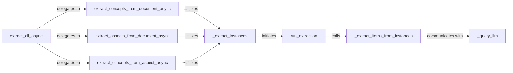

## Details

The LLM interaction subsystem in `contextgem` is designed for efficient and robust extraction of information (concepts and aspects) from various sources using Large Language Models. The `extract_all_async` component serves as the primary entry point, orchestrating specialized extraction flows for documents and existing aspects. These high-level extraction components (`extract_concepts_from_document_async`, `extract_aspects_from_document_async`, `extract_concepts_from_aspect_async`) delegate the core processing to `_extract_instances`, which manages concurrent extraction tasks and optimizes LLM calls. Each individual extraction is handled by `run_extraction`, which ensures proper execution, error handling, and retries. The crucial interaction with the LLM is encapsulated within `_extract_items_from_instances`, responsible for prompt construction and response parsing, which in turn communicates directly with the low-level `_query_llm` component for actual API interaction, including token validation and error management.

### extract_all_async
The primary entry point and top-level coordinator for initiating diverse extraction tasks (concepts, aspects) from documents or existing aspects. It acts as a facade for various specialized extraction flows.

**Related Classes/Methods**:

- <a href="https://github.com/shcherbak-ai/contextgem/blob/main/contextgem/internal/base/llms.py#L752-L850" target="_blank" rel="noopener noreferrer">`extract_concepts_from_document_async`:752-850</a>
- <a href="https://github.com/shcherbak-ai/contextgem/blob/main/contextgem/internal/base/llms.py#L357-L484" target="_blank" rel="noopener noreferrer">`extract_aspects_from_document_async`:357-484</a>
- <a href="https://github.com/shcherbak-ai/contextgem/blob/main/contextgem/internal/base/llms.py#L548-L690" target="_blank" rel="noopener noreferrer">`extract_concepts_from_aspect_async`:548-690</a>

### extract_concepts_from_document_async
Orchestrates the extraction of concepts specifically from an entire document. It prepares the necessary data for batch processing.

**Related Classes/Methods**:

- <a href="https://github.com/shcherbak-ai/contextgem/blob/main/contextgem/internal/base/llms.py#L1982-L2416" target="_blank" rel="noopener noreferrer">`_extract_instances`:1982-2416</a>

### extract_aspects_from_document_async
Orchestrates the extraction of aspects from an entire document, including handling nested sub-aspects. Similar to concept extraction, it sets up the batch.

**Related Classes/Methods**:

- <a href="https://github.com/shcherbak-ai/contextgem/blob/main/contextgem/internal/base/llms.py#L1982-L2416" target="_blank" rel="noopener noreferrer">`_extract_instances`:1982-2416</a>

### extract_concepts_from_aspect_async
Orchestrates the extraction of concepts from a specific existing aspect, including handling nested sub-aspects. This component focuses on refining existing extracted data.

**Related Classes/Methods**:

- <a href="https://github.com/shcherbak-ai/contextgem/blob/main/contextgem/internal/base/llms.py#L1982-L2416" target="_blank" rel="noopener noreferrer">`_extract_instances`:1982-2416</a>

### _extract_instances
A common utility responsible for processing and managing multiple extraction instances (concepts or aspects) concurrently. It optimizes LLM calls by grouping and parallelizing requests.

**Related Classes/Methods**:

- <a href="https://github.com/shcherbak-ai/contextgem/blob/main/contextgem/internal/base/llms.py#L2046-L2328" target="_blank" rel="noopener noreferrer">`run_extraction`:2046-2328</a>

### run_extraction
Manages the execution of a single extraction process. This includes updating usage metrics, handling potential errors, and implementing retry mechanisms for transient failures.

**Related Classes/Methods**:

- <a href="https://github.com/shcherbak-ai/contextgem/blob/main/contextgem/internal/base/llms.py#L1286-L1980" target="_blank" rel="noopener noreferrer">`_extract_items_from_instances`:1286-1980</a>
- <a href="https://github.com/shcherbak-ai/contextgem/blob/main/contextgem/internal/base/llms.py#L2077-L2152" target="_blank" rel="noopener noreferrer">`retry_processing_for_result`:2077-2152</a>

### _extract_items_from_instances
The core logic component directly responsible for interacting with the LLM to extract specific items (concepts or aspects) from given data instances. This component handles prompt construction, sending requests to the LLM, and parsing of LLM responses.

**Related Classes/Methods**:

- <a href="https://github.com/shcherbak-ai/contextgem/blob/main/contextgem/internal/base/llms.py#L3581-L3846" target="_blank" rel="noopener noreferrer">`_query_llm`:3581-3846</a>

### _query_llm
The direct, low-level interface for communicating with the LLM. It abstracts the specific LLM provider, handles input/output token validation, and manages the raw interaction with the language model API.

**Related Classes/Methods**:

- <a href="https://github.com/shcherbak-ai/contextgem/blob/main/contextgem/internal/base/llms.py#L3581-L3846" target="_blank" rel="noopener noreferrer">`contextgem.internal.base.llms._query_llm`:3581-3846</a>

### [FAQ](https://github.com/CodeBoarding/GeneratedOnBoardings/tree/main?tab=readme-ov-file#faq)