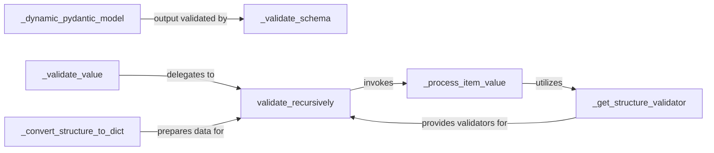

## Details

The `Schema Definition & Validation` subsystem is crucial for ensuring the integrity and structure of information extracted by the LLM framework. It leverages Pydantic for robust data modeling and validation. Subsystem Boundaries: The subsystem encompasses the dynamic generation of data schemas, their internal validation, and the recursive validation of extracted data against these schemas.

### _dynamic_pydantic_model
Dynamically generates Pydantic models from Python type hints, forming the core of schema definition for extracted data.

**Related Classes/Methods**:

- <a href="https://github.com/shcherbak-ai/contextgem/blob/main/contextgem/internal/typings/user_type_hints_validation.py#L83-L176" target="_blank" rel="noopener noreferrer">`_dynamic_pydantic_model`:83-176</a>

### _validate_schema
Ensures the validity and JSON serializability of dynamically generated schemas, acting as a quality gate for defined data structures.

**Related Classes/Methods**:

- <a href="https://github.com/shcherbak-ai/contextgem/blob/main/contextgem/internal/typings/types_to_strings.py#L338-L389" target="_blank" rel="noopener noreferrer">`_validate_schema`:338-389</a>

### _validate_value
Serves as the primary entry point for initiating the validation of an extracted item, orchestrating the overall validation process.

**Related Classes/Methods**:

- <a href="https://github.com/shcherbak-ai/contextgem/blob/main/contextgem/internal/items.py#L234-L252" target="_blank" rel="noopener noreferrer">`_validate_value`:234-252</a>

### validate_recursively
Implements the core recursive logic for validating complex and nested data structures against their defined Pydantic schemas.

**Related Classes/Methods**:

- <a href="https://github.com/shcherbak-ai/contextgem/blob/main/contextgem/internal/items.py#L127-L147" target="_blank" rel="noopener noreferrer">`validate_recursively`:127-147</a>

### _get_structure_validator
Acts as a central registry or factory, responsible for retrieving or constructing the appropriate Pydantic model or validation function for a given data structure.

**Related Classes/Methods**:

- <a href="https://github.com/shcherbak-ai/contextgem/blob/main/contextgem/internal/base/concepts.py#L547-L555" target="_blank" rel="noopener noreferrer">`_get_structure_validator`:547-555</a>

### _process_item_value
Validates the value of a single extracted item against its expected type and structure, often utilizing the structure validator.

**Related Classes/Methods**:

- <a href="https://github.com/shcherbak-ai/contextgem/blob/main/contextgem/internal/base/concepts.py#L1089-L1113" target="_blank" rel="noopener noreferrer">`_process_item_value`:1089-1113</a>

### _convert_structure_to_dict
Prepares complex data structures for validation by converting them into a standardized dictionary format, facilitating Pydantic validation.

**Related Classes/Methods**:

- <a href="https://github.com/shcherbak-ai/contextgem/blob/main/contextgem/internal/base/concepts.py#L573-L627" target="_blank" rel="noopener noreferrer">`_convert_structure_to_dict`:573-627</a>

### [FAQ](https://github.com/CodeBoarding/GeneratedOnBoardings/tree/main?tab=readme-ov-file#faq)