```mermaid
graph LR
    Document_Ingestion_Preprocessing["Document Ingestion & Preprocessing"]
    Schema_Definition_Validation["Schema Definition & Validation"]
    LLM_Interaction_Prompt_Engineering["LLM Interaction & Prompt Engineering"]
    Extraction_Orchestration["Extraction Orchestration"]
    Extracted_Data_Management["Extracted Data Management"]
    Output_Serialization["Output & Serialization"]
    Document_Ingestion_Preprocessing -- "Provides cleaned and segmented document text for prompt context." --> LLM_Interaction_Prompt_Engineering
    Schema_Definition_Validation -- "Supplies structured schemas and validation rules for prompt generation." --> LLM_Interaction_Prompt_Engineering
    LLM_Interaction_Prompt_Engineering -- "Sends raw LLM responses for further processing and validation." --> Extraction_Orchestration
    Extraction_Orchestration -- "Sends extracted items for validation against defined schemas." --> Schema_Definition_Validation
    Schema_Definition_Validation -- "Stores validated `Aspects` and `Concepts`." --> Extracted_Data_Management
    Extracted_Data_Management -- "Provides the stored `Aspects` and `Concepts` for conversion into external formats." --> Output_Serialization
    click Document_Ingestion_Preprocessing href "https://github.com/CodeBoarding/GeneratedOnBoardings/blob/main/contextgem/Document_Ingestion_Preprocessing.md" "Details"
    click Schema_Definition_Validation href "https://github.com/CodeBoarding/GeneratedOnBoardings/blob/main/contextgem/Schema_Definition_Validation.md" "Details"
    click Extraction_Orchestration href "https://github.com/CodeBoarding/GeneratedOnBoardings/blob/main/contextgem/Extraction_Orchestration.md" "Details"
    click Extracted_Data_Management href "https://github.com/CodeBoarding/GeneratedOnBoardings/blob/main/contextgem/Extracted_Data_Management.md" "Details"
```

## Details

The `contextgem` architecture is designed as a modular, pipeline-driven framework for LLM-powered information extraction. It begins with the **Document Ingestion & Preprocessing** component, which transforms raw documents into LLM-ready text. This text, along with dynamically defined schemas from the **Schema Definition & Validation** component, feeds into the **LLM Interaction & Prompt Engineering** component to generate and execute LLM queries. The core **Extraction Orchestration** component then takes the raw LLM output, validates it against the schemas, and manages the flow of extracted data. Validated `Aspects` and `Concepts` are stored and managed by the **Extracted Data Management** component, providing a central source of truth. Finally, the **Output & Serialization** component prepares the structured data for external consumption. This clear separation of concerns and sequential data flow makes `contextgem` highly extensible and maintainable, ideal for complex information extraction tasks.

### Document Ingestion & Preprocessing [[Expand]](./Document_Ingestion_Preprocessing.md)
Handles reading, cleaning, and segmenting raw documents.

**Related Classes/Methods**:

- <a href="https://github.com/shcherbak-ai/contextgem/blob/main/contextgem/internal/converters/docx/base.py" target="_blank" rel="noopener noreferrer">`contextgem/internal/converters/docx/base.py:_process_docx_elements`</a>
- <a href="https://github.com/shcherbak-ai/contextgem/blob/main/contextgem/internal/base/documents.py" target="_blank" rel="noopener noreferrer">`contextgem/internal/base/documents.py:_segment_document_text`</a>
- <a href="https://github.com/shcherbak-ai/contextgem/blob/main/contextgem/internal/utils.py" target="_blank" rel="noopener noreferrer">`contextgem/internal/utils.py:_clean_text_for_llm_prompt`</a>

### Schema Definition & Validation [[Expand]](./Schema_Definition_Validation.md)
Defines and validates the structure of extracted information using Pydantic models.

**Related Classes/Methods**:

- <a href="https://github.com/shcherbak-ai/contextgem/blob/main/contextgem/internal/typings/user_type_hints_validation.py" target="_blank" rel="noopener noreferrer">`contextgem/internal/typings/user_type_hints_validation.py:_dynamic_pydantic_model`</a>
- <a href="https://github.com/shcherbak-ai/contextgem/blob/main/contextgem/internal/base/concepts.py" target="_blank" rel="noopener noreferrer">`contextgem/internal/base/concepts.py:_process_item_value`</a>
- <a href="https://github.com/shcherbak-ai/contextgem/blob/main/contextgem/internal/items.py" target="_blank" rel="noopener noreferrer">`contextgem/internal/items.py:validate_recursively`</a>

### LLM Interaction & Prompt Engineering
Manages communication with LLMs, including prompt construction and response handling.

**Related Classes/Methods**:

- <a href="https://github.com/shcherbak-ai/contextgem/blob/main/contextgem/internal/base/llms.py" target="_blank" rel="noopener noreferrer">`contextgem/internal/base/llms.py:_prepare_message_kwargs_list`</a>
- <a href="https://github.com/shcherbak-ai/contextgem/blob/main/contextgem/internal/base/llms.py" target="_blank" rel="noopener noreferrer">`contextgem/internal/base/llms.py:_query_llm`</a>
- <a href="https://github.com/shcherbak-ai/contextgem/blob/main/contextgem/internal/base/llms.py" target="_blank" rel="noopener noreferrer">`contextgem/internal/base/llms.py:retry_processing_for_result`</a>

### Extraction Orchestration [[Expand]](./Extraction_Orchestration.md)
Coordinates the entire extraction pipeline, from LLM interaction to data validation and storage.

**Related Classes/Methods**:

- <a href="https://github.com/shcherbak-ai/contextgem/blob/main/contextgem/internal/base/llms.py" target="_blank" rel="noopener noreferrer">`contextgem/internal/base/llms.py:extract_all_async`</a>
- <a href="https://github.com/shcherbak-ai/contextgem/blob/main/contextgem/internal/base/llms.py" target="_blank" rel="noopener noreferrer">`contextgem/internal/base/llms.py:_extract_items_from_instances`</a>

### Extracted Data Management [[Expand]](./Extracted_Data_Management.md)
Serves as the internal repository for validated `Aspects` and `Concepts`.

**Related Classes/Methods**:

- <a href="https://github.com/shcherbak-ai/contextgem/blob/main/contextgem/internal/base/attrs.py" target="_blank" rel="noopener noreferrer">`contextgem/internal/base/attrs.py:add_aspects`</a>
- <a href="https://github.com/shcherbak-ai/contextgem/blob/main/contextgem/internal/base/attrs.py" target="_blank" rel="noopener noreferrer">`contextgem/internal/base/attrs.py:add_concepts`</a>

### Output & Serialization
Converts structured extracted data into various external formats.

**Related Classes/Methods**:

- <a href="https://github.com/shcherbak-ai/contextgem/blob/main/contextgem/internal/base/serialization.py" target="_blank" rel="noopener noreferrer">`contextgem/internal/base/serialization.py:to_json`</a>
- <a href="https://github.com/shcherbak-ai/contextgem/blob/main/contextgem/internal/base/serialization.py" target="_blank" rel="noopener noreferrer">`contextgem/internal/base/serialization.py:from_json`</a>

### [FAQ](https://github.com/CodeBoarding/GeneratedOnBoardings/tree/main?tab=readme-ov-file#faq)