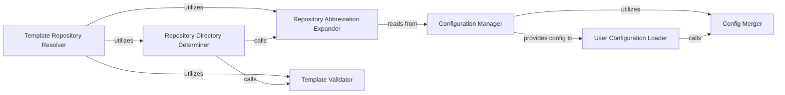

## Details

The `cookiecutter` project's core functionality revolves around its Configuration and Template Repository subsystems. The Configuration Manager, primarily through `cookiecutter.config`, is responsible for centralizing and managing all application settings, leveraging the Config Merger to combine default and user-defined configurations. Concurrently, the Template Repository Resolver, driven by `cookiecutter.repository`, handles the complex task of locating and preparing template repositories. This involves expanding abbreviations for convenience and determining the correct repository directory, with a crucial step of validating the template's integrity via the Template Validator. These two subsystems work in concert, with the Configuration Manager providing essential settings to the Template Repository Resolver, enabling it to correctly identify, retrieve, and validate templates for project generation.

### Configuration Manager
This component, primarily encapsulated by the `cookiecutter.config` module, is responsible for loading, merging, and providing access to all configuration settings, including default and user-specific overrides. It ensures that the application operates with a consistent and validated set of parameters.

**Related Classes/Methods**:

- <a href="https://github.com/cookiecutter/cookiecutter/blob/main/cookiecutter/config.py" target="_blank" rel="noopener noreferrer">`cookiecutter.config`</a>

### Template Repository Resolver
Represented by the `cookiecutter.repository` module, this component handles the complex task of identifying, locating, and preparing the template repository. It supports various input types, including local paths, remote URLs, and zip files, ensuring the template is accessible for rendering.

**Related Classes/Methods**:

- <a href="https://github.com/cookiecutter/cookiecutter/blob/main/cookiecutter/repository.py" target="_blank" rel="noopener noreferrer">`cookiecutter.repository`</a>

### User Configuration Loader
This function serves as the primary entry point for retrieving the complete, merged user configuration. It orchestrates the loading of default settings and then applies user-specific overrides, ensuring a comprehensive configuration object is available.

**Related Classes/Methods**:

- <a href="https://github.com/cookiecutter/cookiecutter/blob/main/cookiecutter/config.py" target="_blank" rel="noopener noreferrer">`cookiecutter.config:get_user_config`</a>

### Repository Directory Determiner
This core function encapsulates the logic for resolving the actual local path of a template repository. It intelligently handles different repository types (local, remote, zip) and ensures the repository is cloned or extracted and ready for use by the templating engine.

**Related Classes/Methods**:

- <a href="https://github.com/cookiecutter/cookiecutter/blob/main/cookiecutter/repository.py" target="_blank" rel="noopener noreferrer">`cookiecutter.repository:determine_repo_dir`</a>

### Config Merger
A utility function that recursively combines multiple configuration dictionaries. It ensures correct precedence, allowing user settings to override defaults, and performs deep merging of nested dictionary structures.

**Related Classes/Methods**:

- <a href="https://github.com/cookiecutter/cookiecutter/blob/main/cookiecutter/config.py" target="_blank" rel="noopener noreferrer">`cookiecutter.config:merge_configs`</a>

### Repository Abbreviation Expander
This utility processes shorthand notations for repositories, expanding them into full URLs or paths based on configured abbreviations found in the user's `cookiecutter` configuration. This simplifies user input for frequently used templates.

**Related Classes/Methods**:

- <a href="https://github.com/cookiecutter/cookiecutter/blob/main/cookiecutter/repository.py" target="_blank" rel="noopener noreferrer">`cookiecutter.repository:expand_abbreviations`</a>

### Template Validator
This utility function validates the presence of the essential `cookiecutter.json` file within the resolved repository. This file is crucial for identifying a valid Cookiecutter template and extracting its default context.

**Related Classes/Methods**:

- <a href="https://github.com/cookiecutter/cookiecutter/blob/main/cookiecutter/repository.py" target="_blank" rel="noopener noreferrer">`cookiecutter.repository:repository_has_cookiecutter_json`</a>

### [FAQ](https://github.com/CodeBoarding/GeneratedOnBoardings/tree/main?tab=readme-ov-file#faq)