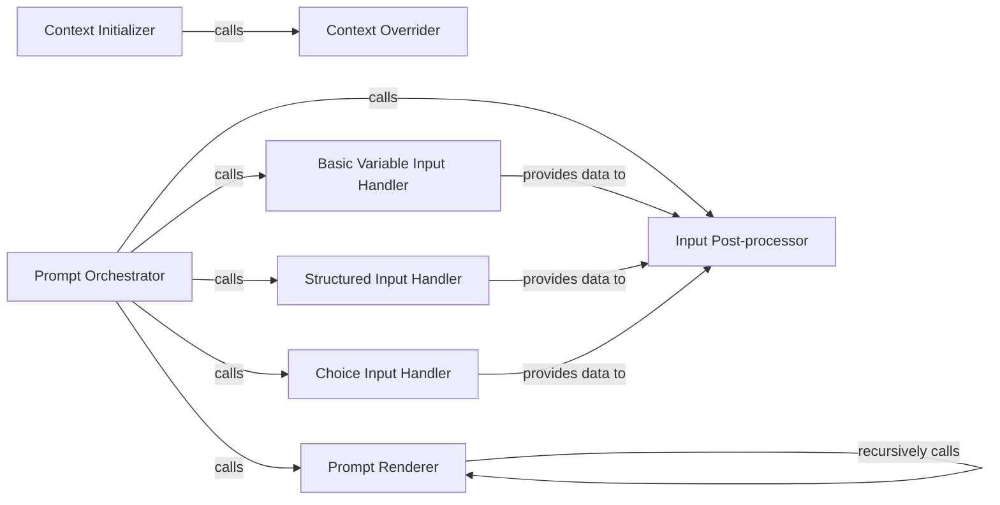

## Details

The `Context & Prompting Engine` subsystem is central to `cookiecutter`'s interactive project generation, managing the creation and population of the Jinja2 rendering context. It handles both the initial setup of default values and the dynamic collection of user inputs, embodying the "Configuration-driven" and "CLI Interface" architectural patterns.

### Context Initializer
Initializes the Jinja2 rendering context with default values extracted from the template's `cookiecutter.json`. This forms the foundational data structure for project generation.

**Related Classes/Methods**:

- <a href="https://github.com/cookiecutter/cookiecutter/blob/main/cookiecutter/generate.py#L126-L172" target="_blank" rel="noopener noreferrer">`cookiecutter.generate.generate_context`:126-172</a>

### Context Overrider
Integrates user-defined or configuration-specified overrides into the generated context, ensuring user preferences take precedence over template defaults.

**Related Classes/Methods**:

- <a href="https://github.com/cookiecutter/cookiecutter/blob/main/cookiecutter/generate.py#L59-L123" target="_blank" rel="noopener noreferrer">`cookiecutter.generate.apply_overwrites_to_context`:59-123</a>

### Prompt Orchestrator
Manages the interactive user prompting process. It iterates through context variables, determines the appropriate input type, and delegates to specialized input handlers. This is the primary user interaction point for variable input.

**Related Classes/Methods**:

- <a href="https://github.com/cookiecutter/cookiecutter/blob/main/cookiecutter/prompt.py#L281-L360" target="_blank" rel="noopener noreferrer">`cookiecutter.prompt.prompt_for_config`:281-360</a>

### Prompt Renderer
Responsible for formatting and displaying individual variable prompts to the user, including default values or available choices. Its recursive nature allows it to handle complex, nested variable structures.

**Related Classes/Methods**:

- <a href="https://github.com/cookiecutter/cookiecutter/blob/main/cookiecutter/prompt.py#L199-L236" target="_blank" rel="noopener noreferrer">`cookiecutter.prompt.render_variable`:199-236</a>

### Basic Variable Input Handler
Handles the basic input of a single string variable from the user.

**Related Classes/Methods**:

- <a href="https://github.com/cookiecutter/cookiecutter/blob/main/cookiecutter/prompt.py#L25-L42" target="_blank" rel="noopener noreferrer">`cookiecutter.prompt.read_user_variable`:25-42</a>

### Structured Input Handler
Manages the input and parsing of dictionary-structured data from the user, supporting more complex configuration inputs.

**Related Classes/Methods**:

- <a href="https://github.com/cookiecutter/cookiecutter/blob/main/cookiecutter/prompt.py#L174-L193" target="_blank" rel="noopener noreferrer">`cookiecutter.prompt.read_user_dict`:174-193</a>

### Choice Input Handler
Presents a list of predefined options to the user and captures their selection, ensuring valid input from a constrained set.

**Related Classes/Methods**:

- <a href="https://github.com/cookiecutter/cookiecutter/blob/main/cookiecutter/prompt.py#L91-L135" target="_blank" rel="noopener noreferrer">`cookiecutter.prompt.read_user_choice`:91-135</a>

### Input Post-processor
Performs post-processing on raw user input, including parsing JSON strings, to ensure data integrity and correct type conversion before updating the context.

**Related Classes/Methods**:

- <a href="https://github.com/cookiecutter/cookiecutter/blob/main/cookiecutter/prompt.py#L168-L171" target="_blank" rel="noopener noreferrer">`cookiecutter.prompt.process_response`:168-171</a>

### [FAQ](https://github.com/CodeBoarding/GeneratedOnBoardings/tree/main?tab=readme-ov-file#faq)