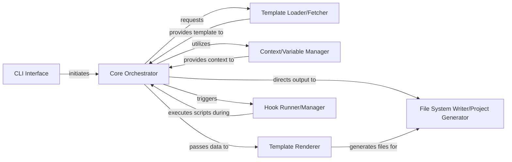

## Details

The `cookiecutter` project generation system is orchestrated by the `Core Orchestrator`, primarily the `cookiecutter.main.cookiecutter` function, which coordinates the entire process. The `CLI Interface` (`cookiecutter.cli.main`) serves as the user's entry point, parsing arguments and initiating the generation. The `Template Loader/Fetcher` (`cookiecutter.repository`) is responsible for acquiring the project template. Once the template is loaded, the `Context/Variable Manager` (`cookiecutter.prompt`) handles user input and context variable processing. The `Template Renderer` (`cookiecutter.generate`) then uses this context to render the template. Finally, the `Hook Runner/Manager` (`cookiecutter.hooks`) executes any pre or post-generation scripts, and the `File System Writer/Project Generator` (also within `cookiecutter.generate`) writes the final project structure to disk.

### Core Orchestrator [[Expand]](./Core_Orchestrator.md)
The central control unit that manages the entire project generation pipeline. It coordinates the sequential flow between template fetching, context variable processing, template rendering, and project output, including the execution of pre- and post-generation hooks. This component acts as the primary orchestrator, ensuring all stages of the code generation process are executed in the correct order.

**Related Classes/Methods**:

- <a href="https://github.com/cookiecutter/cookiecutter/blob/main/cookiecutter/main.py#L29-L200" target="_blank" rel="noopener noreferrer">`cookiecutter.main.cookiecutter`:29-200</a>
- <a href="https://github.com/cookiecutter/cookiecutter/blob/main/cookiecutter/main.py#L203-L212" target="_blank" rel="noopener noreferrer">`cookiecutter.main._patch_import_path_for_repo`:203-212</a>

### CLI Interface
Initiates the project generation process by calling the Core Orchestrator, serving as the user's entry point to the system. It parses command-line arguments and options, then passes them to the Core Orchestrator.

**Related Classes/Methods**:

- <a href="https://github.com/cookiecutter/cookiecutter/blob/main/cookiecutter/cli.py#L87-L254" target="_blank" rel="noopener noreferrer">`cookiecutter.cli.main`:87-254</a>

### Template Loader/Fetcher
Responsible for retrieving the specified project template from various sources (e.g., local path, Git repository). It handles cloning and managing template repositories.

**Related Classes/Methods**:

- <a href="https://github.com/cookiecutter/cookiecutter/blob/main/cookiecutter/repository.py" target="_blank" rel="noopener noreferrer">`cookiecutter.repository`</a>

### Context/Variable Manager
Manages and processes context variables required for template rendering, including prompting the user for input and applying default values. It interacts with the user to gather necessary data for template population.

**Related Classes/Methods**:

- <a href="https://github.com/cookiecutter/cookiecutter/blob/main/cookiecutter/prompt.py" target="_blank" rel="noopener noreferrer">`cookiecutter.prompt`</a>

### Template Renderer
Performs the actual rendering of the template using provided context data, typically leveraging a templating engine like Jinja2. It takes the raw template and the processed context to produce the final project files.

**Related Classes/Methods**:

- <a href="https://github.com/cookiecutter/cookiecutter/blob/main/cookiecutter/generate.py" target="_blank" rel="noopener noreferrer">`cookiecutter.generate`</a>

### Hook Runner/Manager
Executes pre- and post-generation hooks defined within the template, allowing for custom logic to be run at specific points in the pipeline. It ensures that any specified scripts are run at the appropriate stage of project generation.

**Related Classes/Methods**:

- <a href="https://github.com/cookiecutter/cookiecutter/blob/main/cookiecutter/hooks.py" target="_blank" rel="noopener noreferrer">`cookiecutter.hooks`</a>

### File System Writer/Project Generator
Handles the writing of generated files and directories to the file system, creating the final project structure. This component is responsible for persisting the rendered template output.

**Related Classes/Methods**:

- <a href="https://github.com/cookiecutter/cookiecutter/blob/main/cookiecutter/generate.py" target="_blank" rel="noopener noreferrer">`cookiecutter.generate`</a>

### [FAQ](https://github.com/CodeBoarding/GeneratedOnBoardings/tree/main?tab=readme-ov-file#faq)