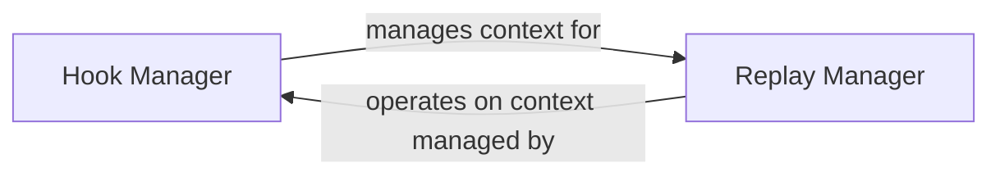

## Details

This subsystem is crucial for the `cookiecutter` project's extensibility and reproducibility. It encapsulates the logic for executing custom scripts (hooks) at various stages of project generation and for persisting/retrieving the user-provided configuration (replay data).

### Hook Manager
Manages the discovery, validation, and execution of Python scripts defined as `pre_gen_project`, `post_gen_project`, and `pre_prompt` hooks. It serves as a core extensibility point, allowing template authors to inject custom logic into the project generation pipeline. This aligns with the project's "Hook-based / Event-Driven" architectural pattern.

**Related Classes/Methods**:

- <a href="https://github.com/cookiecutter/cookiecutter/blob/main/cookiecutter/hooks.py#L51-L77" target="_blank" rel="noopener noreferrer">`cookiecutter.hooks.find_hook`:51-77</a>
- <a href="https://github.com/cookiecutter/cookiecutter/blob/main/cookiecutter/hooks.py#L35-L48" target="_blank" rel="noopener noreferrer">`cookiecutter.hooks.valid_hook`:35-48</a>
- <a href="https://github.com/cookiecutter/cookiecutter/blob/main/cookiecutter/hooks.py#L108-L127" target="_blank" rel="noopener noreferrer">`cookiecutter.hooks.run_script_with_context`:108-127</a>
- <a href="https://github.com/cookiecutter/cookiecutter/blob/main/cookiecutter/hooks.py#L80-L105" target="_blank" rel="noopener noreferrer">`cookiecutter.hooks.run_script`:80-105</a>
- <a href="https://github.com/cookiecutter/cookiecutter/blob/main/cookiecutter/hooks.py#L130-L144" target="_blank" rel="noopener noreferrer">`cookiecutter.hooks.run_hook`:130-144</a>
- <a href="https://github.com/cookiecutter/cookiecutter/blob/main/cookiecutter/hooks.py#L147-L177" target="_blank" rel="noopener noreferrer">`cookiecutter.hooks.run_hook_from_repo_dir`:147-177</a>
- <a href="https://github.com/cookiecutter/cookiecutter/blob/main/cookiecutter/hooks.py#L180-L201" target="_blank" rel="noopener noreferrer">`cookiecutter.hooks.run_pre_prompt_hook`:180-201</a>

### Replay Manager [[Expand]](./Replay_Manager.md)
Handles the serialization (dumping) and deserialization (loading) of project generation parameters (the "context" or "answers") to and from a file. This enables the "replay" functionality, allowing users to regenerate projects with the exact same configuration without re-entering information, thereby enhancing reproducibility and automation. It supports the "Configuration-driven" and "Pipeline / Workflow" architectural patterns.

**Related Classes/Methods**:

- <a href="https://github.com/cookiecutter/cookiecutter/blob/main/cookiecutter/replay.py#L26-L37" target="_blank" rel="noopener noreferrer">`cookiecutter.replay.dump`:26-37</a>
- <a href="https://github.com/cookiecutter/cookiecutter/blob/main/cookiecutter/replay.py#L40-L51" target="_blank" rel="noopener noreferrer">`cookiecutter.replay.load`:40-51</a>
- <a href="https://github.com/cookiecutter/cookiecutter/blob/main/cookiecutter/replay.py#L19-L23" target="_blank" rel="noopener noreferrer">`cookiecutter.replay.get_file_name`:19-23</a>

### [FAQ](https://github.com/CodeBoarding/GeneratedOnBoardings/tree/main?tab=readme-ov-file#faq)