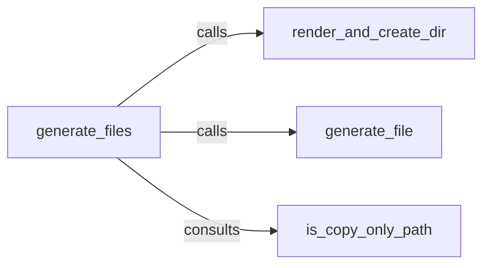

## Details

The Project Renderer subsystem is central to cookiecutter's functionality, responsible for transforming a template into a concrete project structure on the file system.

### generate_files
This component acts as the primary orchestrator of the file and directory generation pipeline. It iterates through the template's structure, delegating the rendering or copying of individual files and directories. It embodies the "Pipeline / Workflow" pattern, managing the overall flow of project generation.

**Related Classes/Methods**:

- <a href="https://github.com/cookiecutter/cookiecutter/blob/main/cookiecutter/generate.py#L327-L466" target="_blank" rel="noopener noreferrer">`cookiecutter.generate.generate_files`:327-466</a>

### generate_file
Responsible for rendering the content of a single template file using the prepared context and writing the output to the file system. This component represents the core "Template Engine" functionality, transforming template syntax into concrete file content.

**Related Classes/Methods**:

- <a href="https://github.com/cookiecutter/cookiecutter/blob/main/cookiecutter/generate.py#L175-L260" target="_blank" rel="noopener noreferrer">`cookiecutter.generate.generate_file`:175-260</a>

### render_and_create_dir
This component renders directory names (if they contain template variables) and creates the corresponding directories on the file system. It extends the templating capability beyond just file content to the dynamic generation of the project's directory structure.

**Related Classes/Methods**:

- <a href="https://github.com/cookiecutter/cookiecutter/blob/main/cookiecutter/generate.py#L263-L297" target="_blank" rel="noopener noreferrer">`cookiecutter.generate.render_and_create_dir`:263-297</a>

### is_copy_only_path
This component determines if a specific file or directory path should be copied directly without undergoing template rendering. It serves as a critical optimization and control mechanism, allowing for the inclusion of static assets or pre-rendered files within the templating process.

**Related Classes/Methods**:

- <a href="https://github.com/cookiecutter/cookiecutter/blob/main/cookiecutter/generate.py#L39-L56" target="_blank" rel="noopener noreferrer">`cookiecutter.generate.is_copy_only_path`:39-56</a>

### [FAQ](https://github.com/CodeBoarding/GeneratedOnBoardings/tree/main?tab=readme-ov-file#faq)