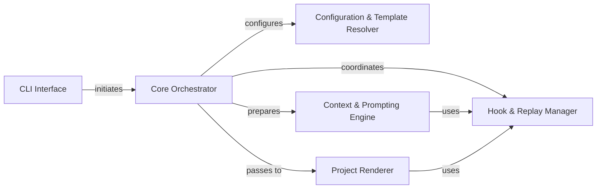

## Details

The `cookiecutter` architecture is designed as a sequential pipeline for project generation, centered around a `Core Orchestrator`. User interaction begins with the `CLI Interface`, which delegates control to the `Core Orchestrator`. This orchestrator then systematically interacts with the `Configuration & Template Resolver` to set up the environment and locate the template. The `Context & Prompting Engine` is then engaged to gather all necessary variables, leveraging the `Hook & Replay Manager` for pre-prompt hooks and state management. Once the context is complete, the `Project Renderer` takes over to transform the template into a concrete project, with the `Hook & Replay Manager` facilitating post-generation actions. This modular design ensures a clear flow of data and control, making it ideal for visual representation as a directed graph.

### CLI Interface
The entry point for user interaction, responsible for parsing commands and initiating the project generation process.

**Related Classes/Methods**:

- <a href="https://github.com/cookiecutter/cookiecutter/blob/main/cookiecutter/cli.py" target="_blank" rel="noopener noreferrer">`cookiecutter.cli`</a>

### Core Orchestrator [[Expand]](./Core_Orchestrator.md)
The central control unit that manages the entire project generation pipeline, coordinating interactions between all other components.

**Related Classes/Methods**:

- <a href="https://github.com/cookiecutter/cookiecutter/blob/main/cookiecutter/main.py" target="_blank" rel="noopener noreferrer">`cookiecutter.main`</a>

### Configuration & Template Resolver [[Expand]](./Configuration_Template_Resolver.md)
Handles loading and merging of configuration settings and resolves the location and type of the template repository.

**Related Classes/Methods**:

- <a href="https://github.com/cookiecutter/cookiecutter/blob/main/cookiecutter/config.py" target="_blank" rel="noopener noreferrer">`cookiecutter.config`</a>
- <a href="https://github.com/cookiecutter/cookiecutter/blob/main/cookiecutter/repository.py" target="_blank" rel="noopener noreferrer">`cookiecutter.repository`</a>

### Context & Prompting Engine [[Expand]](./Context_Prompting_Engine.md)
Manages the creation of the Jinja2 rendering context, including interactive user prompting for variable inputs and applying default values.

**Related Classes/Methods**:

- <a href="https://github.com/cookiecutter/cookiecutter/blob/main/cookiecutter/prompt.py" target="_blank" rel="noopener noreferrer">`cookiecutter.prompt`</a>
- <a href="https://github.com/cookiecutter/cookiecutter/blob/main/cookiecutter/generate.py" target="_blank" rel="noopener noreferrer">`cookiecutter.generate`</a>

### Hook & Replay Manager [[Expand]](./Hook_Replay_Manager.md)
Manages the execution of pre- and post-generation hooks and handles the saving and loading of project generation state for replay functionality.

**Related Classes/Methods**:

- <a href="https://github.com/cookiecutter/cookiecutter/blob/main/cookiecutter/hooks.py" target="_blank" rel="noopener noreferrer">`cookiecutter.hooks`</a>
- <a href="https://github.com/cookiecutter/cookiecutter/blob/main/cookiecutter/replay.py" target="_blank" rel="noopener noreferrer">`cookiecutter.replay`</a>

### Project Renderer [[Expand]](./Project_Renderer.md)
The core component responsible for iterating through the template, rendering files and directories using the generated context, and writing the output to the file system.

**Related Classes/Methods**:

- <a href="https://github.com/cookiecutter/cookiecutter/blob/main/cookiecutter/generate.py" target="_blank" rel="noopener noreferrer">`cookiecutter.generate`</a>

### [FAQ](https://github.com/CodeBoarding/GeneratedOnBoardings/tree/main?tab=readme-ov-file#faq)