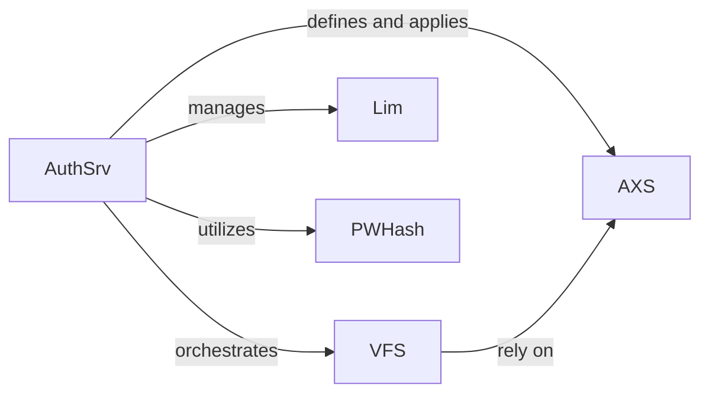

## Details

One paragraph explaining the functionality which is represented by this graph. What the main flow is and what is its purpose.

### AuthSrv
The central orchestrator of the subsystem, responsible for user authentication, session management (loading, checking, forgetting sessions), and overall access control. It parses and reloads server configurations, integrates password hashing, and manages volume mappings for the Virtual File System.

**Related Classes/Methods**:

- <a href="https://github.com/9001/copyparty/blob/hovudstraum/copyparty/authsrv.py#L950-L3385" target="_blank" rel="noopener noreferrer">`copyparty.authsrv.AuthSrv` (950:3385)</a>

### VFS
Provides an abstract layer over the underlying file system, enforcing access permissions and content visibility based on defined rules. It ensures that users only access resources they are authorized to view or modify.

**Related Classes/Methods**:

- <a href="https://github.com/9001/copyparty/blob/hovudstraum/copyparty/authsrv.py#L374-L941" target="_blank" rel="noopener noreferrer">`copyparty.authsrv.VFS` (374:941)</a>

### Lim
Enforces various resource limits (e.g., uploads, bandwidth, disk space) to prevent system abuse, ensure fair resource distribution, and maintain overall system stability and performance.

**Related Classes/Methods**:

- <a href="https://github.com/9001/copyparty/blob/hovudstraum/copyparty/authsrv.py#L136-L371" target="_blank" rel="noopener noreferrer">`copyparty.authsrv.Lim` (136:371)</a>

### PWHash
A dedicated utility component providing secure password hashing and verification functionalities. It ensures that user passwords are never stored in plain text, enhancing the security of user authentication.

**Related Classes/Methods**:

- <a href="https://github.com/9001/copyparty/blob/hovudstraum/copyparty/pwhash.py#L22-L160" target="_blank" rel="noopener noreferrer">`copyparty.pwhash.PWHash` (22:160)</a>

### AXS
Represents and encapsulates specific access permissions and rules. While primarily a data structure, it functions as a conceptual component that defines the policies applied by the Authentication Service and Virtual File System to govern resource access.

**Related Classes/Methods**:

- <a href="https://github.com/9001/copyparty/blob/hovudstraum/copyparty/authsrv.py#L108-L133" target="_blank" rel="noopener noreferrer">`copyparty.authsrv.AXS` (108:133)</a>

### [FAQ](https://github.com/CodeBoarding/GeneratedOnBoardings/tree/main?tab=readme-ov-file#faq)