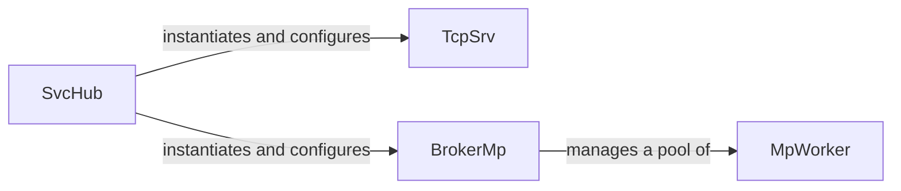

## Details

This subsystem encompasses the core components responsible for the application's lifecycle management, network communication, and multi-process orchestration. It forms the central control plane of the `copyparty` application.

### SvcHub
The central orchestrator and service hub. It is responsible for the application's lifecycle, initializing and configuring other core components like TcpSrv and BrokerMp, and coordinating overall service interactions. This aligns with the "Core Server Module" pattern, acting as the application's main entry point and manager.

**Related Classes/Methods**:

- <a href="https://github.com/9001/copyparty/blob/hovudstraum/copyparty/svchub.py#L96-L1525" target="_blank" rel="noopener noreferrer">`copyparty.svchub.SvcHub` (96:1525)</a>

### TcpSrv
The embedded TCP server responsible for handling all incoming network connections. It manages the listening sockets, accepts new connections, and dispatches requests to appropriate handlers. This component embodies the "Embedded Web Server" and "Protocol Handlers" patterns, providing the direct network interface for the application.

**Related Classes/Methods**:

- <a href="https://github.com/9001/copyparty/blob/hovudstraum/copyparty/tcpsrv.py#L43-L639" target="_blank" rel="noopener noreferrer">`copyparty.tcpsrv.TcpSrv` (43:639)</a>

### BrokerMp
Facilitates inter-process communication and manages multi-process operations. It acts as a broker, distributing tasks to a pool of MpWorker processes and coordinating their activities. This component is crucial for offloading heavy computational tasks and leveraging multi-core architectures, fitting within the "Core Server Module" for its orchestration role.

**Related Classes/Methods**:

- <a href="https://github.com/9001/copyparty/blob/hovudstraum/copyparty/broker_mp.py#L34-L176" target="_blank" rel="noopener noreferrer">`copyparty.broker_mp.BrokerMp` (34:176)</a>

### MpWorker
Represents an individual worker process managed by BrokerMp. Its primary responsibility is to execute tasks in parallel, offloading work from the main server process. These workers perform the actual processing of requests or data, contributing to the overall performance and responsiveness of the server. This component is a key part of the "Core Server Module" for distributed processing.

**Related Classes/Methods**:

- <a href="https://github.com/9001/copyparty/blob/hovudstraum/copyparty/broker_mpw.py#L23-L127" target="_blank" rel="noopener noreferrer">`copyparty.broker_mpw.MpWorker` (23:127)</a>

### [FAQ](https://github.com/CodeBoarding/GeneratedOnBoardings/tree/main?tab=readme-ov-file#faq)