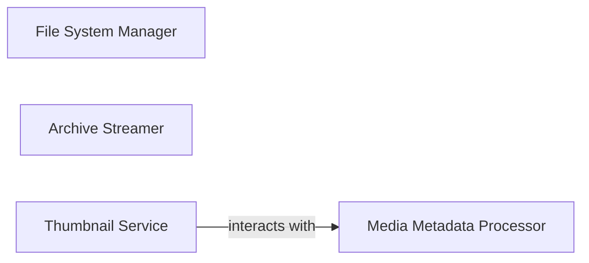

## Details

One paragraph explaining the functionality which is represented by this graph. What the main flow is and what is its purpose.

### File System Manager
Provides core utilities for file path resolution and mount point management, abstracting OS-specific file system interactions. This component is architecturally important as it centralizes all file system access, ensuring consistency and simplifying operations across the application.

**Related Classes/Methods**:

- <a href="https://github.com/9001/copyparty/blob/hovudstraum/copyparty/fsutil.py#L19-L173" target="_blank" rel="noopener noreferrer">`copyparty.fsutil.Fstab` (19:173)</a>

### Media Metadata Processor
Serves as an integration layer for external media libraries (e.g., Mutagen), centralizing metadata handling and enriching file information. This is crucial for a media-serving application to provide rich content descriptions and enable features like sorting or searching based on media attributes.

**Related Classes/Methods**:

- <a href="https://github.com/9001/copyparty/blob/hovudstraum/copyparty/mtag.py#L363-L707" target="_blank" rel="noopener noreferrer">`copyparty.mtag.MTag` (363:707)</a>

### Archive Streamer
Implements on-the-fly content generation, reading files from the file system and streaming them out as archives (TAR, ZIP). This component is vital for efficient network transfer, allowing users to download multiple files as a single compressed stream without requiring temporary storage.

**Related Classes/Methods**:

- <a href="https://github.com/9001/copyparty/blob/hovudstraum/copyparty/star.py#L41-L155" target="_blank" rel="noopener noreferrer">`copyparty.star.StreamTar` (41:155)</a>
- <a href="https://github.com/9001/copyparty/blob/hovudstraum/copyparty/szip.py#L214-L332" target="_blank" rel="noopener noreferrer">`copyparty.szip.StreamZip` (214:332)</a>

### Thumbnail Service
Functions as a dedicated service for media processing, specifically handling thumbnail generation and caching. It orchestrates external tools (FFmpeg, Pillow, PyVips) for image and video processing. This component offloads computationally intensive tasks from the main server, improving responsiveness and scalability.

**Related Classes/Methods**:

- <a href="https://github.com/9001/copyparty/blob/hovudstraum/copyparty/th_srv.py#L165-L1076" target="_blank" rel="noopener noreferrer">`copyparty.th_srv.ThumbSrv` (165:1076)</a>

### [FAQ](https://github.com/CodeBoarding/GeneratedOnBoardings/tree/main?tab=readme-ov-file#faq)