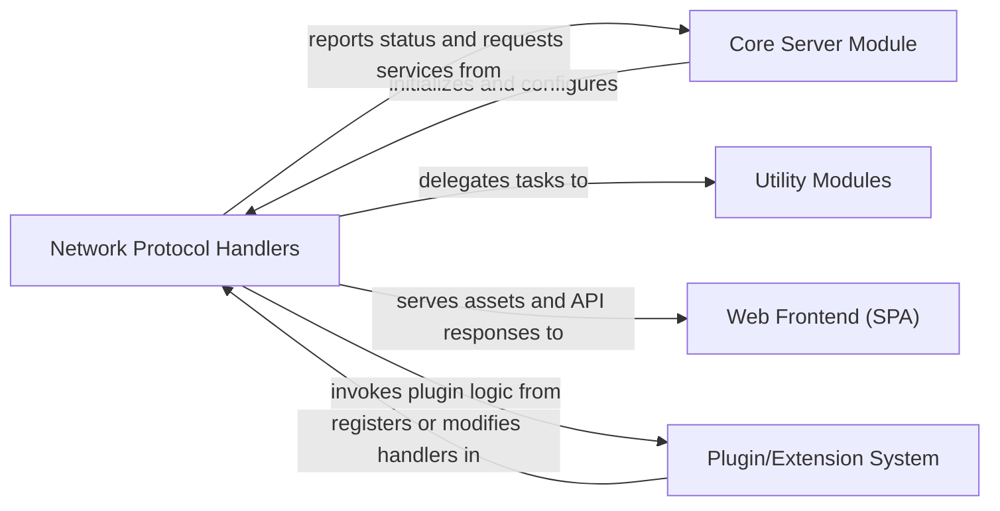

## Details

One paragraph explaining the functionality which is represented by this graph. What the main flow is and what is its purpose.

### Network Protocol Handlers [[Expand]](./Network_Protocol_Handlers.md)
This component is the backbone of copyparty's network communication capabilities. It encapsulates the logic for implementing various network protocols (HTTP, FTP, SMB, TFTP) and service discovery mechanisms (mDNS, SSDP). Its primary responsibility is to listen for incoming client requests, process them according to the specific protocol, and serve content or respond to queries. This component is crucial as it directly enables copyparty to function as a "Multi-protocol Server," a core architectural pattern identified.

**Related Classes/Methods**:

- `copyparty.httpsrv`
- `copyparty.ftpd`
- `copyparty.smbd`
- `copyparty.tftpd`
- `copyparty.mdns`
- `copyparty.multicast`
- `copyparty.ssdp`

### Core Server Module
This component represents the central orchestration and configuration hub of the copyparty application. It is responsible for initializing and managing the lifecycle of various server components, including the Network Protocol Handlers. It handles global settings, resource allocation, and overall server control.

**Related Classes/Methods**: _None_

### Utility Modules
This component encompasses a collection of reusable helper functions and modules that provide common functionalities across the copyparty application. These utilities might include file system operations, data parsing, encryption, or other general-purpose tasks that support the core server logic and protocol handlers.

**Related Classes/Methods**: _None_

### Web Frontend (SPA)
This component represents the Single Page Application (SPA) that provides the user interface for interacting with the copyparty server. It is responsible for rendering the web interface, handling user input, and making API requests to the Network Protocol Handlers to retrieve data or perform actions.

**Related Classes/Methods**: _None_

### Plugin/Extension System
This component provides a mechanism for extending copyparty's functionality through plugins or extensions. It allows external modules to register or modify existing handlers, inject custom logic, or introduce new features without altering the core server code.

**Related Classes/Methods**: _None_

### [FAQ](https://github.com/CodeBoarding/GeneratedOnBoardings/tree/main?tab=readme-ov-file#faq)