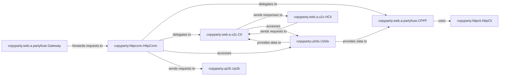

## Details

One paragraph explaining the functionality which is represented by this graph. What the main flow is and what is its purpose.

### copyparty.httpconn.HttpConn
Manages the lifecycle of individual HTTP connections. It is responsible for parsing incoming HTTP requests, handling headers, and preparing responses. It acts as the low-level handler for all web traffic.

**Related Classes/Methods**:

- <a href="https://github.com/9001/copyparty/blob/hovudstraum/copyparty/httpconn.py#L40-L228" target="_blank" rel="noopener noreferrer">`copyparty.httpconn.HttpConn` (40:228)</a>

### copyparty.httpcli.HttpCli
Represents the client-side of HTTP communication within the server. It is used for making internal HTTP requests, potentially to other parts of the server or external services, or for proxying client requests.

**Related Classes/Methods**:

- <a href="https://github.com/9001/copyparty/blob/hovudstraum/copyparty/httpcli.py#L167-L6775" target="_blank" rel="noopener noreferrer">`copyparty.httpcli.HttpCli` (167:6775)</a>

### copyparty.u2idx.U2idx
Manages the mapping between users and their respective data indices or access permissions. This component is crucial for personalizing content and enforcing access control within the web interface.

**Related Classes/Methods**:

- <a href="https://github.com/9001/copyparty/blob/hovudstraum/copyparty/u2idx.py#L44-L486" target="_blank" rel="noopener noreferrer">`copyparty.u2idx.U2idx` (44:486)</a>

### copyparty.up2k.Up2k
Dedicated to handling file upload functionalities. It processes incoming file data streams, manages storage, and ensures the integrity of uploaded files. This is a core API endpoint.

**Related Classes/Methods**:

- <a href="https://github.com/9001/copyparty/blob/hovudstraum/copyparty/up2k.py#L129-L5456" target="_blank" rel="noopener noreferrer">`copyparty.up2k.Up2k` (129:5456)</a>

### copyparty.web.a.partyfuse.Gateway
Serves as the primary entry point and router for all incoming web requests. It dispatches requests to the appropriate handlers based on URL patterns and request types, effectively acting as the front controller for the web interface.

**Related Classes/Methods**:

- <a href="https://github.com/9001/copyparty/blob/hovudstraum/copyparty/web/a/partyfuse.py#L254-L635" target="_blank" rel="noopener noreferrer">`copyparty.web.a.partyfuse.Gateway` (254:635)</a>

### copyparty.web.a.partyfuse.CPPF
Contains core logic for the `partyfuse` web application, orchestrating interactions between various web components. It likely handles general web page rendering, session management, and common web application flows.

**Related Classes/Methods**:

- <a href="https://github.com/9001/copyparty/blob/hovudstraum/copyparty/web/a/partyfuse.py#L638-L1105" target="_blank" rel="noopener noreferrer">`copyparty.web.a.partyfuse.CPPF` (638:1105)</a>

### copyparty.web.a.u2c.HCli
Handles specific client-side interaction logic within the `u2c` (user-to-client) context. This might involve real-time updates or specific client-initiated actions that require direct server interaction.

**Related Classes/Methods**:

- <a href="https://github.com/9001/copyparty/blob/hovudstraum/copyparty/web/a/u2c.py#L140-L227" target="_blank" rel="noopener noreferrer">`copyparty.web.a.u2c.HCli` (140:227)</a>

### copyparty.web.a.u2c.Ctl
A controller component specifically responsible for handling API endpoints or web application flows related to user-to-client communication. It processes requests from `HCli` and orchestrates responses.

**Related Classes/Methods**:

- <a href="https://github.com/9001/copyparty/blob/hovudstraum/copyparty/web/a/u2c.py#L926-L1500" target="_blank" rel="noopener noreferrer">`copyparty.web.a.u2c.Ctl` (926:1500)</a>

### [FAQ](https://github.com/CodeBoarding/GeneratedOnBoardings/tree/main?tab=readme-ov-file#faq)