```mermaid
graph LR
    Core_Server_Orchestration["Core Server & Orchestration"]
    Network_Protocol_Handlers["Network Protocol Handlers"]
    Authentication_Access_Control["Authentication & Access Control"]
    Web_Interface_API["Web Interface & API"]
    File_System_Media_Management["File System & Media Management"]
    Core_Server_Orchestration -- "manages" --> Network_Protocol_Handlers
    Core_Server_Orchestration -- "manages" --> Authentication_Access_Control
    Core_Server_Orchestration -- "manages" --> Web_Interface_API
    Core_Server_Orchestration -- "manages" --> File_System_Media_Management
    Network_Protocol_Handlers -- "requests" --> Authentication_Access_Control
    Network_Protocol_Handlers -- "accesses" --> File_System_Media_Management
    Authentication_Access_Control -- "provides services to" --> Network_Protocol_Handlers
    Authentication_Access_Control -- "provides services to" --> Web_Interface_API
    Authentication_Access_Control -- "configures" --> File_System_Media_Management
    Web_Interface_API -- "requests" --> Authentication_Access_Control
    Web_Interface_API -- "accesses" --> File_System_Media_Management
    File_System_Media_Management -- "serves data to" --> Network_Protocol_Handlers
    File_System_Media_Management -- "serves data to" --> Web_Interface_API
    click Core_Server_Orchestration href "https://github.com/CodeBoarding/GeneratedOnBoardings/blob/main/copyparty/Core_Server_Orchestration.md" "Details"
    click Network_Protocol_Handlers href "https://github.com/CodeBoarding/GeneratedOnBoardings/blob/main/copyparty/Network_Protocol_Handlers.md" "Details"
    click Authentication_Access_Control href "https://github.com/CodeBoarding/GeneratedOnBoardings/blob/main/copyparty/Authentication_Access_Control.md" "Details"
    click Web_Interface_API href "https://github.com/CodeBoarding/GeneratedOnBoardings/blob/main/copyparty/Web_Interface_API.md" "Details"
    click File_System_Media_Management href "https://github.com/CodeBoarding/GeneratedOnBoardings/blob/main/copyparty/File_System_Media_Management.md" "Details"
```

## Details

`copyparty` operates as a monolithic, multi-protocol network service, centered around its **Core Server & Orchestration** component which manages the application's lifecycle and coordinates all other services. Incoming client requests are handled by the **Network Protocol Handlers**, which support various protocols like HTTP, FTP, and SMB, or by the specialized **Web Interface & API** for web-based interactions and SPA serving. Both protocol handlers and the web interface rely on the **Authentication & Access Control** component to validate user credentials and enforce permissions, which in turn influences the **File System & Media Management** component to provide authorized access to files, generate media thumbnails, and stream archives on demand. This architecture ensures a cohesive flow from network reception to secure data delivery.

### Core Server & Orchestration [[Expand]](./Core_Server_Orchestration.md)
The central control plane responsible for the application's lifecycle, service orchestration, and inter-process communication. It initializes and manages other core components.

**Related Classes/Methods**:

- <a href="https://github.com/9001/copyparty/blob/hovudstraum/copyparty/svchub.py#L96-L1525" target="_blank" rel="noopener noreferrer">`copyparty.svchub.SvcHub` (96:1525)</a>
- <a href="https://github.com/9001/copyparty/blob/hovudstraum/copyparty/tcpsrv.py#L43-L639" target="_blank" rel="noopener noreferrer">`copyparty.tcpsrv.TcpSrv` (43:639)</a>
- <a href="https://github.com/9001/copyparty/blob/hovudstraum/copyparty/broker_mp.py#L34-L176" target="_blank" rel="noopener noreferrer">`copyparty.broker_mp.BrokerMp` (34:176)</a>
- <a href="https://github.com/9001/copyparty/blob/hovudstraum/copyparty/broker_mpw.py#L23-L127" target="_blank" rel="noopener noreferrer">`copyparty.broker_mpw.MpWorker` (23:127)</a>

### Network Protocol Handlers [[Expand]](./Network_Protocol_Handlers.md)
Manages all network communication, implementing various protocols (HTTP, FTP, SMB, TFTP) and discovery services (mDNS, SSDP) to serve content and respond to client requests.

**Related Classes/Methods**:

- <a href="https://github.com/9001/copyparty/blob/hovudstraum/copyparty/httpsrv.py#L102-L633" target="_blank" rel="noopener noreferrer">`copyparty.httpsrv.HttpSrv` (102:633)</a>
- <a href="https://github.com/9001/copyparty/blob/hovudstraum/copyparty/ftpd.py#L132-L449" target="_blank" rel="noopener noreferrer">`copyparty.ftpd.FtpFs` (132:449)</a>
- <a href="https://github.com/9001/copyparty/blob/hovudstraum/copyparty/smbd.py#L27-L440" target="_blank" rel="noopener noreferrer">`copyparty.smbd.SMB` (27:440)</a>
- <a href="https://github.com/9001/copyparty/blob/hovudstraum/copyparty/tftpd.py#L85-L479" target="_blank" rel="noopener noreferrer">`copyparty.tftpd.Tftpd` (85:479)</a>
- <a href="https://github.com/9001/copyparty/blob/hovudstraum/copyparty/mdns.py#L62-L582" target="_blank" rel="noopener noreferrer">`copyparty.mdns.MDNS` (62:582)</a>
- <a href="https://github.com/9001/copyparty/blob/hovudstraum/copyparty/multicast.py#L57-L396" target="_blank" rel="noopener noreferrer">`copyparty.multicast.MCast` (57:396)</a>
- <a href="https://github.com/9001/copyparty/blob/hovudstraum/copyparty/ssdp.py#L31-L86" target="_blank" rel="noopener noreferrer">`copyparty.ssdp.SSDPr` (31:86)</a>
- <a href="https://github.com/9001/copyparty/blob/hovudstraum/copyparty/ssdp.py#L89-L239" target="_blank" rel="noopener noreferrer">`copyparty.ssdp.SSDPd` (89:239)</a>

### Authentication & Access Control [[Expand]](./Authentication_Access_Control.md)
Handles user authentication, authorization, rate limiting, and manages the Virtual File System (VFS) to enforce access permissions and content visibility.

**Related Classes/Methods**:

- <a href="https://github.com/9001/copyparty/blob/hovudstraum/copyparty/authsrv.py#L950-L3385" target="_blank" rel="noopener noreferrer">`copyparty.authsrv.AuthSrv` (950:3385)</a>
- <a href="https://github.com/9001/copyparty/blob/hovudstraum/copyparty/authsrv.py#L136-L371" target="_blank" rel="noopener noreferrer">`copyparty.authsrv.Lim` (136:371)</a>
- <a href="https://github.com/9001/copyparty/blob/hovudstraum/copyparty/authsrv.py#L374-L941" target="_blank" rel="noopener noreferrer">`copyparty.authsrv.VFS` (374:941)</a>
- <a href="https://github.com/9001/copyparty/blob/hovudstraum/copyparty/pwhash.py#L22-L160" target="_blank" rel="noopener noreferrer">`copyparty.pwhash.PWHash` (22:160)</a>

### Web Interface & API [[Expand]](./Web_Interface_API.md)
Dedicated to serving the Single-Page Application (SPA) assets, processing web-based client requests, and exposing API endpoints for functionalities like file uploads (`up2k`) and user-to-index mapping.

**Related Classes/Methods**:

- <a href="https://github.com/9001/copyparty/blob/hovudstraum/copyparty/httpconn.py#L40-L228" target="_blank" rel="noopener noreferrer">`copyparty.httpconn.HttpConn` (40:228)</a>
- <a href="https://github.com/9001/copyparty/blob/hovudstraum/copyparty/httpcli.py#L167-L6775" target="_blank" rel="noopener noreferrer">`copyparty.httpcli.HttpCli` (167:6775)</a>
- <a href="https://github.com/9001/copyparty/blob/hovudstraum/copyparty/u2idx.py#L44-L486" target="_blank" rel="noopener noreferrer">`copyparty.u2idx.U2idx` (44:486)</a>
- <a href="https://github.com/9001/copyparty/blob/hovudstraum/copyparty/up2k.py#L129-L5456" target="_blank" rel="noopener noreferrer">`copyparty.up2k.Up2k` (129:5456)</a>
- <a href="https://github.com/9001/copyparty/blob/hovudstraum/copyparty/web/a/partyfuse.py#L254-L635" target="_blank" rel="noopener noreferrer">`copyparty.web.a.partyfuse.Gateway` (254:635)</a>
- <a href="https://github.com/9001/copyparty/blob/hovudstraum/copyparty/web/a/partyfuse.py#L638-L1105" target="_blank" rel="noopener noreferrer">`copyparty.web.a.partyfuse.CPPF` (638:1105)</a>
- <a href="https://github.com/9001/copyparty/blob/hovudstraum/copyparty/web/a/u2c.py#L140-L227" target="_blank" rel="noopener noreferrer">`copyparty.web.a.u2c.HCli` (140:227)</a>
- <a href="https://github.com/9001/copyparty/blob/hovudstraum/copyparty/web/a/u2c.py#L926-L1500" target="_blank" rel="noopener noreferrer">`copyparty.web.a.u2c.Ctl` (926:1500)</a>

### File System & Media Management [[Expand]](./File_System_Media_Management.md)
Provides core utilities for file system interaction, media metadata handling, and on-the-fly operations such as streaming archive creation (TAR, ZIP) and media thumbnail generation.

**Related Classes/Methods**:

- <a href="https://github.com/9001/copyparty/blob/hovudstraum/copyparty/fsutil.py#L19-L173" target="_blank" rel="noopener noreferrer">`copyparty.fsutil.Fstab` (19:173)</a>
- <a href="https://github.com/9001/copyparty/blob/hovudstraum/copyparty/mtag.py#L363-L707" target="_blank" rel="noopener noreferrer">`copyparty.mtag.MTag` (363:707)</a>
- <a href="https://github.com/9001/copyparty/blob/hovudstraum/copyparty/star.py#L41-L155" target="_blank" rel="noopener noreferrer">`copyparty.star.StreamTar` (41:155)</a>
- <a href="https://github.com/9001/copyparty/blob/hovudstraum/copyparty/szip.py#L214-L332" target="_blank" rel="noopener noreferrer">`copyparty.szip.StreamZip` (214:332)</a>
- <a href="https://github.com/9001/copyparty/blob/hovudstraum/copyparty/th_srv.py#L165-L1076" target="_blank" rel="noopener noreferrer">`copyparty.th_srv.ThumbSrv` (165:1076)</a>
- <a href="https://github.com/9001/copyparty/blob/hovudstraum/copyparty/th_cli.py#L23-L182" target="_blank" rel="noopener noreferrer">`copyparty.th_cli.ThumbCli` (23:182)</a>

### [FAQ](https://github.com/CodeBoarding/GeneratedOnBoardings/tree/main?tab=readme-ov-file#faq)