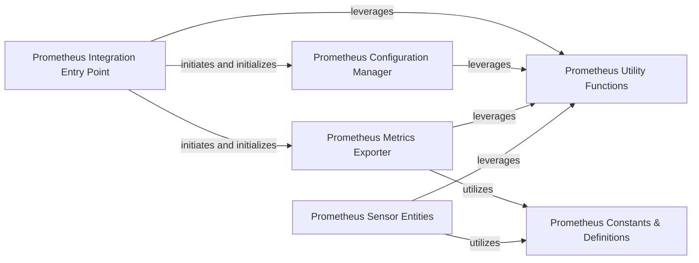

## Details

The `Data, Monitoring & System Services` component, specifically within the `homeassistant.components.prometheus` subsystem, is structured to provide robust data exposition and system health monitoring capabilities for Home Assistant.

### Prometheus Integration Entry Point
Serves as the primary entry point for the Prometheus integration. It handles the initial setup, registration with Home Assistant, and orchestrates the loading and initialization of other Prometheus-related components. This component is fundamental for integrating monitoring services into the Home Assistant ecosystem.

**Related Classes/Methods**:

- <a href="https://github.com/home-assistant/core/blob/dev/homeassistant/auth/providers/homeassistant.py" target="_blank" rel="noopener noreferrer">`homeassistant.components.prometheus`</a>

### Prometheus Configuration Manager
Manages the user interface and underlying logic for configuring the Prometheus integration. This includes defining configuration steps, validating user inputs (e.g., port for metrics exposure), and persisting settings. It's crucial for the operational setup of the monitoring service.

**Related Classes/Methods**:

- `homeassistant.components.prometheus.config_flow`

### Prometheus Constants & Definitions
Centralizes all constant values, enumerations, and fixed parameters used throughout the Prometheus integration. This ensures consistency, simplifies maintenance, and provides a single source of truth for critical definitions within the monitoring system.

**Related Classes/Methods**:

- `homeassistant.components.prometheus.const`

### Prometheus Metrics Exporter
This is the core functional component for system health monitoring and data exposition. It is responsible for defining, collecting, and exposing Home Assistant's internal state and event data as Prometheus metrics. It directly interacts with Home Assistant's state machine and event bus to gather relevant data and makes it available via an HTTP endpoint for Prometheus to scrape.

**Related Classes/Methods**:

- `homeassistant.components.prometheus.metrics`

### Prometheus Sensor Entities
Defines any Home Assistant sensor entities that the Prometheus integration might expose. These sensors could represent internal states of the Prometheus exporter itself (e.g., number of metrics exposed, last successful scrape) or specific Home Assistant data points formatted as sensors, contributing to structured data availability.

**Related Classes/Methods**:

- `homeassistant.components.prometheus.sensor`

### Prometheus Utility Functions
Contains reusable helper functions and common logic that support various aspects of the Prometheus integration, such as data processing, formatting, or specific calculations required for metrics. This component provides general system utilities to support the overall monitoring and data handling.

**Related Classes/Methods**:

- `homeassistant.components.prometheus.utils`

### [FAQ](https://github.com/CodeBoarding/GeneratedOnBoardings/tree/main?tab=readme-ov-file#faq)