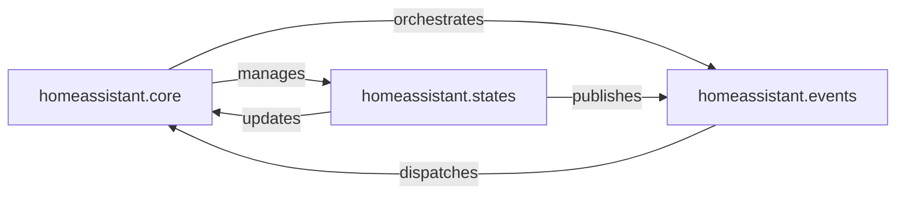

## Details

Abstract Components Overview

### homeassistant.core
The main orchestrator of the Home Assistant application. It initializes and manages the lifecycle of the state machine and the event bus. It serves as the primary interface for other components to interact with the core system.

**Related Classes/Methods**:

- <a href="https://github.com/home-assistant/core/blob/dev/homeassistant/core.py" target="_blank" rel="noopener noreferrer">`homeassistant.core`</a>

### homeassistant.states
Responsible for the creation, storage, retrieval, and updating of all entity states within Home Assistant. It ensures data consistency and provides the current "snapshot" of the smart home's status.

**Related Classes/Methods**:

- <a href="https://github.com/home-assistant/core/blob/dev/homeassistant/auth/providers/homeassistant.py" target="_blank" rel="noopener noreferrer">`homeassistant.states`</a>

### homeassistant.events
Implements the publish-subscribe mechanism for the entire Home Assistant system. It allows components to register listeners for specific event types (e.g., state changes, service calls) and for other components to publish events, enabling loose coupling and reactive programming.

**Related Classes/Methods**:

- <a href="https://github.com/home-assistant/core/blob/dev/homeassistant/auth/providers/homeassistant.py" target="_blank" rel="noopener noreferrer">`homeassistant.events`</a>

### [FAQ](https://github.com/CodeBoarding/GeneratedOnBoardings/tree/main?tab=readme-ov-file#faq)