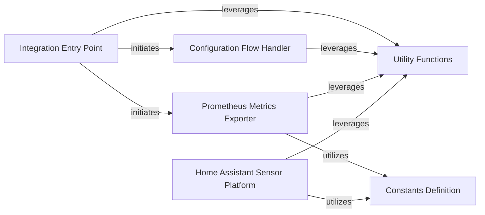

## Details

Component Overview: Home Assistant Prometheus Integration Subsystem

### Integration Entry Point
The foundational component responsible for the integration's lifecycle management, including its setup, initialization, and registration within the Home Assistant core. It orchestrates the loading and configuration of other integration-specific components.

**Related Classes/Methods**:

- <a href="https://github.com/home-assistant/core/blob/dev/homeassistant/components/prometheus/__init__.py#L1-L1" target="_blank" rel="noopener noreferrer">`homeassistant/components/prometheus/__init__.py` (1:1)</a>

### Configuration Flow Handler
Manages the user interface and backend logic for configuring the Prometheus integration. It handles user input, validates settings, and persists the configuration.

**Related Classes/Methods**:

- `homeassistant/components/prometheus/config_flow.py` (1:1)

### Constants Definition
A centralized repository for immutable values, such as configuration keys, default values, and other fixed strings or numbers used throughout the Prometheus integration.

**Related Classes/Methods**:

- `homeassistant/components/prometheus/const.py` (1:1)

### Prometheus Metrics Exporter
The core functional component responsible for collecting relevant data from Home Assistant's state machine and event bus, transforming it into Prometheus-compatible metrics, and exposing them via an HTTP endpoint.

**Related Classes/Methods**:

- `homeassistant/components/prometheus/metrics.py` (1:1)

### Home Assistant Sensor Platform
Defines and manages any specific sensor entities that the Prometheus integration might expose within Home Assistant itself, allowing users to monitor aspects of the exporter's operation or related data directly within Home Assistant.

**Related Classes/Methods**:

- `homeassistant/components/prometheus/sensor.py` (1:1)

### Utility Functions
A collection of reusable helper functions and common logic specific to the Prometheus integration, designed to support various other components by encapsulating repetitive or complex operations.

**Related Classes/Methods**:

- `homeassistant/components/prometheus/utils.py` (1:1)

### [FAQ](https://github.com/CodeBoarding/GeneratedOnBoardings/tree/main?tab=readme-ov-file#faq)