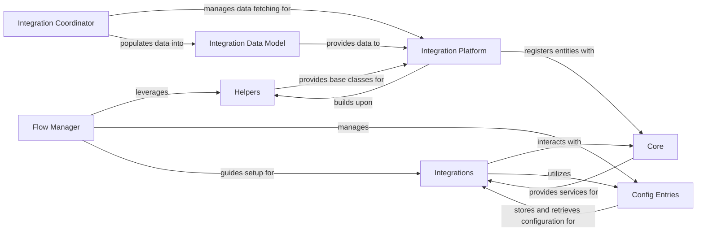

## Details

Abstract Components Overview

### Integrations
The primary entry point for specific external devices or services. Each integration (`homeassistant.components.prometheus`, `homeassistant.components.bluetooth`, etc.) encapsulates the logic for discovering, connecting to, and managing a particular type of device or service, abstracting its complexities.

**Related Classes/Methods**:

- <a href="https://github.com/home-assistant/core/blob/dev/homeassistant/auth/providers/homeassistant.py#L1-L1" target="_blank" rel="noopener noreferrer">`homeassistant.components` (1:1)</a>
- <a href="https://github.com/home-assistant/core/blob/dev/homeassistant/auth/providers/homeassistant.py#L1-L1" target="_blank" rel="noopener noreferrer">`homeassistant.components.prometheus` (1:1)</a>

### Core [[Expand]](./Core.md)
The foundational backbone of Home Assistant, providing the event bus, state machine, and essential services that all integrations interact with. It acts as the central hub for data flow and communication within the system.

**Related Classes/Methods**:

- <a href="https://github.com/home-assistant/core/blob/dev/homeassistant/core.py#L1-L1" target="_blank" rel="noopener noreferrer">`homeassistant.core` (1:1)</a>

### Helpers
A collection of utility modules and base classes that integrations extend to standardize their entity representations and behaviors. This includes common entity types (e.g., `SensorEntity`, `ClimateEntity`) and helper functions for common tasks. Additionally, it provides foundational data structures and utilities crucial for configuration flows, such as authentication context and results, which are leveraged by the Flow Manager.

**Related Classes/Methods**:

- <a href="https://github.com/home-assistant/core/blob/dev/homeassistant/auth/providers/homeassistant.py#L1-L1" target="_blank" rel="noopener noreferrer">`homeassistant.helpers` (1:1)</a>
- <a href="https://github.com/home-assistant/core/blob/dev/homeassistant/helpers/entity.py#L1-L1" target="_blank" rel="noopener noreferrer">`homeassistant.helpers.entity` (1:1)</a>

### Config Entries
Manages the persistent configuration data for integrations. It handles the storage, retrieval, and updating of integration-specific settings, ensuring that configurations persist across restarts.

**Related Classes/Methods**:

- <a href="https://github.com/home-assistant/core/blob/dev/homeassistant/config_entries.py#L1-L1" target="_blank" rel="noopener noreferrer">`homeassistant.config_entries` (1:1)</a>

### Flow Manager
Orchestrates the user-guided setup and configuration processes for integrations. It provides a consistent user interface and workflow for onboarding new devices and services, often involving multiple steps and user input. It leverages utilities from the Helpers component for managing configuration flows, particularly authentication.

**Related Classes/Methods**:

- `homeassistant.data_entry_flow`

### Integration Platform
These modules (e.g., `sensor.py`, `binary_sensor.py` within an integration's directory) implement the specific Home Assistant entity types for an integration. They translate device-specific functionalities into the standardized Home Assistant entity model (e.g., a device's temperature reading becomes a `sensor` entity).

**Related Classes/Methods**:

- `homeassistant.components.prometheus.sensor` (1:1)
- `homeassistant.components.prometheus.binary_sensor` (1:1)

### Integration Coordinator
Within an integration, this component is responsible for fetching and updating data from external devices or services. It often handles polling, data caching, and ensuring data consistency before passing it to the entities.

**Related Classes/Methods**:

- `homeassistant.components.prometheus.coordinator` (1:1)

### Integration Data Model
Encapsulates the structured data fetched by an integration's coordinator. This model provides a standardized representation of the external device's state or information, making it accessible and consistent for various entities within the integration.

**Related Classes/Methods**:

- `homeassistant.components.prometheus.models` (1:1)

### [FAQ](https://github.com/CodeBoarding/GeneratedOnBoardings/tree/main?tab=readme-ov-file#faq)