```mermaid
graph LR
    homeassistant_components_http["homeassistant.components.http"]
    homeassistant_components_websocket_api["homeassistant.components.websocket_api"]
    homeassistant_components_stt["homeassistant.components.stt"]
    homeassistant_components_tts["homeassistant.components.tts"]
    homeassistant_components_assist_pipeline["homeassistant.components.assist_pipeline"]
    homeassistant_components_conversation["homeassistant.components.conversation"]
    homeassistant_core["homeassistant.core"]
    homeassistant_helpers["homeassistant.helpers"]
    homeassistant_components_websocket_api -- "communicates over" --> homeassistant_components_http
    homeassistant_components_stt -- "provides input to" --> homeassistant_components_assist_pipeline
    homeassistant_components_assist_pipeline -- "orchestrates" --> homeassistant_components_stt
    homeassistant_components_assist_pipeline -- "orchestrates" --> homeassistant_components_tts
    homeassistant_components_assist_pipeline -- "routes to" --> homeassistant_components_conversation
    homeassistant_components_conversation -- "interacts with" --> homeassistant_core
    homeassistant_components_tts -- "is used by" --> homeassistant_components_assist_pipeline
    homeassistant_core -- "dispatches notification events to" --> homeassistant_components_websocket_api
    homeassistant_helpers -- "supports" --> homeassistant_core
```

## Details

Provides all user-facing functionalities, including the web interface (Lovelace), voice command processing, and notification services. It also encompasses the automation and scripting engine, allowing users to define complex behaviors based on triggers and conditions.

### homeassistant.components.http
Serves as the web server infrastructure, delivering the frontend user interface (Lovelace) to users and handling incoming RESTful API requests, forming the primary visual interaction point for the system.

**Related Classes/Methods**:

- <a href="https://github.com/home-assistant/core/blob/dev/homeassistant/auth/providers/homeassistant.py#L1-L1" target="_blank" rel="noopener noreferrer">`homeassistant.components.http` (1:1)</a>

### homeassistant.components.websocket_api
Enables real-time, bidirectional communication between the Home Assistant backend and connected clients (e.g., web browser, mobile apps), crucial for dynamic UI updates, interactive control, and delivering notifications.

**Related Classes/Methods**:

- <a href="https://github.com/home-assistant/core/blob/dev/homeassistant/auth/providers/homeassistant.py#L1-L1" target="_blank" rel="noopener noreferrer">`homeassistant.components.websocket_api` (1:1)</a>

### homeassistant.components.stt
Provides services to convert spoken audio input from users into text, forming the initial step for voice command processing within the system.

**Related Classes/Methods**:

- <a href="https://github.com/home-assistant/core/blob/dev/homeassistant/auth/providers/homeassistant.py#L1-L1" target="_blank" rel="noopener noreferrer">`homeassistant.components.stt` (1:1)</a>

### homeassistant.components.tts
Offers services to convert text into spoken audio, used for voice assistant responses and audible notifications, completing the voice interaction loop.

**Related Classes/Methods**:

- <a href="https://github.com/home-assistant/core/blob/dev/homeassistant/auth/providers/homeassistant.py#L1-L1" target="_blank" rel="noopener noreferrer">`homeassistant.components.tts` (1:1)</a>

### homeassistant.components.assist_pipeline
Orchestrates the entire flow for voice assistants, integrating STT for input, TTS for output, and routing to conversational components for processing natural language commands.

**Related Classes/Methods**:

- <a href="https://github.com/home-assistant/core/blob/dev/homeassistant/auth/providers/homeassistant.py#L1-L1" target="_blank" rel="noopener noreferrer">`homeassistant.components.assist_pipeline` (1:1)</a>

### homeassistant.components.conversation
Manages conversational interactions, utilizing natural language understanding to interpret user commands and generate appropriate responses, enabling complex voice-driven behaviors.

**Related Classes/Methods**:

- <a href="https://github.com/home-assistant/core/blob/dev/homeassistant/auth/providers/homeassistant.py#L1-L1" target="_blank" rel="noopener noreferrer">`homeassistant.components.conversation` (1:1)</a>

### homeassistant.core
The foundational layer that manages the central event bus and the global state of all entities. It is fundamental for the automation engine, as automations are triggered by events and manipulate entity states, and notifications also rely on its event dispatching.

**Related Classes/Methods**:

- <a href="https://github.com/home-assistant/core/blob/dev/homeassistant/core.py#L1-L1" target="_blank" rel="noopener noreferrer">`homeassistant.core` (1:1)</a>

### homeassistant.helpers
A collection of utility classes and base entities that support common patterns across Home Assistant, including those used in defining and managing automations (e.g., state restoration, common triggers/conditions), directly supporting the scripting engine.

**Related Classes/Methods**:

- <a href="https://github.com/home-assistant/core/blob/dev/homeassistant/auth/providers/homeassistant.py#L1-L1" target="_blank" rel="noopener noreferrer">`homeassistant.helpers` (1:1)</a>

### [FAQ](https://github.com/CodeBoarding/GeneratedOnBoardings/tree/main?tab=readme-ov-file#faq)