```mermaid
graph LR
    Home_Assistant_Core["Home Assistant Core"]
    Integration_Device_Management["Integration & Device Management"]
    Entity_State_Engine["Entity & State Engine"]
    User_Interaction_Automation["User Interaction & Automation"]
    Data_Monitoring_System_Services["Data, Monitoring & System Services"]
    Home_Assistant_Core -- "provides configuration to" --> Integration_Device_Management
    Home_Assistant_Core -- "provides configuration to" --> Data_Monitoring_System_Services
    Integration_Device_Management -- "registers entities with" --> Entity_State_Engine
    Integration_Device_Management -- "sends state updates to" --> Entity_State_Engine
    Entity_State_Engine -- "communicates state changes with" --> User_Interaction_Automation
    Entity_State_Engine -- "publishes state changes to" --> Data_Monitoring_System_Services
    User_Interaction_Automation -- "sends commands to" --> Entity_State_Engine
    Data_Monitoring_System_Services -- "provides historical data and system metrics to" --> User_Interaction_Automation
    click Home_Assistant_Core href "https://github.com/CodeBoarding/GeneratedOnBoardings/blob/main/core/Home_Assistant_Core.md" "Details"
    click Integration_Device_Management href "https://github.com/CodeBoarding/GeneratedOnBoardings/blob/main/core/Integration_Device_Management.md" "Details"
    click Entity_State_Engine href "https://github.com/CodeBoarding/GeneratedOnBoardings/blob/main/core/Entity_State_Engine.md" "Details"
    click User_Interaction_Automation href "https://github.com/CodeBoarding/GeneratedOnBoardings/blob/main/core/User_Interaction_Automation.md" "Details"
    click Data_Monitoring_System_Services href "https://github.com/CodeBoarding/GeneratedOnBoardings/blob/main/core/Data_Monitoring_System_Services.md" "Details"
```

## Details

One paragraph explaining the functionality which is represented by this graph. What the main flow is and what is its purpose.

### Home Assistant Core [[Expand]](./Home_Assistant_Core.md)
The central orchestrator of the Home Assistant platform, responsible for managing the application lifecycle, global configuration, and core system services. It acts as the foundational layer upon which all other components operate.

**Related Classes/Methods**: _None_

### Integration & Device Management [[Expand]](./Integration_Device_Management.md)
Manages the discovery, setup, and interaction with external devices and services. It abstracts the complexities of various protocols and functionalities, presenting them as standardized entities to the rest of the system.

**Related Classes/Methods**: _None_

### Entity & State Engine [[Expand]](./Entity_State_Engine.md)
The core data model and event bus of Home Assistant. It maintains the real-time state of all connected entities (e.g., sensors, lights, switches) and publishes state changes, acting as the central source of truth for the smart home's current status.

**Related Classes/Methods**: _None_

### User Interaction & Automation [[Expand]](./User_Interaction_Automation.md)
Provides all user-facing functionalities, including the web interface (Lovelace), voice command processing, and notification services. It also encompasses the automation and scripting engine, allowing users to define complex behaviors based on triggers and conditions.

**Related Classes/Methods**: _None_

### Data, Monitoring & System Services [[Expand]](./Data_Monitoring_System_Services.md)
Responsible for data persistence (e.g., historical data, logs), system health monitoring (including the Prometheus data exporter), security, authentication, and general system utilities like backup and recovery. This component is key for analytical and operational insights.

**Related Classes/Methods**: _None_

### [FAQ](https://github.com/CodeBoarding/GeneratedOnBoardings/tree/main?tab=readme-ov-file#faq)