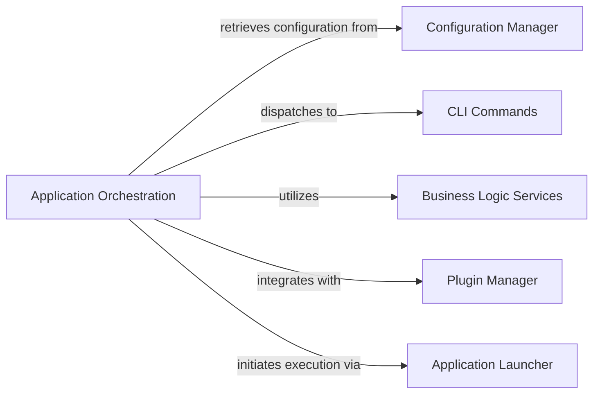

## Details

The `craft-application` subsystem is orchestrated by the `Application` component, which serves as the central hub for managing the application's lifecycle. It leverages the `Configuration Manager` to retrieve and apply application-wide settings. User interactions are primarily handled through `CLI Commands`, which are dispatched and executed by the `Application` orchestrator. Core functionalities are provided by `Business Logic Services`, accessed and managed through a `ServiceFactory`. The `Application` also acts as a `Plugin Manager`, dynamically loading and integrating external plugins to extend its capabilities. Finally, the `Application Launcher` aspect of the `Application` component is responsible for initiating various execution scenarios, including managed and unmanaged modes, ensuring a flexible and robust operational environment.

### Application Orchestration [[Expand]](./Application_Orchestration.md)
The central orchestrator of the SDK, managing the overall application lifecycle, configuration, and command dispatching. It acts as the primary entry point and coordinator for the craft-application subsystem.

**Related Classes/Methods**:

- <a href="https://github.com/canonical/craft-application/blob/main/craft_application/application.py#L117-L777" target="_blank" rel="noopener noreferrer">`craft_application.application.Application`:117-777</a>

### Configuration Manager
Manages application-wide settings and configurations, providing essential parameters to the orchestrator and other services. It provides a centralized way to access and update configuration options.

**Related Classes/Methods**:

- <a href="https://github.com/canonical/craft-application/blob/main/craft_application/services/config.py#L148-L231" target="_blank" rel="noopener noreferrer">`craft_application.services.config.ConfigService`:148-231</a>

### CLI Commands
Defines the structure and behavior of command-line interface commands, serving as the primary external interface for user interaction with the SDK. It handles command parsing and execution.

**Related Classes/Methods**:

- <a href="https://github.com/canonical/craft-application/blob/main/craft_application/commands/base.py" target="_blank" rel="noopener noreferrer">`craft_application.commands.base.BaseCommand`</a>

### Business Logic Services
Encapsulates and performs the core business operations and functionalities of the SDK. This component acts as a factory for various services, providing a structured way to access and manage them.

**Related Classes/Methods**:

- <a href="https://github.com/canonical/craft-application/blob/main/craft_application/services/service_factory.py#L61-L335" target="_blank" rel="noopener noreferrer">`craft_application.services.service_factory.ServiceFactory`:61-335</a>

### Plugin Manager
Manages the registration, loading, and integration of external plugins, enabling the SDK's extensibility. This functionality is integrated within the main Application class, which discovers and configures plugins.

**Related Classes/Methods**:

- <a href="https://github.com/canonical/craft-application/blob/main/craft_application/application.py" target="_blank" rel="noopener noreferrer">`craft_application.application.Application:_load_plugins`</a>
- <a href="https://github.com/canonical/craft-application/blob/main/craft_application/application.py" target="_blank" rel="noopener noreferrer">`craft_application.application.Application:register_plugins`</a>

### Application Launcher
Initiates specific application execution scenarios or modes, acting as a specialized entry point for different operational contexts. The main run method of the Application class serves this purpose.

**Related Classes/Methods**:

- <a href="https://github.com/canonical/craft-application/blob/main/craft_application/application.py" target="_blank" rel="noopener noreferrer">`craft_application.application.Application:run`</a>
- <a href="https://github.com/canonical/craft-application/blob/main/craft_application/application.py" target="_blank" rel="noopener noreferrer">`craft_application.application.Application:run_managed`</a>

### [FAQ](https://github.com/CodeBoarding/GeneratedOnBoardings/tree/main?tab=readme-ov-file#faq)