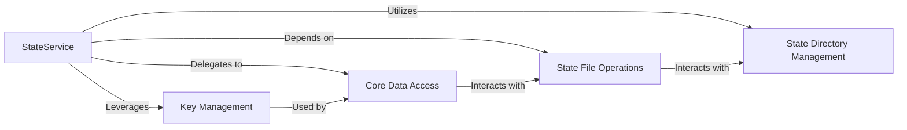

## Details

The StateService subsystem provides a robust mechanism for managing application state, centralizing state interactions through a high-level service interface. It encapsulates the complexities of file system operations, data serialization, and key validation. The StateService orchestrates interactions between State Directory Management (for directory lifecycle), State File Operations (for file I/O), Key Management (for data integrity), and Core Data Access (for low-level data manipulation). This layered architecture ensures clear separation of concerns, making the state management predictable and maintainable.

### StateService
This is the primary public interface for the subsystem, adhering to the Service Layer pattern. It provides a high-level API for external components to interact with application state, abstracting away the underlying persistence mechanisms.

**Related Classes/Methods**:

- <a href="https://github.com/canonical/craft-application/blob/main/craft_application/services/state.py#L48-L406" target="_blank" rel="noopener noreferrer">`craft_application.services.state.StateService`:48-406</a>

### State Directory Management
Handles the creation, destruction, and retrieval of state directories on the file system. These are internal helper functions that manage the physical storage locations for application state.

**Related Classes/Methods**:

- <a href="https://github.com/canonical/craft-application/blob/main/craft_application/services/state.py" target="_blank" rel="noopener noreferrer">`craft_application.services.state.StateService._get_state_dir`</a>
- <a href="https://github.com/canonical/craft-application/blob/main/craft_application/services/state.py" target="_blank" rel="noopener noreferrer">`craft_application.services.state.StateService._create_state_dir`</a>
- <a href="https://github.com/canonical/craft-application/blob/main/craft_application/services/state.py" target="_blank" rel="noopener noreferrer">`craft_application.services.state.StateService._destroy_state_dir`</a>

### State File Operations
Manages the loading and saving of state data to and from individual files within the state directories. These are internal helper functions responsible for serialization and deserialization.

**Related Classes/Methods**:

- <a href="https://github.com/canonical/craft-application/blob/main/craft_application/services/state.py" target="_blank" rel="noopener noreferrer">`craft_application.services.state.StateService._load_state_file`</a>
- <a href="https://github.com/canonical/craft-application/blob/main/craft_application/services/state.py" target="_blank" rel="noopener noreferrer">`craft_application.services.state.StateService._save_state_file`</a>

### Key Management
Ensures data integrity and proper access by formatting and validating keys used for state access. These are internal utility functions that standardize key structures.

**Related Classes/Methods**:

- <a href="https://github.com/canonical/craft-application/blob/main/craft_application/services/state.py" target="_blank" rel="noopener noreferrer">`craft_application.services.state.StateService._format_keys`</a>
- <a href="https://github.com/canonical/craft-application/blob/main/craft_application/services/state.py" target="_blank" rel="noopener noreferrer">`craft_application.services.state.StateService._validate_keys`</a>

### Core Data Access
Provides the fundamental, low-level mechanisms for retrieving and modifying state data. These are internal helper functions that interact directly with the stored state, often leveraging the file operations.

**Related Classes/Methods**:

- <a href="https://github.com/canonical/craft-application/blob/main/craft_application/services/state.py" target="_blank" rel="noopener noreferrer">`craft_application.services.state.StateService._get`</a>
- <a href="https://github.com/canonical/craft-application/blob/main/craft_application/services/state.py" target="_blank" rel="noopener noreferrer">`craft_application.services.state.StateService._set`</a>

### [FAQ](https://github.com/CodeBoarding/GeneratedOnBoardings/tree/main?tab=readme-ov-file#faq)