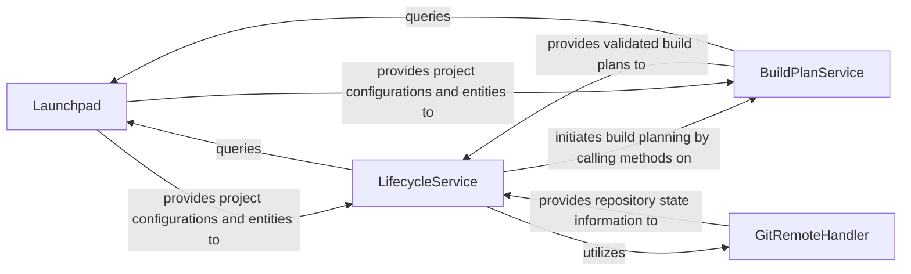

## Details

The `Build & Deployment Management` subsystem is responsible for managing project configurations, generating build plans, overseeing the entire build lifecycle (local and remote), and interfacing with various build environments and external code repositories.

### Launchpad
Serves as the primary interface for managing application projects, recipes, repositories, and user credentials. It provides methods to retrieve, create, and manage project-related entities and their metadata. This component acts as a central registry or access point for project configurations, aligning with the SDK's need for a consistent way to access project-specific data.

**Related Classes/Methods**:

- <a href="https://github.com/canonical/craft-application/blob/main/craft_application/launchpad/launchpad.py" target="_blank" rel="noopener noreferrer">`craft_application.launchpad.launchpad`</a>

### LifecycleService
Orchestrates the entire application lifecycle, including setup, planning, building, priming, and cleaning. It manages the execution flow of various build steps and actions. This service embodies the core business logic for managing the build and deployment process, adhering to the Service Layer pattern.

**Related Classes/Methods**:

- <a href="https://github.com/canonical/craft-application/blob/main/craft_application/services/lifecycle.py" target="_blank" rel="noopener noreferrer">`craft_application.services.lifecycle`</a>

### BuildPlanService
Generates, validates, and manages the build plan for an application. It handles configurations related to different platforms and build targets, ensuring a structured and exhaustive build process. This service is crucial for abstracting the complexities of build configuration and validation, providing a clear interface for build plan management within the SDK.

**Related Classes/Methods**:

- <a href="https://github.com/canonical/craft-application/blob/main/craft_application/services/buildplan.py" target="_blank" rel="noopener noreferrer">`craft_application.services.buildplan`</a>

### GitRemoteHandler
Provides utility functions for interacting with Git repositories, such as checking for remote build capabilities and managing repository paths. This component encapsulates external system interactions, ensuring that the core services remain clean and focused on their primary responsibilities.

**Related Classes/Methods**:

- <a href="https://github.com/canonical/craft-application/blob/main/craft_application/remote/git.py" target="_blank" rel="noopener noreferrer">`craft_application.remote.git`</a>

### [FAQ](https://github.com/CodeBoarding/GeneratedOnBoardings/tree/main?tab=readme-ov-file#faq)