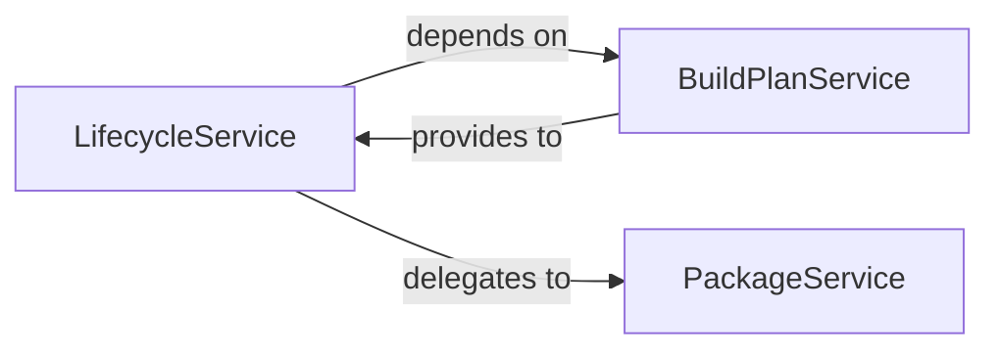

## Details

The Build & Packaging Engine subsystem is primarily encapsulated within the craft_application.services package, specifically involving the lifecycle, buildplan, and package modules. These modules define the core services responsible for orchestrating and managing the application's build and packaging processes.

### LifecycleService
This service acts as the central orchestrator for the entire application build and execution lifecycle. It manages the high-level flow, including setup, build plan validation, execution of build phases (compilation, staging, priming), running the application, and cleanup. It ensures a consistent and controlled progression through the application's lifecycle stages, making it a critical component for any SDK providing build capabilities.

**Related Classes/Methods**:

- <a href="https://github.com/canonical/craft-application/blob/main/craft_application/services/lifecycle.py#L115-L397" target="_blank" rel="noopener noreferrer">`LifecycleService`:115-397</a>

### BuildPlanService
Responsible for the creation, refinement, and validation of the application's build plan. It generates comprehensive build configurations, applies filters based on project requirements, and sets up all necessary parameters for the build process. This service ensures that the build is well-defined and adheres to project specifications before execution.

**Related Classes/Methods**:

- <a href="https://github.com/canonical/craft-application/blob/main/craft_application/services/buildplan.py#L33-L171" target="_blank" rel="noopener noreferrer">`BuildPlanService`:33-171</a>

### PackageService
Manages all aspects related to the final packaging and distribution of the application. This includes handling build artifacts, persisting and retrieving build state, updating project metadata, and preparing the final output for deployment or distribution. It ensures that the built application is correctly assembled and ready for its intended use.

**Related Classes/Methods**:

- <a href="https://github.com/canonical/craft-application/blob/main/partitioncraft/services/package.py#L26-L52" target="_blank" rel="noopener noreferrer">`PackageService`:26-52</a>

### [FAQ](https://github.com/CodeBoarding/GeneratedOnBoardings/tree/main?tab=readme-ov-file#faq)