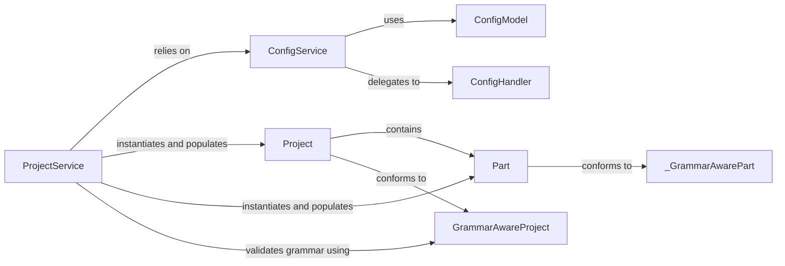

## Details

The craft-application project is structured around a core set of services and models that manage project configuration, definition, and lifecycle. The Application class acts as the entry point, orchestrating various services like ProjectService and ConfigService. ProjectService is responsible for loading, parsing, and validating project definitions, transforming raw YAML data into structured Project models. It interacts with grammar validation mechanisms to ensure project integrity. ConfigService provides a centralized way to access application-wide configurations, delegating to various ConfigHandler implementations to retrieve settings from different sources. The Project and ConfigModel define the data structures for project metadata and application configuration, respectively, ensuring data consistency and validation.

### ProjectService
Orchestrates the loading, parsing, validation, and rendering of project definitions. It encapsulates the business logic related to the project lifecycle, adapting raw project data into structured models. It acts as the primary interface for interacting with project configurations.

**Related Classes/Methods**:

- <a href="https://github.com/canonical/craft-application/blob/main/partitioncraft/services/project.py#L26-L38" target="_blank" rel="noopener noreferrer">`ProjectService`:26-38</a>

### ConfigService
Centralized service for managing and providing access to application configuration. It orchestrates various ConfigHandler instances to retrieve configuration values from different sources (e.g., environment variables, default values) based on a defined hierarchy.

**Related Classes/Methods**:

- <a href="https://github.com/canonical/craft-application/blob/main/craft_application/services/config.py#L148-L231" target="_blank" rel="noopener noreferrer">`ConfigService`:148-231</a>

### Project
Represents the high-level data model for a project, including its name, version, platforms, and references to its constituent parts and package repositories. It's the primary data structure for project metadata.

**Related Classes/Methods**:

- <a href="https://github.com/canonical/craft-application/blob/main/partitioncraft/services/package.py" target="_blank" rel="noopener noreferrer">`Project`</a>

### ConfigModel
Defines the schema and structure for application-wide configuration parameters (e.g., verbosity_level, debug, build_environment). It acts as a foundational data schema for configuration.

**Related Classes/Methods**:

- <a href="https://github.com/canonical/craft-application/blob/main/craft_application/application.py" target="_blank" rel="noopener noreferrer">`ConfigModel`</a>

### GrammarAwareProject
Defines the overall structure and rules for a project's build "grammar," including how individual parts are defined and validated within the build process. It provides static methods for validating the project's grammar.

**Related Classes/Methods**:

- <a href="https://github.com/canonical/craft-application/blob/main/craft_application/models/grammar.py#L81-L101" target="_blank" rel="noopener noreferrer">`GrammarAwareProject`:81-101</a>

### ConfigHandler
Provides a standardized interface for retrieving configuration values from a specific source. Subclasses implement the logic for different configuration origins (e.g., environment variables, snap configuration).

**Related Classes/Methods**:

- <a href="https://github.com/canonical/craft-application/blob/main/craft_application/services/config.py#L44-L57" target="_blank" rel="noopener noreferrer">`ConfigHandler`:44-57</a>

### Part
Represents a specific component or module within a project, as defined in the overall project model. It's a dictionary structure validated against craft_parts.validate_part.

**Related Classes/Methods**:

- <a href="https://github.com/canonical/craft-application/blob/main/craft_application/grammar.py#L51-L103" target="_blank" rel="noopener noreferrer">`Part`:51-103</a>

### _GrammarAwarePart
Defines the schema and properties for individual "parts" within the project's build grammar, detailing aspects like source, build steps, and file organization. It's a conceptual component related to how grammar is applied to parts.

**Related Classes/Methods**:

- <a href="https://github.com/canonical/craft-application/blob/main/craft_application/models/grammar.py#L38-L70" target="_blank" rel="noopener noreferrer">`_GrammarAwarePart`:38-70</a>

### [FAQ](https://github.com/CodeBoarding/GeneratedOnBoardings/tree/main?tab=readme-ov-file#faq)