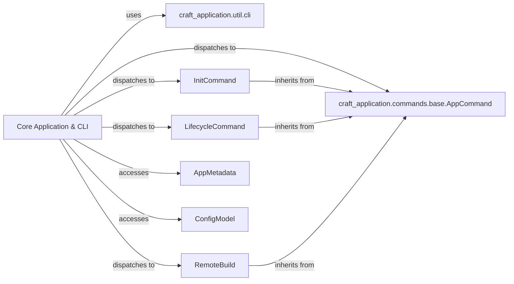

## Details

The `Core Application & CLI` subsystem forms the foundational layer of the `craft-application` SDK, providing the primary interface for user interaction and orchestrating the application's core functionalities.

### Core Application & CLI [[Expand]](./Core_Application_CLI.md)
The main entry point and orchestrator of the SDK. It parses command-line arguments, manages the application's lifecycle, loads plugins, and dispatches commands. It embodies the core application logic and its command-line interface.

**Related Classes/Methods**:

- <a href="https://github.com/canonical/craft-application/blob/main/craft_application/application.py#L117-L777" target="_blank" rel="noopener noreferrer">`craft_application.application.Application`:117-777</a>

### craft_application.util.cli
Provides essential utility functions for parsing command-line arguments and handling general CLI interactions, abstracting the underlying argument parsing mechanism.

**Related Classes/Methods**:

- <a href="https://github.com/canonical/craft-application/blob/main/craft_application/util/cli.py" target="_blank" rel="noopener noreferrer">`craft_application.util.cli`</a>

### craft_application.commands.base.AppCommand
An abstract base class that defines the common interface and structure for all executable commands within the SDK. Concrete commands inherit from this class.

**Related Classes/Methods**:

- <a href="https://github.com/canonical/craft-application/blob/main/craft_application/commands/base.py#L55-L129" target="_blank" rel="noopener noreferrer">`craft_application.commands.base.AppCommand`:55-129</a>

### InitCommand
A concrete command implementation responsible for initializing new projects or configurations within the SDK.

**Related Classes/Methods**:

- <a href="https://github.com/canonical/craft-application/blob/main/craft_application/commands/init.py#L33-L155" target="_blank" rel="noopener noreferrer">`craft_application.commands.init.InitCommand`:33-155</a>

### LifecycleCommand
A concrete command implementation focused on managing the various lifecycle stages of the application or project, such as building or deploying.

**Related Classes/Methods**:

- <a href="https://github.com/canonical/craft-application/blob/main/craft_application/commands/lifecycle.py#L118-L230" target="_blank" rel="noopener noreferrer">`craft_application.commands.lifecycle.LifecycleCommand`:118-230</a>

### RemoteBuild
A concrete command implementation specifically for initiating and managing remote build processes.

**Related Classes/Methods**:

- <a href="https://github.com/canonical/craft-application/blob/main/craft_application/commands/remote.py#L52-L238" target="_blank" rel="noopener noreferrer">`craft_application.commands.remote.RemoteBuild`:52-238</a>

### AppMetadata
A data model or component holding application-wide settings, version information, and other static metadata crucial for the SDK's operation.

**Related Classes/Methods**:

- <a href="https://github.com/canonical/craft-application/blob/main/craft_application/application.py#L67-L114" target="_blank" rel="noopener noreferrer">`craft_application.application.AppMetadata`:67-114</a>

### ConfigModel
A structured configuration model that defines and manages the application's dynamic settings and parameters.

**Related Classes/Methods**:

- <a href="https://github.com/canonical/craft-application/blob/main/craft_application/application.py" target="_blank" rel="noopener noreferrer">`craft_application.application.ConfigModel`</a>

### [FAQ](https://github.com/CodeBoarding/GeneratedOnBoardings/tree/main?tab=readme-ov-file#faq)