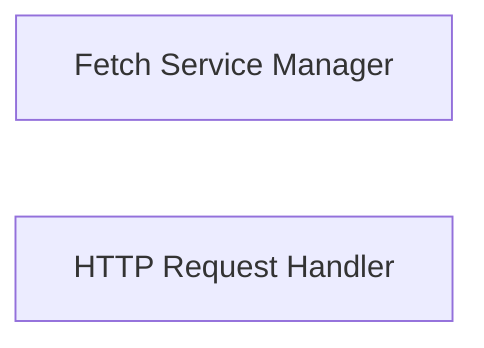

## Details

The `craft-application` project includes two distinct and independent service components: the `Fetch Service Manager` and the `HTTP Request Handler`. The `Fetch Service Manager` is dedicated to managing the lifecycle and interactions with an external "fetch" service, handling its operational status, communication, and configuration. Concurrently, the `HTTP Request Handler` provides a robust and generic interface for all standard HTTP operations, including file downloads, by leveraging the 'requests' library. These components operate autonomously, each fulfilling a specialized networking role within the application's architecture.

### Fetch Service Manager
This component is responsible for the complete lifecycle management of an external "fetch" service. Its duties include starting, stopping, and checking the operational status of the service, establishing and tearing down communication sessions, and managing necessary security certificates. It also handles the retrieval of service-specific configurations (e.g., gateway and network details) and verifies the service's installation. This component acts as a dedicated interface to an underlying "fetch" binary or service, providing the core capability for external resource fetching.

**Related Classes/Methods**:

- <a href="https://github.com/canonical/craft-application/blob/main/craft_application/fetch.py" target="_blank" rel="noopener noreferrer">`craft_application.fetch`</a>

### HTTP Request Handler
This component provides a comprehensive and generic interface for performing various HTTP operations (GET, POST, PUT, DELETE, HEAD, OPTIONS, PATCH). A key responsibility is handling file downloads, including support for chunked transfers and progress reporting, making it a versatile networking utility. It encapsulates the general network request capabilities, primarily utilizing the 'requests' library for its operations.

**Related Classes/Methods**:

- <a href="https://github.com/canonical/craft-application/blob/main/craft_application/services/request.py" target="_blank" rel="noopener noreferrer">`craft_application.services.request`</a>

### [FAQ](https://github.com/CodeBoarding/GeneratedOnBoardings/tree/main?tab=readme-ov-file#faq)