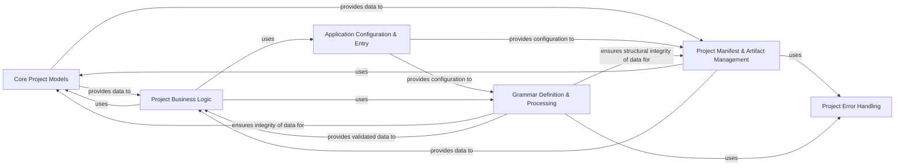

## Details

The `craft-application` project is structured around a clear separation of concerns, facilitating robust project management and execution. At its core, the Core Project Models define the fundamental data structures, providing a canonical representation of project entities. The Project Manifest & Artifact Management component builds upon these models, handling the serialization, deserialization, and lifecycle of project manifests and associated artifacts, crucial for build and session metadata. Grammar Definition & Processing ensures data integrity and transformation by defining and validating structural rules for project components. The Application Configuration & Entry component serves as the central orchestrator, managing global application settings and acting as the primary interface for high-level operations. The Project Business Logic component encapsulates the core operational workflows, leveraging data from the models and grammar to manage project lifecycles and processes. Finally, Project Error Handling provides a centralized mechanism for managing and reporting errors, ensuring application stability and consistent feedback.

### Core Project Models
Defines the fundamental data structures and constraints for a "project" within the `craft-application` ecosystem. This includes project types, names, titles, and how projects integrate with grammar definitions. It acts as the canonical source for project data definitions.

**Related Classes/Methods**:

- <a href="https://github.com/canonical/craft-application/blob/main/craft_application/models/project.py" target="_blank" rel="noopener noreferrer">`craft_application/models/project.py`</a>
- <a href="https://github.com/canonical/craft-application/blob/main/craft_application/launchpad/models/project.py" target="_blank" rel="noopener noreferrer">`craft_application/launchpad/models/project.py`</a>

### Project Manifest & Artifact Management
Manages the lifecycle and data of project manifests, including component identification, hashing (SHA1, SHA256), and serialization/deserialization of project artifacts. It serves as a central repository for project build and session metadata.

**Related Classes/Methods**:

- <a href="https://github.com/canonical/craft-application/blob/main/craft_application/models/manifest.py" target="_blank" rel="noopener noreferrer">`craft_application/models/manifest.py`</a>

### Grammar Definition & Processing
Defines, parses, and processes the structural rules (grammar) for project components and configurations. It handles the transformation and validation of data according to these defined rules.

**Related Classes/Methods**:

- <a href="https://github.com/canonical/craft-application/blob/main/craft_application/grammar.py" target="_blank" rel="noopener noreferrer">`craft_application/grammar.py`</a>

### Application Configuration & Entry
Manages the overall application configuration and potentially serves as a central orchestrator or entry point for high-level project operations. It manages the persistent application state related to configuration settings.

**Related Classes/Methods**:

- <a href="https://github.com/canonical/craft-application/blob/main/craft_application/application.py" target="_blank" rel="noopener noreferrer">`craft_application/application.py`</a>
- <a href="https://github.com/canonical/craft-application/blob/main/craft_application/_config.py" target="_blank" rel="noopener noreferrer">`craft_application/_config.py`</a>

### Project Business Logic
Handles the core business operations and logic of the project, operating on the data defined and managed by other components. This includes project lifecycle management, build processes, and state transitions.

**Related Classes/Methods**:

- <a href="https://github.com/canonical/craft-application/blob/main/craft_application/services/project.py" target="_blank" rel="noopener noreferrer">`craft_application/services/project.py`</a>
- <a href="https://github.com/canonical/craft-application/blob/main/craft_application/services/lifecycle.py" target="_blank" rel="noopener noreferrer">`craft_application/services/lifecycle.py`</a>

### Project Error Handling
Provides consistent error reporting and handling mechanisms across the project, particularly for data validation and processing failures. It defines custom exceptions and error structures to ensure robust application behavior.

**Related Classes/Methods**:

- <a href="https://github.com/canonical/craft-application/blob/main/craft_application/errors.py" target="_blank" rel="noopener noreferrer">`craft_application/errors.py`</a>

### [FAQ](https://github.com/CodeBoarding/GeneratedOnBoardings/tree/main?tab=readme-ov-file#faq)