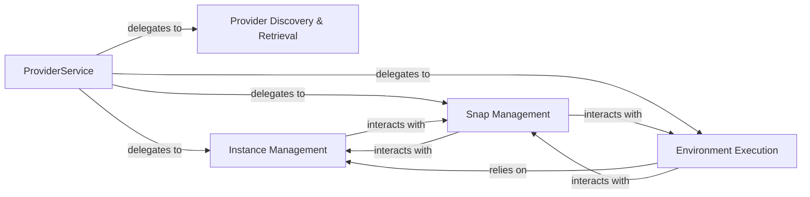

## Details

The `Execution Environment Manager` subsystem is responsible for abstracting and managing interactions with various underlying build environments, such as LXD and Multipass instances. Its scope encompasses environment setup, teardown, and providing the execution context for build processes, ensuring a consistent interface regardless of the specific backend.

### ProviderService
Serves as the primary entry point and facade for the `Execution Environment Manager`. It provides a high-level, consistent API for consumers to interact with different application providers, orchestrating operations, managing application-specific configurations, and delegating tasks to specialized internal components. This aligns with the Service Layer pattern, offering a clean interface for SDK users.

**Related Classes/Methods**:

- <a href="https://github.com/canonical/craft-application/blob/main/craft_application/services/provider.py#L58-L464" target="_blank" rel="noopener noreferrer">`craft_application.services.provider.ProviderService`:58-464</a>

### Provider Discovery & Retrieval
Abstracts the underlying environment types (e.g., LXD, Multipass) by identifying and retrieving the correct provider implementation based on configuration, snap information, or explicit naming. This component is crucial for ensuring the `Execution Environment Manager` can seamlessly work with diverse backends, embodying the modular design principle of an SDK.

**Related Classes/Methods**:

- <a href="https://github.com/canonical/craft-application/blob/main/craft_application/services/provider.py#L234-L279" target="_blank" rel="noopener noreferrer">`craft_application.services.provider.get_provider`:234-279</a>
- <a href="https://github.com/canonical/craft-application/blob/main/craft_application/services/provider.py#L281-L297" target="_blank" rel="noopener noreferrer">`craft_application.services.provider._get_provider_from_snap_config`:281-297</a>
- <a href="https://github.com/canonical/craft-application/blob/main/craft_application/services/provider.py#L333-L342" target="_blank" rel="noopener noreferrer">`craft_application.services.provider._get_provider_by_name`:333-342</a>
- <a href="https://github.com/canonical/craft-application/blob/main/craft_application/services/provider.py#L344-L347" target="_blank" rel="noopener noreferrer">`craft_application.services.provider._get_lxd_provider`:344-347</a>
- <a href="https://github.com/canonical/craft-application/blob/main/craft_application/services/provider.py#L349-L351" target="_blank" rel="noopener noreferrer">`craft_application.services.provider._get_multipass_provider`:349-351</a>

### Instance Management
Manages the complete lifecycle of individual provider instances. This includes provisioning new instances, configuring their execution environment (e.g., setting up bash profiles), identifying existing instances, capturing logs, and ensuring proper cleanup and teardown. This component provides the core operational capabilities for managing the execution environments.

**Related Classes/Methods**:

- <a href="https://github.com/canonical/craft-application/blob/main/craft_application/services/provider.py#L138-L194" target="_blank" rel="noopener noreferrer">`craft_application.services.provider.instance`:138-194</a>
- <a href="https://github.com/canonical/craft-application/blob/main/craft_application/services/provider.py#L385-L395" target="_blank" rel="noopener noreferrer">`craft_application.services.provider._clean_instance`:385-395</a>
- <a href="https://github.com/canonical/craft-application/blob/main/craft_application/services/provider.py#L368-L383" target="_blank" rel="noopener noreferrer">`craft_application.services.provider._setup_instance_bashrc`:368-383</a>
- <a href="https://github.com/canonical/craft-application/blob/main/craft_application/services/provider.py#L319-L331" target="_blank" rel="noopener noreferrer">`craft_application.services.provider._get_instance_name`:319-331</a>
- <a href="https://github.com/canonical/craft-application/blob/main/craft_application/services/provider.py#L353-L366" target="_blank" rel="noopener noreferrer">`craft_application.services.provider._capture_logs_from_instance`:353-366</a>

### Environment Execution
Provides the core capability to execute commands or applications within the context of a managed provider instance. It ensures that the execution environment is correctly prepared with necessary environment variables and configurations before running the desired command, abstracting the specifics of command execution across different providers. This is a fundamental utility for an SDK focused on environment interaction.

**Related Classes/Methods**:

- <a href="https://github.com/canonical/craft-application/blob/main/craft_application/services/provider.py#L410-L464" target="_blank" rel="noopener noreferrer">`craft_application.services.provider.run_managed`:410-464</a>

### Snap Management
Handles the installation, registration, and unregistration of "snaps" (pre-packaged applications or configurations) within the managed provider environments. This component extends the utility of the `Execution Environment Manager` by enabling the deployment of specific software components, showcasing the extensibility of the SDK.

**Related Classes/Methods**:

- <a href="https://github.com/canonical/craft-application/blob/main/craft_application/services/provider.py" target="_blank" rel="noopener noreferrer">`craft_application.services.provider.install_snap`</a>
- <a href="https://github.com/canonical/craft-application/blob/main/craft_application/services/provider.py#L397-L400" target="_blank" rel="noopener noreferrer">`craft_application.services.provider.register_snap`:397-400</a>
- <a href="https://github.com/canonical/craft-application/blob/main/craft_application/services/provider.py#L402-L408" target="_blank" rel="noopener noreferrer">`craft_application.services.provider.unregister_snap`:402-408</a>

### [FAQ](https://github.com/CodeBoarding/GeneratedOnBoardings/tree/main?tab=readme-ov-file#faq)