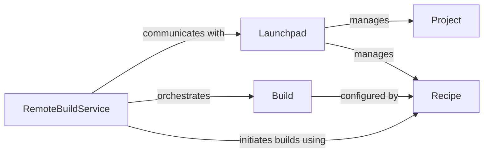

## Details

The `craft-application`'s remote build subsystem is centered around the `RemoteBuildService`, which acts as the primary orchestrator for the entire remote build lifecycle. This service communicates with the `Launchpad` component, a high-level client for the external Launchpad API, to manage `Project` and `Recipe` entities. `Recipe` components define the specific configurations for building artifacts, which the `RemoteBuildService` uses to initiate and manage `Build` instances. Each `Build` represents a remote build execution, whose state and progress are monitored by the `RemoteBuildService`. This architecture ensures a clear separation of concerns, with models (`Project`, `Recipe`, `Build`) encapsulating data, `Launchpad` handling external API interactions, and `RemoteBuildService` orchestrating the core business logic of remote builds.

### RemoteBuildService
This component acts as the primary orchestrator for the remote build lifecycle. It manages the entire process from setting up projects and repositories to initiating, monitoring, and retrieving artifacts and logs for builds. It embodies the "Service Layer" pattern, providing a high-level interface for remote build operations.

**Related Classes/Methods**:

- <a href="https://github.com/canonical/craft-application/blob/main/craft_application/services/remotebuild.py#L52-L407" target="_blank" rel="noopener noreferrer">`RemoteBuildService`:52-407</a>

### Launchpad
Serves as the high-level client for the Launchpad API. It provides an abstraction layer for interacting with the remote platform's project, recipe, and repository management functionalities. This component represents the "API/Interfaces" aspect, handling communication with the external service.

**Related Classes/Methods**:

- <a href="https://github.com/canonical/craft-application/blob/main/craft_application/launchpad/launchpad.py" target="_blank" rel="noopener noreferrer">`Launchpad`</a>

### Build
A "Model" component representing a remote build instance. It encapsulates the build's state, progress, and provides access to associated logs and artifacts. This component holds the data structure for a remote build.

**Related Classes/Methods**:

- <a href="https://github.com/canonical/craft-application/blob/main/craft_application/commands/lifecycle.py" target="_blank" rel="noopener noreferrer">`Build`</a>

### Project
A "Model" component that defines a project entity on the Launchpad platform, including its metadata and relationships. It encapsulates project-specific data.

**Related Classes/Methods**:

- <a href="https://github.com/canonical/craft-application/blob/main/partitioncraft/services/package.py" target="_blank" rel="noopener noreferrer">`Project`</a>

### Recipe
A "Model" component defining the configuration and instructions for building a specific type of artifact (e.g., Snap, Charm, Rock). It is crucial for initiating builds based on these definitions.

**Related Classes/Methods**:

- <a href="https://github.com/canonical/craft-application/blob/main/craft_application/launchpad/launchpad.py#L139-L175" target="_blank" rel="noopener noreferrer">`Recipe`:139-175</a>

### [FAQ](https://github.com/CodeBoarding/GeneratedOnBoardings/tree/main?tab=readme-ov-file#faq)