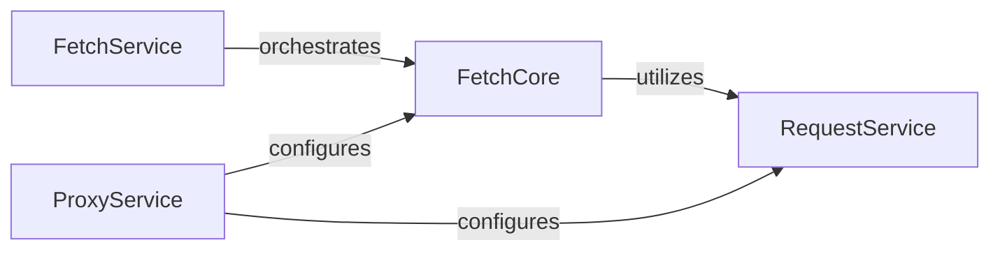

## Details

The `Resource Fetching & Proxy` subsystem is responsible for managing the secure and efficient fetching of external resources, including handling proxy configurations, HTTP session management, and download processes for various external dependencies. Its core functionalities are encapsulated within the `craft_application.fetch`, `craft_application.services.fetch`, `craft_application.services.request`, and `craft_application.services.proxy` modules.

### FetchCore
Acts as the foundational client for remote fetching services. It manages the lifecycle of the fetching service (start, stop, status), handles raw network requests, manages HTTP sessions, and obtains necessary security certificates. It provides the low-level primitives for network communication, essential for an SDK's core networking capabilities.

**Related Classes/Methods**:

- <a href="https://github.com/canonical/craft-application/blob/main/craft_application/fetch.py" target="_blank" rel="noopener noreferrer">`craft_application.fetch`</a>

### FetchService
Offers a higher-level, abstract interface for fetching operations. It orchestrates the functionalities provided by `FetchCore`, manages session policies, and facilitates the creation of project manifests related to fetched resources. This component provides a more user-friendly API for common fetching tasks, abstracting away low-level details for SDK consumers.

**Related Classes/Methods**:

- <a href="https://github.com/canonical/craft-application/blob/main/craft_application/services/fetch.py#L57-L302" target="_blank" rel="noopener noreferrer">`craft_application.services.fetch.FetchService`:57-302</a>

### RequestService
A general-purpose utility for performing various HTTP requests (GET, POST, PUT, DELETE, etc.) and managing file downloads, including progress tracking. It provides robust and reusable network communication primitives that can be leveraged by other components, serving as a core utility for any network-dependent part of the SDK.

**Related Classes/Methods**:

- <a href="https://github.com/canonical/craft-application/blob/main/craft_application/services/request.py#L36-L113" target="_blank" rel="noopener noreferrer">`craft_application.services.request.RequestService`:36-113</a>

### ProxyService
Manages and configures proxy settings across different system components (e.g., pip, snapd, apt) and handles the installation of necessary proxy certificates. It ensures that all network operations within the SDK can correctly function in proxied environments, providing essential environmental setup and configuration for robust SDK operation in diverse network conditions.

**Related Classes/Methods**:

- <a href="https://github.com/canonical/craft-application/blob/main/craft_application/services/proxy.py#L36-L177" target="_blank" rel="noopener noreferrer">`craft_application.services.proxy.ProxyService`:36-177</a>

### [FAQ](https://github.com/CodeBoarding/GeneratedOnBoardings/tree/main?tab=readme-ov-file#faq)