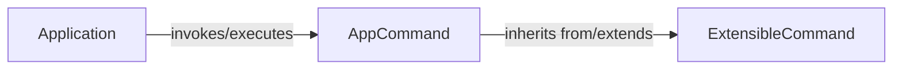

## Details

The User Interface (CLI) subsystem manages the command-line interface, from application initialization and argument parsing to command discovery and execution. It is defined by the Application, AppCommand, and ExtensibleCommand components, which are fundamental for defining and managing the CLI for an SDK, ensuring consistency, extensibility, and modularity.

### Application
Acts as the central orchestrator and primary entry point for the command-line interface. It is responsible for initializing the application context, discovering available commands (instances of AppCommand), parsing command-line arguments, and dispatching execution to the appropriate command based on user input. It manages the overall lifecycle of a CLI invocation. This component serves as the main interface for users to interact with the SDK's functionalities via the command line, providing a consistent and predictable entry point.

**Related Classes/Methods**:

- <a href="https://github.com/canonical/craft-application/blob/main/craft_application/application.py#L117-L777" target="_blank" rel="noopener noreferrer">`craft_application.application.Application`:117-777</a>

### AppCommand
Defines the abstract interface and common behavior for all application-specific commands within the SDK. It provides a standardized structure for command implementation, including methods for defining arguments, parsing them, validating input, and encapsulating the core execution logic for a particular command. Concrete commands within the SDK will inherit from this class. This component is crucial for the SDK's extensibility, providing a clear contract (API) for developers to add new commands, ensuring consistency across the CLI.

**Related Classes/Methods**:

- <a href="https://github.com/canonical/craft-application/blob/main/craft_application/commands/base.py#L55-L129" target="_blank" rel="noopener noreferrer">`craft_application.commands.base.AppCommand`:55-129</a>

### ExtensibleCommand
Provides a foundational layer for creating commands that can be extended or customized. This class likely includes mechanisms for adding sub-commands, defining hooks (e.g., pre-execution, post-execution), or integrating with a plugin system. It enables dynamic command behavior and promotes modularity by allowing developers to extend CLI functionality without modifying core command logic. Directly supports the SDK's architectural bias towards extensibility and modularity, allowing for a rich and customizable command-line experience.

**Related Classes/Methods**:

- <a href="https://github.com/canonical/craft-application/blob/main/craft_application/commands/base.py#L132-L205" target="_blank" rel="noopener noreferrer">`craft_application.commands.base.ExtensibleCommand`:132-205</a>

### [FAQ](https://github.com/CodeBoarding/GeneratedOnBoardings/tree/main?tab=readme-ov-file#faq)