```mermaid
graph LR
    User_Interface_CLI_["User Interface (CLI)"]
    Application_Orchestration["Application Orchestration"]
    Core_Business_Logic["Core Business Logic"]
    Build_Deployment_Management["Build & Deployment Management"]
    Data_State_Management["Data & State Management"]
    User_External_["User (External)"]
    Launchpad_Platform_External_["Launchpad Platform (External)"]
    Git_Repositories_External_["Git Repositories (External)"]
    User_External_ -- "initiates commands to" --> User_Interface_CLI_
    User_Interface_CLI_ -- "dispatches commands for execution to" --> Application_Orchestration
    Application_Orchestration -- "initializes and accesses services from" --> Core_Business_Logic
    Core_Business_Logic -- "orchestrates operations with" --> Build_Deployment_Management
    Core_Business_Logic -- "retrieves and updates application state and configuration from" --> Data_State_Management
    Build_Deployment_Management -- "utilizes data models from" --> Data_State_Management
    Build_Deployment_Management -- "communicates with" --> Launchpad_Platform_External_
    Build_Deployment_Management -- "performs Git operations on" --> Git_Repositories_External_
    Data_State_Management -- "provides application state and configuration to" --> Application_Orchestration
    Data_State_Management -- "provides data models and configuration to" --> Core_Business_Logic
    click User_Interface_CLI_ href "https://github.com/CodeBoarding/GeneratedOnBoardings/blob/main/craft-application/User_Interface_CLI_.md" "Details"
    click Application_Orchestration href "https://github.com/CodeBoarding/GeneratedOnBoardings/blob/main/craft-application/Application_Orchestration.md" "Details"
    click Core_Business_Logic href "https://github.com/CodeBoarding/GeneratedOnBoardings/blob/main/craft-application/Core_Business_Logic.md" "Details"
    click Build_Deployment_Management href "https://github.com/CodeBoarding/GeneratedOnBoardings/blob/main/craft-application/Build_Deployment_Management.md" "Details"
    click Data_State_Management href "https://github.com/CodeBoarding/GeneratedOnBoardings/blob/main/craft-application/Data_State_Management.md" "Details"
```

## Details

The `craft-application` project is structured around a core `Application Orchestration` component that manages the application's lifecycle and command dispatch. User interaction is primarily handled by the `User Interface (CLI)`. The `Core Business Logic` component provides the main operational capabilities, interacting with `Data & State Management` for configuration and project definitions. `Build & Deployment Management` handles the build process, leveraging data models and interacting with external platforms like `Launchpad Platform (External)` and `Git Repositories (External)`. The system is designed to allow external `User (External)` interaction, initiating workflows through the CLI.

### User Interface (CLI) [[Expand]](./User_Interface_CLI_.md)
Handles user interactions via the command line, parsing arguments, and initiating application workflows.

**Related Classes/Methods**:

- <a href="https://github.com/canonical/craft-application/blob/main/craft_application/commands/base.py#L55-L129" target="_blank" rel="noopener noreferrer">`AppCommand`:55-129</a>
- <a href="https://github.com/canonical/craft-application/blob/main/craft_application/commands/base.py#L132-L205" target="_blank" rel="noopener noreferrer">`ExtensibleCommand`:132-205</a>
- <a href="https://github.com/canonical/craft-application/blob/main/craft_application/application.py#L117-L777" target="_blank" rel="noopener noreferrer">`Application`:117-777</a>

### Application Orchestration [[Expand]](./Application_Orchestration.md)
The central orchestrator of the SDK, managing the overall application lifecycle, configuration, and command dispatching. It acts as the primary entry point and coordinator.

**Related Classes/Methods**:

- <a href="https://github.com/canonical/craft-application/blob/main/craft_application/application.py" target="_blank" rel="noopener noreferrer">`Application:run`</a>
- <a href="https://github.com/canonical/craft-application/blob/main/craft_application/application.py" target="_blank" rel="noopener noreferrer">`Application:_get_dispatcher`</a>
- <a href="https://github.com/canonical/craft-application/blob/main/craft_application/application.py" target="_blank" rel="noopener noreferrer">`Application:_run_inner`</a>

### Core Business Logic [[Expand]](./Core_Business_Logic.md)
Provides the primary business logic and operational capabilities, acting as a facade for specialized services including external resource fetching and general network requests.

**Related Classes/Methods**:

- <a href="https://github.com/canonical/craft-application/blob/main/craft_application/fetch.py" target="_blank" rel="noopener noreferrer">`craft_application.fetch`</a>
- <a href="https://github.com/canonical/craft-application/blob/main/craft_application/services/request.py" target="_blank" rel="noopener noreferrer">`craft_application.services.request`</a>

### Build & Deployment Management [[Expand]](./Build_Deployment_Management.md)
Manages project configurations, generates build plans, oversees the entire build lifecycle (local and remote), and interfaces with various build environments and external code repositories.

**Related Classes/Methods**:

- <a href="https://github.com/canonical/craft-application/blob/main/craft_application/services/buildplan.py" target="_blank" rel="noopener noreferrer">`craft_application.services.buildplan`</a>
- <a href="https://github.com/canonical/craft-application/blob/main/craft_application/services/lifecycle.py" target="_blank" rel="noopener noreferrer">`craft_application.services.lifecycle`</a>
- <a href="https://github.com/canonical/craft-application/blob/main/craft_application/launchpad/launchpad.py" target="_blank" rel="noopener noreferrer">`craft_application.launchpad.launchpad`</a>
- <a href="https://github.com/canonical/craft-application/blob/main/craft_application/remote/git.py" target="_blank" rel="noopener noreferrer">`craft_application.remote.git`</a>

### Data & State Management [[Expand]](./Data_State_Management.md)
Defines the structure and validation rules for all application data, including project definitions, manifests, and grammar, and manages persistent application state and configuration settings.

**Related Classes/Methods**:

- <a href="https://github.com/canonical/craft-application/blob/main/partitioncraft/services/package.py" target="_blank" rel="noopener noreferrer">`Project`</a>
- <a href="https://github.com/canonical/craft-application/blob/main/craft_application/application.py" target="_blank" rel="noopener noreferrer">`ConfigModel`</a>
- <a href="https://github.com/canonical/craft-application/blob/main/craft_application/models/manifest.py" target="_blank" rel="noopener noreferrer">`craft_application.models.manifest`</a>
- <a href="https://github.com/canonical/craft-application/blob/main/craft_application/grammar.py" target="_blank" rel="noopener noreferrer">`craft_application.grammar`</a>

### User (External)
Represents an external user interacting with the system.

**Related Classes/Methods**: _None_

### Launchpad Platform (External)
An external platform for remote build orchestration.

**Related Classes/Methods**: _None_

### Git Repositories (External)
External repositories for source code management.

**Related Classes/Methods**: _None_

### [FAQ](https://github.com/CodeBoarding/GeneratedOnBoardings/tree/main?tab=readme-ov-file#faq)