```mermaid
graph LR
    Core_Application_CLI["Core Application & CLI"]
    Configuration_Project_Management["Configuration & Project Management"]
    Build_Packaging_Engine["Build & Packaging Engine"]
    Execution_Environment_Manager["Execution Environment Manager"]
    Remote_Services_Artifacts["Remote Services & Artifacts"]
    Resource_Fetching_Proxy["Resource Fetching & Proxy"]
    Application_State_Persistence["Application State & Persistence"]
    Core_Application_CLI -- "configures and loads project data" --> Configuration_Project_Management
    Core_Application_CLI -- "initiates and monitors build processes" --> Build_Packaging_Engine
    Core_Application_CLI -- "requests and manages build environments" --> Execution_Environment_Manager
    Core_Application_CLI -- "triggers and manages remote builds" --> Remote_Services_Artifacts
    Core_Application_CLI -- "configures and uses for external resource access" --> Resource_Fetching_Proxy
    Core_Application_CLI -- "persists and retrieves application state" --> Application_State_Persistence
    Configuration_Project_Management -- "provides project definition and build plan" --> Build_Packaging_Engine
    Configuration_Project_Management -- "provides project-specific environment details" --> Execution_Environment_Manager
    Configuration_Project_Management -- "provides project information for remote build configuration" --> Remote_Services_Artifacts
    Build_Packaging_Engine -- "requests and utilizes build instances for execution" --> Execution_Environment_Manager
    Build_Packaging_Engine -- "uses for fetching source code and external dependencies" --> Resource_Fetching_Proxy
    Build_Packaging_Engine -- "stores and retrieves build-related state" --> Application_State_Persistence
    Build_Packaging_Engine -- "can trigger remote builds as part of the overall lifecycle" --> Remote_Services_Artifacts
    Execution_Environment_Manager -- "may use to fetch resources required for environment setup" --> Resource_Fetching_Proxy
    Remote_Services_Artifacts -- "uses to download build logs and artifacts from external services" --> Resource_Fetching_Proxy
    Remote_Services_Artifacts -- "stores remote build IDs and their current status" --> Application_State_Persistence
    Resource_Fetching_Proxy -- "stores session data and manifest information related to fetched resources" --> Application_State_Persistence
    click Core_Application_CLI href "https://github.com/CodeBoarding/GeneratedOnBoardings/blob/main/craft-application/Core_Application_CLI.md" "Details"
    click Configuration_Project_Management href "https://github.com/CodeBoarding/GeneratedOnBoardings/blob/main/craft-application/Configuration_Project_Management.md" "Details"
    click Build_Packaging_Engine href "https://github.com/CodeBoarding/GeneratedOnBoardings/blob/main/craft-application/Build_Packaging_Engine.md" "Details"
    click Execution_Environment_Manager href "https://github.com/CodeBoarding/GeneratedOnBoardings/blob/main/craft-application/Execution_Environment_Manager.md" "Details"
    click Remote_Services_Artifacts href "https://github.com/CodeBoarding/GeneratedOnBoardings/blob/main/craft-application/Remote_Services_Artifacts.md" "Details"
    click Resource_Fetching_Proxy href "https://github.com/CodeBoarding/GeneratedOnBoardings/blob/main/craft-application/Resource_Fetching_Proxy.md" "Details"
    click Application_State_Persistence href "https://github.com/CodeBoarding/GeneratedOnBoardings/blob/main/craft-application/Application_State_Persistence.md" "Details"
```

## Details

The `craft-application` project is structured around a core command-line interface and application logic, which orchestrates interactions with several specialized service components. The `Core Application & CLI` acts as the central hub, processing user commands and delegating tasks to components like `Configuration & Project Management` for loading project settings, `Build & Packaging Engine` for managing the build lifecycle, `Execution Environment Manager` for handling build environments, `Remote Services & Artifacts` for external build interactions, `Resource Fetching & Proxy` for secure resource retrieval, and `Application State & Persistence` for maintaining application state. This modular design promotes clear separation of concerns, enabling efficient data flow and maintainable interactions between distinct functional units.

### Core Application & CLI [[Expand]](./Core_Application_CLI.md)
The central entry point for the SDK, responsible for parsing command-line arguments, dispatching commands, and orchestrating the overall application flow. It acts as the primary interface for users interacting with the SDK.

**Related Classes/Methods**:

- <a href="https://github.com/canonical/craft-application/blob/main/craft_application/application.py" target="_blank" rel="noopener noreferrer">`craft_application.application`</a>
- <a href="https://github.com/canonical/craft-application/blob/main/craft_application/util/cli.py" target="_blank" rel="noopener noreferrer">`craft_application.util.cli`</a>
- <a href="https://github.com/canonical/craft-application/blob/main/craft_application/commands/base.py" target="_blank" rel="noopener noreferrer">`craft_application.commands.base`</a>
- <a href="https://github.com/canonical/craft-application/blob/main/craft_application/commands/init.py" target="_blank" rel="noopener noreferrer">`craft_application.commands.init`</a>
- <a href="https://github.com/canonical/craft-application/blob/main/craft_application/commands/lifecycle.py" target="_blank" rel="noopener noreferrer">`craft_application.commands.lifecycle`</a>
- <a href="https://github.com/canonical/craft-application/blob/main/craft_application/commands/remote.py" target="_blank" rel="noopener noreferrer">`craft_application.commands.remote`</a>

### Configuration & Project Management [[Expand]](./Configuration_Project_Management.md)
Manages the loading, validation, and structured access to project-specific configurations (e.g., craft.yaml) and general SDK settings. It defines the core project models and grammar.

**Related Classes/Methods**:

- <a href="https://github.com/canonical/craft-application/blob/main/craft_application/services/project.py" target="_blank" rel="noopener noreferrer">`craft_application.services.project`</a>
- <a href="https://github.com/canonical/craft-application/blob/main/craft_application/services/config.py" target="_blank" rel="noopener noreferrer">`craft_application.services.config`</a>
- <a href="https://github.com/canonical/craft-application/blob/main/craft_application/models/project.py" target="_blank" rel="noopener noreferrer">`craft_application.models.project`</a>
- <a href="https://github.com/canonical/craft-application/blob/main/craft_application/models/grammar.py" target="_blank" rel="noopener noreferrer">`craft_application.models.grammar`</a>
- <a href="https://github.com/canonical/craft-application/blob/main/craft_application/_config.py" target="_blank" rel="noopener noreferrer">`craft_application._config`</a>

### Build & Packaging Engine [[Expand]](./Build_Packaging_Engine.md)
Orchestrates the complete build lifecycle, encompassing stages from source code retrieval and compilation to staging, priming, and final package creation. It manages the build plan and execution flow.

**Related Classes/Methods**:

- <a href="https://github.com/canonical/craft-application/blob/main/craft_application/services/lifecycle.py" target="_blank" rel="noopener noreferrer">`craft_application.services.lifecycle`</a>
- <a href="https://github.com/canonical/craft-application/blob/main/craft_application/services/package.py" target="_blank" rel="noopener noreferrer">`craft_application.services.package`</a>
- <a href="https://github.com/canonical/craft-application/blob/main/craft_application/services/buildplan.py" target="_blank" rel="noopener noreferrer">`craft_application.services.buildplan`</a>

### Execution Environment Manager [[Expand]](./Execution_Environment_Manager.md)
Abstracts and manages interactions with various underlying build environments (e.g., LXD, Multipass instances). It handles environment setup, teardown, and provides the execution context for build processes.

**Related Classes/Methods**:

- <a href="https://github.com/canonical/craft-application/blob/main/craft_application/services/provider.py" target="_blank" rel="noopener noreferrer">`craft_application.services.provider`</a>

### Remote Services & Artifacts [[Expand]](./Remote_Services_Artifacts.md)
Facilitates interaction with external build services (e.g., Launchpad) for initiating and monitoring remote builds, and retrieving build artifacts and logs. It also manages remote worktrees and Git repository interactions.

**Related Classes/Methods**:

- <a href="https://github.com/canonical/craft-application/blob/main/craft_application/services/remotebuild.py" target="_blank" rel="noopener noreferrer">`craft_application.services.remotebuild`</a>
- <a href="https://github.com/canonical/craft-application/blob/main/craft_application/launchpad/launchpad.py" target="_blank" rel="noopener noreferrer">`craft_application.launchpad.launchpad`</a>
- <a href="https://github.com/canonical/craft-application/blob/main/craft_application/launchpad/models/build.py" target="_blank" rel="noopener noreferrer">`craft_application.launchpad.models.build`</a>
- <a href="https://github.com/canonical/craft-application/blob/main/craft_application/launchpad/models/project.py" target="_blank" rel="noopener noreferrer">`craft_application.launchpad.models.project`</a>
- <a href="https://github.com/canonical/craft-application/blob/main/craft_application/launchpad/models/recipe.py" target="_blank" rel="noopener noreferrer">`craft_application.launchpad.models.recipe`</a>
- <a href="https://github.com/canonical/craft-application/blob/main/craft_application/remote/worktree.py" target="_blank" rel="noopener noreferrer">`craft_application.remote.worktree`</a>
- <a href="https://github.com/canonical/craft-application/blob/main/craft_application/git/_git_repo.py" target="_blank" rel="noopener noreferrer">`craft_application.git._git_repo`</a>

### Resource Fetching & Proxy [[Expand]](./Resource_Fetching_Proxy.md)
Manages the secure and efficient fetching of external resources, including handling proxy configurations, HTTP session management, and download processes for various external dependencies.

**Related Classes/Methods**:

- <a href="https://github.com/canonical/craft-application/blob/main/craft_application/services/fetch.py" target="_blank" rel="noopener noreferrer">`craft_application.services.fetch`</a>
- <a href="https://github.com/canonical/craft-application/blob/main/craft_application/services/request.py" target="_blank" rel="noopener noreferrer">`craft_application.services.request`</a>
- <a href="https://github.com/canonical/craft-application/blob/main/craft_application/services/proxy.py" target="_blank" rel="noopener noreferrer">`craft_application.services.proxy`</a>
- <a href="https://github.com/canonical/craft-application/blob/main/craft_application/fetch.py" target="_blank" rel="noopener noreferrer">`craft_application.fetch`</a>

### Application State & Persistence [[Expand]](./Application_State_Persistence.md)
Provides mechanisms for persisting and retrieving application-specific state data across different runs or sessions, ensuring data continuity and consistency.

**Related Classes/Methods**:

- <a href="https://github.com/canonical/craft-application/blob/main/craft_application/services/state.py" target="_blank" rel="noopener noreferrer">`craft_application.services.state`</a>

### [FAQ](https://github.com/CodeBoarding/GeneratedOnBoardings/tree/main?tab=readme-ov-file#faq)