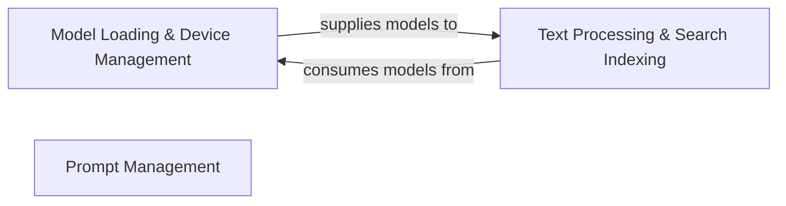

## Details

The AI/LLM Integration Services subsystem is a critical part of crawl4ai, focusing on the integration and management of Large Language Models (LLMs) and embedding models. It provides the foundational capabilities for semantic analysis and advanced content processing, aligning with the project's "LLM Integration Adapters" architectural pattern.

### Model Loading & Device Management
This component is responsible for the dynamic loading of diverse AI/LLM and embedding models (e.g., BERT, Hugging Face models). It intelligently optimizes model performance by calculating appropriate batch sizes and efficiently assigning models to suitable computational devices (CPU/GPU). Furthermore, it orchestrates the downloading of necessary model assets and associated data, such as NLTK data.

**Related Classes/Methods**:

- <a href="https://github.com/unclecode/crawl4ai/blob/main/crawl4ai/model_loader.py" target="_blank" rel="noopener noreferrer">`crawl4ai.model_loader`</a>

### Text Processing & Search Indexing
This component performs comprehensive preprocessing of raw text data, including tokenization and caching. It is responsible for building and maintaining efficient search indexes (e.g., using BM25 for relevance scoring) and executing semantic searches against the indexed content. Its core function is to ensure textual data is prepared for efficient retrieval and analysis, often leveraging embedding models for semantic understanding.

**Related Classes/Methods**:

- <a href="https://github.com/unclecode/crawl4ai/blob/main/crawl4ai/legacy/llmtxt.py" target="_blank" rel="noopener noreferrer">`crawl4ai.legacy.llmtxt`</a>

### Prompt Management
This component acts as a centralized repository for configurable and reusable prompt templates. It provides structured prompts designed for various tasks involving Large Language Models, ensuring consistency, reusability, and maintainability across different LLM interactions within the system.

**Related Classes/Methods**:

- <a href="https://github.com/unclecode/crawl4ai/blob/main/crawl4ai/prompts.py" target="_blank" rel="noopener noreferrer">`crawl4ai.prompts`</a>

### [FAQ](https://github.com/CodeBoarding/GeneratedOnBoardings/tree/main?tab=readme-ov-file#faq)