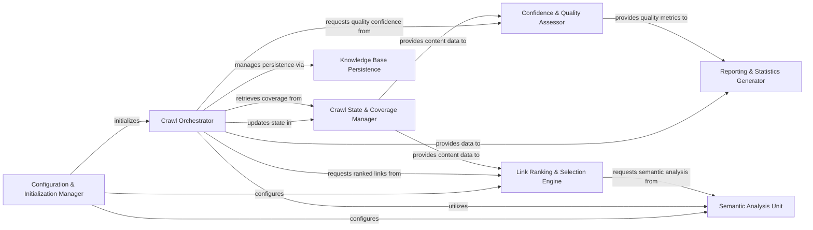

## Details

The AdaptiveCrawler subsystem is designed around a central Crawl Orchestrator that manages an iterative, adaptive crawling process. The Configuration & Initialization Manager sets up the system, including the Crawl Orchestrator and its key dependencies. During execution, the Crawl Orchestrator continuously interacts with the Crawl State & Coverage Manager to update and retrieve the current crawl state and coverage metrics. For intelligent link prioritization, the Crawl Orchestrator requests ranked links from the Link Ranking & Selection Engine, which in turn leverages the Crawl State & Coverage Manager for content data and the Semantic Analysis Unit for deep semantic understanding. The Semantic Analysis Unit is also directly utilized by the Crawl Orchestrator for mapping queries. To assess the quality and completeness of the crawl, the Crawl Orchestrator queries the Confidence & Quality Assessor, which relies on the Crawl State & Coverage Manager for raw content data. All crawl results and learned knowledge are managed for persistence by the Knowledge Base Persistence component, orchestrated by the Crawl Orchestrator. Finally, the Reporting & Statistics Generator provides insights into the crawl's performance, receiving data from both the Crawl Orchestrator and the Confidence & Quality Assessor.

### Crawl Orchestrator
Orchestrates the entire adaptive crawling process, managing the flow between different stages, including batch processing, state updates, and stopping conditions. This acts as the central control for the adaptive loop.

**Related Classes/Methods**:

- <a href="https://github.com/unclecode/crawl4ai/blob/main/crawl4ai/adaptive_crawler.py" target="_blank" rel="noopener noreferrer">`crawl4ai.adaptive_crawler.AdaptiveCrawler.digest`</a>
- <a href="https://github.com/unclecode/crawl4ai/blob/main/crawl4ai/adaptive_crawler.py" target="_blank" rel="noopener noreferrer">`crawl4ai.adaptive_crawler.AdaptiveCrawler._crawl_batch`</a>
- <a href="https://github.com/unclecode/crawl4ai/blob/main/crawl4ai/adaptive_crawler.py" target="_blank" rel="noopener noreferrer">`crawl4ai.adaptive_crawler.AdaptiveCrawler._crawl_with_preview`</a>
- <a href="https://github.com/unclecode/crawl4ai/blob/main/crawl4ai/adaptive_crawler.py" target="_blank" rel="noopener noreferrer">`crawl4ai.adaptive_crawler.AdaptiveCrawler.should_stop`</a>

### Configuration & Initialization Manager
Manages the setup and validation of adaptive strategies for the crawler.

**Related Classes/Methods**:

- <a href="https://github.com/unclecode/crawl4ai/blob/main/crawl4ai/adaptive_crawler.py" target="_blank" rel="noopener noreferrer">`crawl4ai.adaptive_crawler.AdaptiveCrawler.__init__`</a>
- <a href="https://github.com/unclecode/crawl4ai/blob/main/crawl4ai/adaptive_crawler.py" target="_blank" rel="noopener noreferrer">`crawl4ai.adaptive_crawler.AdaptiveCrawler._create_strategy`</a>

### Crawl State & Coverage Manager
Updates and maintains the internal state of the crawler, including tokenizing content and computing the shape of the coverage achieved.

**Related Classes/Methods**:

- <a href="https://github.com/unclecode/crawl4ai/blob/main/crawl4ai/adaptive_crawler.py" target="_blank" rel="noopener noreferrer">`crawl4ai.adaptive_crawler.AdaptiveCrawler.update_state`</a>
- <a href="https://github.com/unclecode/crawl4ai/blob/main/crawl4ai/adaptive_crawler.py" target="_blank" rel="noopener noreferrer">`crawl4ai.adaptive_crawler.AdaptiveCrawler._tokenize`</a>
- <a href="https://github.com/unclecode/crawl4ai/blob/main/crawl4ai/adaptive_crawler.py" target="_blank" rel="noopener noreferrer">`crawl4ai.adaptive_crawler.AdaptiveCrawler.compute_coverage_shape`</a>

### Confidence & Quality Assessor
Calculates various confidence metrics (consistency, saturation, coverage) to assess the quality and completeness of the crawled data, crucial for adaptive adjustments.

**Related Classes/Methods**:

- <a href="https://github.com/unclecode/crawl4ai/blob/main/crawl4ai/adaptive_crawler.py" target="_blank" rel="noopener noreferrer">`crawl4ai.adaptive_crawler.AdaptiveCrawler.calculate_confidence`</a>
- <a href="https://github.com/unclecode/crawl4ai/blob/main/crawl4ai/adaptive_crawler.py" target="_blank" rel="noopener noreferrer">`crawl4ai.adaptive_crawler.AdaptiveCrawler._calculate_consistency`</a>
- <a href="https://github.com/unclecode/crawl4ai/blob/main/crawl4ai/adaptive_crawler.py" target="_blank" rel="noopener noreferrer">`crawl4ai.adaptive_crawler.AdaptiveCrawler._calculate_saturation`</a>
- <a href="https://github.com/unclecode/crawl4ai/blob/main/crawl4ai/adaptive_crawler.py" target="_blank" rel="noopener noreferrer">`crawl4ai.adaptive_crawler.AdaptiveCrawler._calculate_coverage`</a>
- <a href="https://github.com/unclecode/crawl4ai/blob/main/crawl4ai/adaptive_crawler.py" target="_blank" rel="noopener noreferrer">`crawl4ai.adaptive_crawler.AdaptiveCrawler._get_document_terms`</a>
- <a href="https://github.com/unclecode/crawl4ai/blob/main/crawl4ai/adaptive_crawler.py" target="_blank" rel="noopener noreferrer">`crawl4ai.adaptive_crawler.AdaptiveCrawler.get_quality_confidence`</a>
- <a href="https://github.com/unclecode/crawl4ai/blob/main/crawl4ai/adaptive_crawler.py" target="_blank" rel="noopener noreferrer">`crawl4ai.adaptive_crawler.AdaptiveCrawler.confidence`</a>

### Link Ranking & Selection Engine
Prioritizes and selects links for further exploration based on relevance, novelty, and identified coverage gaps, driving the adaptive nature of the crawl.

**Related Classes/Methods**:

- <a href="https://github.com/unclecode/crawl4ai/blob/main/crawl4ai/adaptive_crawler.py" target="_blank" rel="noopener noreferrer">`crawl4ai.adaptive_crawler.AdaptiveCrawler.rank_links`</a>
- <a href="https://github.com/unclecode/crawl4ai/blob/main/crawl4ai/adaptive_crawler.py" target="_blank" rel="noopener noreferrer">`crawl4ai.adaptive_crawler.AdaptiveCrawler._calculate_relevance`</a>
- <a href="https://github.com/unclecode/crawl4ai/blob/main/crawl4ai/adaptive_crawler.py" target="_blank" rel="noopener noreferrer">`crawl4ai.adaptive_crawler.AdaptiveCrawler.find_coverage_gaps`</a>
- <a href="https://github.com/unclecode/crawl4ai/blob/main/crawl4ai/adaptive_crawler.py" target="_blank" rel="noopener noreferrer">`crawl4ai.adaptive_crawler.AdaptiveCrawler.select_links_for_expansion`</a>
- <a href="https://github.com/unclecode/crawl4ai/blob/main/crawl4ai/adaptive_crawler.py" target="_blank" rel="noopener noreferrer">`crawl4ai.adaptive_crawler.AdaptiveCrawler._calculate_novelty`</a>

### Semantic Analysis Unit
Maps queries and documents into a semantic space using embeddings, facilitating advanced analysis like distance matrix computation for coverage and relevance, which is vital for AI/LLM integration.

**Related Classes/Methods**:

- <a href="https://github.com/unclecode/crawl4ai/blob/main/crawl4ai/adaptive_crawler.py" target="_blank" rel="noopener noreferrer">`crawl4ai.adaptive_crawler.AdaptiveCrawler.map_query_semantic_space`</a>
- <a href="https://github.com/unclecode/crawl4ai/blob/main/crawl4ai/adaptive_crawler.py" target="_blank" rel="noopener noreferrer">`crawl4ai.adaptive_crawler.AdaptiveCrawler._get_embeddings`</a>
- <a href="https://github.com/unclecode/crawl4ai/blob/main/crawl4ai/adaptive_crawler.py" target="_blank" rel="noopener noreferrer">`crawl4ai.adaptive_crawler.AdaptiveCrawler._get_cached_distance_matrix`</a>
- <a href="https://github.com/unclecode/crawl4ai/blob/main/crawl4ai/adaptive_crawler.py" target="_blank" rel="noopener noreferrer">`crawl4ai.adaptive_crawler.AdaptiveCrawler._compute_distance_matrix`</a>
- <a href="https://github.com/unclecode/crawl4ai/blob/main/crawl4ai/adaptive_crawler.py" target="_blank" rel="noopener noreferrer">`crawl4ai.adaptive_crawler.AdaptiveCrawler.validate_coverage`</a>

### Knowledge Base Persistence
Manages the saving, loading, importing, and exporting of crawl results and the accumulated knowledge base, ensuring the persistence of learned information for adaptive strategies.

**Related Classes/Methods**:

- <a href="https://github.com/unclecode/crawl4ai/blob/main/crawl4ai/adaptive_crawler.py" target="_blank" rel="noopener noreferrer">`crawl4ai.adaptive_crawler.AdaptiveCrawler.save`</a>
- <a href="https://github.com/unclecode/crawl4ai/blob/main/crawl4ai/adaptive_crawler.py" target="_blank" rel="noopener noreferrer">`crawl4ai.adaptive_crawler.AdaptiveCrawler._crawl_result_to_dict`</a>
- <a href="https://github.com/unclecode/crawl4ai/blob/main/crawl4ai/adaptive_crawler.py" target="_blank" rel="noopener noreferrer">`crawl4ai.adaptive_crawler.AdaptiveCrawler.load`</a>
- <a href="https://github.com/unclecode/crawl4ai/blob/main/crawl4ai/adaptive_crawler.py" target="_blank" rel="noopener noreferrer">`crawl4ai.adaptive_crawler.AdaptiveCrawler._dict_to_crawl_result`</a>
- <a href="https://github.com/unclecode/crawl4ai/blob/main/crawl4ai/adaptive_crawler.py" target="_blank" rel="noopener noreferrer">`crawl4ai.adaptive_crawler.AdaptiveCrawler.export_knowledge_base`</a>
- <a href="https://github.com/unclecode/crawl4ai/blob/main/crawl4ai/adaptive_crawler.py" target="_blank" rel="noopener noreferrer">`crawl4ai.adaptive_crawler.AdaptiveCrawler._crawl_result_to_export_dict`</a>
- <a href="https://github.com/unclecode/crawl4ai/blob/main/crawl4ai/adaptive_crawler.py" target="_blank" rel="noopener noreferrer">`crawl4ai.adaptive_crawler.AdaptiveCrawler.import_knowledge_base`</a>
- <a href="https://github.com/unclecode/crawl4ai/blob/main/crawl4ai/adaptive_crawler.py" target="_blank" rel="noopener noreferrer">`crawl4ai.adaptive_crawler.AdaptiveCrawler._import_dict_to_crawl_result`</a>

### Reporting & Statistics Generator
Provides insights into the crawl progress, coverage, and overall quality through various statistics and reports, aiding in monitoring and evaluating adaptive performance.

**Related Classes/Methods**:

- <a href="https://github.com/unclecode/crawl4ai/blob/main/crawl4ai/adaptive_crawler.py" target="_blank" rel="noopener noreferrer">`crawl4ai.adaptive_crawler.AdaptiveCrawler.print_stats`</a>
- <a href="https://github.com/unclecode/crawl4ai/blob/main/crawl4ai/adaptive_crawler.py" target="_blank" rel="noopener noreferrer">`crawl4ai.adaptive_crawler.AdaptiveCrawler.is_sufficient`</a>
- <a href="https://github.com/unclecode/crawl4ai/blob/main/crawl4ai/adaptive_crawler.py" target="_blank" rel="noopener noreferrer">`crawl4ai.adaptive_crawler.AdaptiveCrawler.coverage_stats`</a>

### [FAQ](https://github.com/CodeBoarding/GeneratedOnBoardings/tree/main?tab=readme-ov-file#faq)