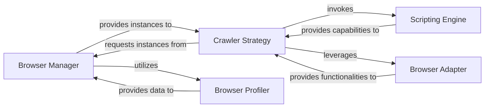

## Details

The `Browser Automation Layer` subsystem is responsible for programmatically controlling web browsers to navigate, interact with, and extract content from web pages. It forms the foundational layer for web scraping, providing the necessary abstractions to manage browser instances, execute scripts, and handle various browser-specific functionalities.

### Browser Manager
Manages the lifecycle of browser instances and contexts (e.g., Playwright Browser and BrowserContext objects). It is responsible for launching, configuring, and closing browsers, ensuring isolated and efficient browsing sessions.

**Related Classes/Methods**:

- <a href="https://github.com/unclecode/crawl4ai/blob/main/crawl4ai/async_crawler_strategy.py" target="_blank" rel="noopener noreferrer">`browser_manager`</a>

### Crawler Strategy
Orchestrates the high-level web crawling process within a browser context. This includes navigating to URLs, performing page interactions (clicks, typing, scrolling), capturing various forms of content (HTML, screenshots, PDFs), and triggering the execution of custom automation scripts.

**Related Classes/Methods**:

- <a href="https://github.com/unclecode/crawl4ai/blob/main/crawl4ai/async_crawler_strategy.py#L1-L9999" target="_blank" rel="noopener noreferrer">`async_crawler_strategy`:1-9999</a>

### Scripting Engine
Provides the capability to define, compile, and execute custom browser automation sequences, often in the form of JavaScript snippets or a Domain-Specific Language (DSL). It translates high-level commands into executable code within the browser's page context.

**Related Classes/Methods**:

- <a href="https://github.com/unclecode/crawl4ai/blob/main/crawl4ai/script/c4ai_script.py#L1-L9999" target="_blank" rel="noopener noreferrer">`c4ai_script`:1-9999</a>
- <a href="https://github.com/unclecode/crawl4ai/blob/main/crawl4ai/js_snippet/#L1-L9999" target="_blank" rel="noopener noreferrer">`js_snippet`:1-9999</a>

### Browser Adapter
Offers a standardized, low-level interface for specific browser functionalities that are not directly part of navigation or interaction. This includes capturing console messages, handling network requests, managing specific browser events, and providing direct access to page elements.

**Related Classes/Methods**:

- <a href="https://github.com/unclecode/crawl4ai/blob/main/crawl4ai/async_crawler_strategy.py" target="_blank" rel="noopener noreferrer">`browser_adapter`</a>

### Browser Profiler
Manages browser profiles, which are essential for maintaining session state, cookies, local storage, and other user-specific data across crawling sessions. It ensures that each browsing session can be configured with specific persistent data.

**Related Classes/Methods**:

- <a href="https://github.com/unclecode/crawl4ai/blob/main/crawl4ai/browser_profiler.py#L1-L9999" target="_blank" rel="noopener noreferrer">`browser_profiler`:1-9999</a>

### [FAQ](https://github.com/CodeBoarding/GeneratedOnBoardings/tree/main?tab=readme-ov-file#faq)