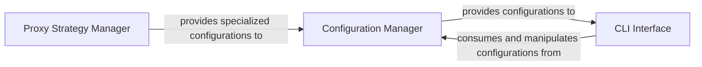

## Details

The `Configuration & CLI` subsystem encompasses the core functionalities for managing all crawler settings and providing the primary user interface for initiating and controlling crawl operations.

### Configuration Manager
This component is responsible for the comprehensive management of all crawler-related configurations. It defines, loads, serializes, and deserializes various configuration types, including browser behavior (`BrowserConfig`), crawl execution (`CrawlerRunConfig`), LLM integration (`LLMConfig`), initial seeding (`SeedingConfig`), HTTP crawling (`HTTPCrawlerConfig`), link previewing (`LinkPreviewConfig`), proxy settings (`ProxyConfig`), and geolocation (`GeolocationConfig`). It provides mechanisms to load configurations from diverse sources (dictionaries, environment variables, keyword arguments) and to clone existing configurations for modification.

**Related Classes/Methods**:

- <a href="https://github.com/unclecode/crawl4ai/blob/main/crawl4ai/async_configs.py" target="_blank" rel="noopener noreferrer">`crawl4ai/async_configs.py`</a>
- <a href="https://github.com/unclecode/crawl4ai/blob/main/crawl4ai/config.py" target="_blank" rel="noopener noreferrer">`crawl4ai/config.py`</a>

### Proxy Strategy Manager
A specialized sub-component of the `Configuration Manager`, this module specifically handles proxy-related settings. Its responsibilities include managing the addition of proxies, extracting IP information from proxy configurations, and loading proxy configurations from various formats. It ensures that the crawler can effectively utilize different proxy strategies for robust and anonymous web access.

**Related Classes/Methods**:

- <a href="https://github.com/unclecode/crawl4ai/blob/main/crawl4ai/proxy_strategy.py" target="_blank" rel="noopener noreferrer">`crawl4ai/proxy_strategy.py`</a>

### CLI Interface
This component provides the command-line interface, serving as the primary user interaction point for the `crawl4ai` library. It is responsible for parsing command-line arguments, setting up LLM configurations, loading schema files, displaying and managing persistent crawl profiles (creation, deletion, usage), and handling general configuration commands (listing, getting, and setting values). It also acts as the main entry point for initiating the crawling process (`run_crawler`).

**Related Classes/Methods**:

- <a href="https://github.com/unclecode/crawl4ai/blob/main/crawl4ai/cli.py" target="_blank" rel="noopener noreferrer">`crawl4ai/cli.py`</a>

### [FAQ](https://github.com/CodeBoarding/GeneratedOnBoardings/tree/main?tab=readme-ov-file#faq)