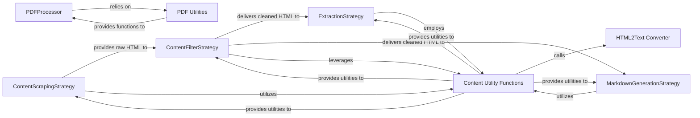

## Details

The `crawl4ai` content processing subsystem is designed around a pipeline of strategic components, each responsible for a distinct phase of content acquisition, refinement, and transformation. The `ContentScrapingStrategy` initiates the process by fetching raw HTML. This raw content then flows into the `ContentFilterStrategy` for cleaning and noise reduction. Subsequently, the cleaned content is directed to either the `ExtractionStrategy` for structured data output or the `MarkdownGenerationStrategy` for LLM-ready Markdown. Supporting these core strategies are utility components like `Content Utility Functions`, which provide common HTML and text manipulation capabilities, and specialized processors such as `PDFProcessor` and `PDF Utilities` for handling non-HTML content. This modular design ensures flexibility and extensibility in content processing workflows.

### ContentScrapingStrategy
Acts as the initial acquisition layer, responsible for fetching raw HTML content from web pages. This includes handling the extraction of various HTML elements, images, links, and tabular data, effectively bridging the "Browser Control Layer" with the content processing pipeline.

**Related Classes/Methods**:

- <a href="https://github.com/unclecode/crawl4ai/blob/main/crawl4ai/content_scraping_strategy.py" target="_blank" rel="noopener noreferrer">`crawl4ai/content_scraping_strategy.py`</a>

### ContentFilterStrategy
Focuses on refining the raw HTML by removing irrelevant or unwanted elements (e.g., ads, navigation, boilerplate). This component is crucial for improving content quality and preparing it for subsequent extraction or transformation, aligning with the "Data Transformation Module".

**Related Classes/Methods**:

- <a href="https://github.com/unclecode/crawl4ai/blob/main/crawl4ai/content_filter_strategy.py" target="_blank" rel="noopener noreferrer">`crawl4ai/content_filter_strategy.py`</a>

### ExtractionStrategy
The core "Content Parser/Extractor" component. It transforms cleaned HTML into highly structured data formats (e.g., JSON) based on predefined schemas or rules, making the content machine-readable and ready for further analysis.

**Related Classes/Methods**:

- <a href="https://github.com/unclecode/crawl4ai/blob/main/crawl4ai/extraction_strategy.py" target="_blank" rel="noopener noreferrer">`crawl4ai/extraction_strategy.py`</a>

### MarkdownGenerationStrategy
A specialized "Data Transformation Module" component that converts processed content into a clean and readable Markdown format. A key feature is ensuring proper formatting of links as citations, which is vital for preparing content for LLM consumption.

**Related Classes/Methods**:

- <a href="https://github.com/unclecode/crawl4ai/blob/main/crawl4ai/markdown_generation_strategy.py" target="_blank" rel="noopener noreferrer">`crawl4ai/markdown_generation_strategy.py`</a>

### HTML2Text Converter
Provides a utility for converting HTML content into plain text or a simplified text-based representation. This is essential for noise reduction and preparing content for text-based analysis where HTML structure is not required.

**Related Classes/Methods**:

- <a href="https://github.com/unclecode/crawl4ai/blob/main/crawl4ai/html2text/__init__.py" target="_blank" rel="noopener noreferrer">`crawl4ai.html2text.HTML2Text`</a>

### PDFProcessor
A specialized "Content Parser/Extractor" for handling PDF documents. It processes and extracts text, images, and metadata from PDFs, providing structured output. This extends the content processing capabilities beyond web pages.

**Related Classes/Methods**:

- <a href="https://github.com/unclecode/crawl4ai/blob/main/crawl4ai/processors/pdf/processor.py" target="_blank" rel="noopener noreferrer">`crawl4ai/processors/pdf/processor.py`</a>

### Content Utility Functions
Serves as a shared library providing general-purpose utility functions for HTML manipulation, cleaning, and content processing. It acts as a foundational layer, promoting code reuse and modularity across the subsystem.

**Related Classes/Methods**:

- <a href="https://github.com/unclecode/crawl4ai/blob/main/crawl4ai/utils.py" target="_blank" rel="noopener noreferrer">`crawl4ai.utils`</a>

### PDF Utilities
Provides specialized helper functions for cleaning text extracted from PDFs and processing images embedded within PDF documents, supporting the `PDFProcessor`.

**Related Classes/Methods**:

- <a href="https://github.com/unclecode/crawl4ai/blob/main/crawl4ai/processors/pdf/utils.py" target="_blank" rel="noopener noreferrer">`crawl4ai/processors/pdf/utils.py`</a>

### [FAQ](https://github.com/CodeBoarding/GeneratedOnBoardings/tree/main?tab=readme-ov-file#faq)