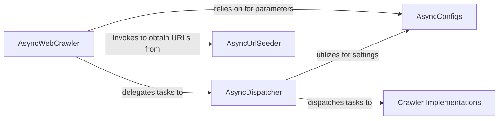

## Details

The `Crawl Orchestration Engine` subsystem primarily encompasses the `crawl4ai` package, with a specific focus on the `async_dispatcher.py`, `async_webcrawler.py`, and `crawlers/` modules. These components collectively manage the lifecycle, task dispatch, and execution of web crawling operations. The `Crawl Orchestration Engine` operates as a pipeline where `AsyncWebCrawler` initiates the process by obtaining seed URLs from `AsyncUrlSeeder`. It then delegates the actual task management and execution to `AsyncDispatcher`. The `AsyncDispatcher`, in turn, dispatches these tasks to various `Crawler Implementations` for content retrieval, all while adhering to settings provided by `AsyncConfigs`. This establishes a clear flow from initial URL discovery to task execution and content acquisition.

### AsyncWebCrawler
The primary entry point and high-level orchestrator of the crawling process. It initiates the overall crawl lifecycle, manages the crawl state, and seeds initial URLs.

**Related Classes/Methods**:

- <a href="https://github.com/unclecode/crawl4ai/blob/main/crawl4ai/async_webcrawler.py" target="_blank" rel="noopener noreferrer">`crawl4ai.async_webcrawler`</a>

### AsyncDispatcher
The core task coordinator and executor for individual crawl tasks. It manages the URL queue, applies domain-specific rate limits, dispatches tasks to appropriate crawlers, and handles concurrent execution.

**Related Classes/Methods**:

- <a href="https://github.com/unclecode/crawl4ai/blob/main/crawl4ai/async_dispatcher.py" target="_blank" rel="noopener noreferrer">`crawl4ai.async_dispatcher`</a>

### Crawler Implementations
Contains the concrete crawler implementations. These modules provide the actual logic for navigating, crawling, and extracting content from different types of web pages or domains, acting as the "workers" dispatched by the `AsyncDispatcher`.

**Related Classes/Methods**:

- <a href="https://github.com/unclecode/crawl4ai/blob/main/crawl4ai/crawlers/" target="_blank" rel="noopener noreferrer">`crawl4ai.crawlers`</a>

### AsyncUrlSeeder
Responsible for discovering and providing initial URLs to the `AsyncWebCrawler` based on various strategies (e.g., sitemaps, common crawl data, initial seed lists).

**Related Classes/Methods**:

- <a href="https://github.com/unclecode/crawl4ai/blob/main/crawl4ai/async_url_seeder.py" target="_blank" rel="noopener noreferrer">`crawl4ai.async_url_seeder`</a>

### AsyncConfigs
Manages and provides centralized configuration settings that influence the behavior of the `AsyncDispatcher`, `AsyncWebCrawler`, and underlying crawler implementations, ensuring consistent operational parameters.

**Related Classes/Methods**:

- <a href="https://github.com/unclecode/crawl4ai/blob/main/crawl4ai/async_configs.py" target="_blank" rel="noopener noreferrer">`crawl4ai.async_configs`</a>

### [FAQ](https://github.com/CodeBoarding/GeneratedOnBoardings/tree/main?tab=readme-ov-file#faq)