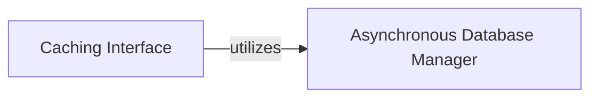

## Details

This subsystem is responsible for the efficient storage, retrieval, and management of crawled data, including URLs, raw content, and associated metadata. It forms a critical part of the web crawler's ability to avoid redundant requests and maintain a persistent record of its activities.

### Asynchronous Database Manager
This component provides the foundational asynchronous database operations for the entire application. It handles low-level concerns such as database schema management, connection pooling, and robust execution of queries with retry mechanisms. Its core responsibility within this subsystem is the direct storage and retrieval of cached web content and metadata.

**Related Classes/Methods**:

- <a href="https://github.com/unclecode/crawl4ai/blob/main/crawl4ai/async_database.py" target="_blank" rel="noopener noreferrer">`crawl4ai.async_database:acache_url`</a>
- <a href="https://github.com/unclecode/crawl4ai/blob/main/crawl4ai/async_database.py" target="_blank" rel="noopener noreferrer">`crawl4ai.async_database:_store_content`</a>
- <a href="https://github.com/unclecode/crawl4ai/blob/main/crawl4ai/async_database.py" target="_blank" rel="noopener noreferrer">`crawl4ai.async_database:aget_cached_url`</a>
- <a href="https://github.com/unclecode/crawl4ai/blob/main/crawl4ai/async_database.py" target="_blank" rel="noopener noreferrer">`crawl4ai.async_database:_get`</a>
- <a href="https://github.com/unclecode/crawl4ai/blob/main/crawl4ai/async_database.py" target="_blank" rel="noopener noreferrer">`crawl4ai.async_database:_load_content`</a>

### Caching Interface
Acting as the primary facade for the caching mechanism, this component offers a simplified, high-level API for other parts of the application to interact with the cache. It abstracts away the complexities of the underlying database operations, managing the lifecycle of caching requests and providing a clean interface for storing and retrieving cached URLs and their associated content.

**Related Classes/Methods**:

- <a href="https://github.com/unclecode/crawl4ai/blob/main/crawl4ai/cache_context.py" target="_blank" rel="noopener noreferrer">`crawl4ai.cache_context.CacheContext:cache_url`</a>
- <a href="https://github.com/unclecode/crawl4ai/blob/main/crawl4ai/cache_context.py" target="_blank" rel="noopener noreferrer">`crawl4ai.cache_context.CacheContext:get_cached_url`</a>

### [FAQ](https://github.com/CodeBoarding/GeneratedOnBoardings/tree/main?tab=readme-ov-file#faq)