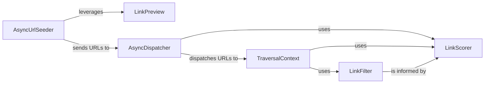

## Details

The `URL & Link Management` subsystem is crucial for a Web Crawler & Scraper Library, focusing on the discovery, prioritization, and efficient queuing of URLs for crawling. It embodies the pipeline and event-driven architectural patterns by managing the flow of URLs through various stages of evaluation and dispatch.

### AsyncUrlSeeder
The primary entry point for URL discovery. It identifies initial URLs from diverse sources (e.g., sitemaps, Common Crawl archives), performs initial validation, and applies a preliminary relevance score (e.g., BM25) to seed the crawling process.

**Related Classes/Methods**:

- <a href="https://github.com/unclecode/crawl4ai/blob/main/crawl4ai/async_url_seeder.py#L164-L1471" target="_blank" rel="noopener noreferrer">`AsyncUrlSeeder`:164-1471</a>

### LinkPreview
Extracts essential, lightweight header information (e.g., title, description, Open Graph metadata) from a batch of links. This enables rapid evaluation and prioritization of URLs without incurring the overhead of a full page crawl, supporting efficient queue management.

**Related Classes/Methods**:

- <a href="https://github.com/unclecode/crawl4ai/blob/main/crawl4ai/link_preview.py#L18-L395" target="_blank" rel="noopener noreferrer">`LinkPreview`:18-395</a>

### AsyncDispatcher
Acts as the central orchestrator for the URL queue. It manages the flow of URLs to be crawled, applies rate limiting, dynamically adjusts crawl delays, and prioritizes URLs based on various scoring mechanisms before dispatching them to the actual crawler engine.

**Related Classes/Methods**:

- <a href="https://github.com/unclecode/crawl4ai/blob/main/crawl4ai/async_dispatcher.py" target="_blank" rel="noopener noreferrer">`AsyncDispatcher`</a>

### TraversalContext
Manages the state and logic for deep crawling. It maintains a priority queue of URLs to visit, tracks already visited URLs (e.g., using a Bloom filter to prevent redundant crawls), and implements the core traversal strategy to explore the web graph.

**Related Classes/Methods**:

- <a href="https://github.com/unclecode/crawl4ai/blob/main/crawl4ai/deep_crawling/crazy.py#L48-L65" target="_blank" rel="noopener noreferrer">`TraversalContext`:48-65</a>

### LinkFilter
Filters URLs based on a predefined set of criteria (e.g., domain restrictions, keyword presence, file extensions, schema.org data). It plays a crucial role in pruning irrelevant or low-quality links, ensuring that the crawler focuses on valuable content.

**Related Classes/Methods**:

- <a href="https://github.com/unclecode/crawl4ai/blob/main/crawl4ai/deep_crawling/filters.py" target="_blank" rel="noopener noreferrer">`LinkFilter`</a>

### LinkScorer
Calculates a numerical score for URLs based on various attributes such as link depth, file type, and custom weighting rules. This score is instrumental for prioritization by the `AsyncDispatcher` and `TraversalContext`, and for filtering decisions by the `LinkFilter`.

**Related Classes/Methods**:

- <a href="https://github.com/unclecode/crawl4ai/blob/main/crawl4ai/deep_crawling/scorers.py" target="_blank" rel="noopener noreferrer">`LinkScorer`</a>

### [FAQ](https://github.com/CodeBoarding/GeneratedOnBoardings/tree/main?tab=readme-ov-file#faq)