```mermaid
graph LR
    Configuration_CLI["Configuration & CLI"]
    URL_Link_Management["URL & Link Management"]
    Crawl_Orchestration_Engine["Crawl Orchestration Engine"]
    Browser_Automation_Layer["Browser Automation Layer"]
    Content_Processing_Extraction["Content Processing & Extraction"]
    AI_LLM_Integration_Services["AI/LLM Integration Services"]
    Data_Persistence_Caching["Data Persistence & Caching"]
    Monitoring_Reporting["Monitoring & Reporting"]
    Adaptive_Strategy_Intelligence["Adaptive Strategy & Intelligence"]
    Configuration_CLI -- "configures" --> URL_Link_Management
    Configuration_CLI -- "configures" --> Browser_Automation_Layer
    Configuration_CLI -- "configures" --> Crawl_Orchestration_Engine
    Configuration_CLI -- "configures" --> AI_LLM_Integration_Services
    Configuration_CLI -- "configures" --> Monitoring_Reporting
    URL_Link_Management -- "provides URLs to" --> Crawl_Orchestration_Engine
    URL_Link_Management -- "receives feedback from" --> Adaptive_Strategy_Intelligence
    Crawl_Orchestration_Engine -- "dispatches tasks to" --> Browser_Automation_Layer
    Crawl_Orchestration_Engine -- "sends updates to" --> Monitoring_Reporting
    Crawl_Orchestration_Engine -- "requests data from" --> Data_Persistence_Caching
    Crawl_Orchestration_Engine -- "receives adjustments from" --> Adaptive_Strategy_Intelligence
    Browser_Automation_Layer -- "provides content to" --> Content_Processing_Extraction
    Browser_Automation_Layer -- "caches data in" --> Data_Persistence_Caching
    Content_Processing_Extraction -- "provides data to" --> Adaptive_Strategy_Intelligence
    Content_Processing_Extraction -- "stores data in" --> Data_Persistence_Caching
    Content_Processing_Extraction -- "utilizes services from" --> AI_LLM_Integration_Services
    AI_LLM_Integration_Services -- "provides embeddings to" --> Adaptive_Strategy_Intelligence
    AI_LLM_Integration_Services -- "provides capabilities to" --> Content_Processing_Extraction
    Data_Persistence_Caching -- "provides cached content to" --> Crawl_Orchestration_Engine
    Data_Persistence_Caching -- "provides historical data to" --> Adaptive_Strategy_Intelligence
    click Configuration_CLI href "https://github.com/CodeBoarding/GeneratedOnBoardings/blob/main/crawl4ai/Configuration_CLI.md" "Details"
    click URL_Link_Management href "https://github.com/CodeBoarding/GeneratedOnBoardings/blob/main/crawl4ai/URL_Link_Management.md" "Details"
    click Crawl_Orchestration_Engine href "https://github.com/CodeBoarding/GeneratedOnBoardings/blob/main/crawl4ai/Crawl_Orchestration_Engine.md" "Details"
    click Browser_Automation_Layer href "https://github.com/CodeBoarding/GeneratedOnBoardings/blob/main/crawl4ai/Browser_Automation_Layer.md" "Details"
    click Content_Processing_Extraction href "https://github.com/CodeBoarding/GeneratedOnBoardings/blob/main/crawl4ai/Content_Processing_Extraction.md" "Details"
    click AI_LLM_Integration_Services href "https://github.com/CodeBoarding/GeneratedOnBoardings/blob/main/crawl4ai/AI_LLM_Integration_Services.md" "Details"
    click Data_Persistence_Caching href "https://github.com/CodeBoarding/GeneratedOnBoardings/blob/main/crawl4ai/Data_Persistence_Caching.md" "Details"
    click Adaptive_Strategy_Intelligence href "https://github.com/CodeBoarding/GeneratedOnBoardings/blob/main/crawl4ai/Adaptive_Strategy_Intelligence.md" "Details"
```

## Details

The `crawl4ai` project operates as a sophisticated web crawling system, designed with a modular architecture to facilitate efficient and intelligent data acquisition. At its core, the **Configuration & CLI** component serves as the central control point, allowing users to define and manage crawl settings and initiate operations. This configuration directly influences the behavior of key components such as the **URL & Link Management** system, which is responsible for discovering and prioritizing URLs, and the **Crawl Orchestration Engine**, the primary coordinator that dispatches crawling tasks.

The **Crawl Orchestration Engine** interacts closely with the **Browser Automation Layer** to execute web page interactions and content retrieval. The raw content obtained is then passed to the **Content Processing & Extraction** component for cleaning, transformation, and structuring. For advanced semantic understanding and content enrichment, the **AI/LLM Integration Services** provide essential capabilities, particularly to the **Content Processing & Extraction** and **Adaptive Strategy & Intelligence** components.

The **Adaptive Strategy & Intelligence** component is crucial for dynamic crawl adjustments, analyzing processed content and historical data (retrieved from **Data Persistence & Caching**) to refine crawling strategies and provide feedback to the **URL & Link Management** system. All operational data, including crawled content and metadata, is managed by the **Data Persistence & Caching** component. Throughout the entire process, the **Monitoring & Reporting** component provides real-time insights into the crawl's progress and performance, ensuring operational transparency. This interconnected design allows for a highly adaptable and intelligent crawling workflow, optimized for diverse web data acquisition needs.

### Configuration & CLI [[Expand]](./Configuration_CLI.md)
Centralized management of all crawler settings and the primary user interface for initiating and controlling crawl operations.

**Related Classes/Methods**:

- <a href="https://github.com/unclecode/crawl4ai/blob/main/crawl4ai/async_configs.py" target="_blank" rel="noopener noreferrer">`crawl4ai/async_configs.py`</a>
- <a href="https://github.com/unclecode/crawl4ai/blob/main/crawl4ai/proxy_strategy.py" target="_blank" rel="noopener noreferrer">`crawl4ai/proxy_strategy.py`</a>
- <a href="https://github.com/unclecode/crawl4ai/blob/main/crawl4ai/config.py" target="_blank" rel="noopener noreferrer">`crawl4ai/config.py`</a>
- <a href="https://github.com/unclecode/crawl4ai/blob/main/crawl4ai/cli.py" target="_blank" rel="noopener noreferrer">`crawl4ai/cli.py`</a>

### URL & Link Management [[Expand]](./URL_Link_Management.md)
Responsible for discovering, generating, prioritizing, and managing the queue of URLs to be crawled, optimizing the crawl path.

**Related Classes/Methods**:

- <a href="https://github.com/unclecode/crawl4ai/blob/main/crawl4ai/async_url_seeder.py" target="_blank" rel="noopener noreferrer">`crawl4ai/async_url_seeder.py`</a>
- <a href="https://github.com/unclecode/crawl4ai/blob/main/crawl4ai/link_preview.py" target="_blank" rel="noopener noreferrer">`crawl4ai/link_preview.py`</a>

### Crawl Orchestration Engine [[Expand]](./Crawl_Orchestration_Engine.md)
The core coordinator of the crawling process, managing URL queues, applying rate limits, dispatching tasks, and handling parallelization.

**Related Classes/Methods**:

- <a href="https://github.com/unclecode/crawl4ai/blob/main/crawl4ai/async_dispatcher.py" target="_blank" rel="noopener noreferrer">`crawl4ai/async_dispatcher.py`</a>
- <a href="https://github.com/unclecode/crawl4ai/blob/main/crawl4ai/async_webcrawler.py" target="_blank" rel="noopener noreferrer">`crawl4ai/async_webcrawler.py`</a>
- <a href="https://github.com/unclecode/crawl4ai/blob/main/crawl4ai/crawlers/" target="_blank" rel="noopener noreferrer">`crawl4ai/crawlers/`</a>

### Browser Automation Layer [[Expand]](./Browser_Automation_Layer.md)
Manages browser instances (e.g., Playwright), handles page navigation, interaction, and executes custom scripts to capture raw web content.

**Related Classes/Methods**:

- <a href="https://github.com/unclecode/crawl4ai/blob/main/crawl4ai/browser_manager.py" target="_blank" rel="noopener noreferrer">`crawl4ai/browser_manager.py`</a>
- <a href="https://github.com/unclecode/crawl4ai/blob/main/crawl4ai/async_crawler_strategy.py" target="_blank" rel="noopener noreferrer">`crawl4ai/async_crawler_strategy.py`</a>
- <a href="https://github.com/unclecode/crawl4ai/blob/main/crawl4ai/script/c4ai_script.py" target="_blank" rel="noopener noreferrer">`crawl4ai/script/c4ai_script.py`</a>
- <a href="https://github.com/unclecode/crawl4ai/blob/main/crawl4ai/browser_adapter.py" target="_blank" rel="noopener noreferrer">`crawl4ai/browser_adapter.py`</a>
- <a href="https://github.com/unclecode/crawl4ai/blob/main/crawl4ai/browser_profiler.py" target="_blank" rel="noopener noreferrer">`crawl4ai/browser_profiler.py`</a>
- <a href="https://github.com/unclecode/crawl4ai/blob/main/crawl4ai/js_snippet/" target="_blank" rel="noopener noreferrer">`crawl4ai/js_snippet/`</a>

### Content Processing & Extraction [[Expand]](./Content_Processing_Extraction.md)
Cleans, prunes, and transforms raw HTML content into various structured formats (JSON, Markdown) and handles specialized content types.

**Related Classes/Methods**:

- <a href="https://github.com/unclecode/crawl4ai/blob/main/crawl4ai/content_scraping_strategy.py" target="_blank" rel="noopener noreferrer">`crawl4ai/content_scraping_strategy.py`</a>
- <a href="https://github.com/unclecode/crawl4ai/blob/main/crawl4ai/content_filter_strategy.py" target="_blank" rel="noopener noreferrer">`crawl4ai/content_filter_strategy.py`</a>
- <a href="https://github.com/unclecode/crawl4ai/blob/main/crawl4ai/extraction_strategy.py" target="_blank" rel="noopener noreferrer">`crawl4ai/extraction_strategy.py`</a>
- <a href="https://github.com/unclecode/crawl4ai/blob/main/crawl4ai/markdown_generation_strategy.py" target="_blank" rel="noopener noreferrer">`crawl4ai/markdown_generation_strategy.py`</a>
- <a href="https://github.com/unclecode/crawl4ai/blob/main/crawl4ai/html2text/" target="_blank" rel="noopener noreferrer">`crawl4ai/html2text/`</a>
- <a href="https://github.com/unclecode/crawl4ai/blob/main/crawl4ai/processors/" target="_blank" rel="noopener noreferrer">`crawl4ai/processors/`</a>

### AI/LLM Integration Services [[Expand]](./AI_LLM_Integration_Services.md)
Provides functionalities for loading and utilizing Large Language Models (LLMs) and embedding models for semantic analysis and advanced content processing.

**Related Classes/Methods**:

- <a href="https://github.com/unclecode/crawl4ai/blob/main/crawl4ai/model_loader.py" target="_blank" rel="noopener noreferrer">`crawl4ai/model_loader.py`</a>
- <a href="https://github.com/unclecode/crawl4ai/blob/main/crawl4ai/legacy/llmtxt.py" target="_blank" rel="noopener noreferrer">`crawl4ai/legacy/llmtxt.py`</a>
- <a href="https://github.com/unclecode/crawl4ai/blob/main/crawl4ai/prompts.py" target="_blank" rel="noopener noreferrer">`crawl4ai/prompts.py`</a>

### Data Persistence & Caching [[Expand]](./Data_Persistence_Caching.md)
Manages the caching and persistence of crawled URLs, raw content, extracted data, and other metadata for efficient storage and retrieval.

**Related Classes/Methods**:

- <a href="https://github.com/unclecode/crawl4ai/blob/main/crawl4ai/async_database.py" target="_blank" rel="noopener noreferrer">`crawl4ai/async_database.py`</a>
- <a href="https://github.com/unclecode/crawl4ai/blob/main/crawl4ai/cache_context.py" target="_blank" rel="noopener noreferrer">`crawl4ai/cache_context.py`</a>

### Monitoring & Reporting
Offers real-time monitoring and reporting capabilities, displaying progress, statistics, and task details for operational insights.

**Related Classes/Methods**:

- <a href="https://github.com/unclecode/crawl4ai/blob/main/crawl4ai/components/crawler_monitor.py" target="_blank" rel="noopener noreferrer">`crawl4ai/components/crawler_monitor.py`</a>

### Adaptive Strategy & Intelligence [[Expand]](./Adaptive_Strategy_Intelligence.md)
Analyzes processed content and historical data, utilizing AI/LLM Integration Services for semantic understanding, and provides feedback for dynamic crawl adjustments.

**Related Classes/Methods**:

- <a href="https://github.com/unclecode/crawl4ai/blob/main/crawl4ai/adaptive_crawler.py#L1231-L1861" target="_blank" rel="noopener noreferrer">`crawl4ai.adaptive_crawler.AdaptiveCrawler`:1231-1861</a>

### [FAQ](https://github.com/CodeBoarding/GeneratedOnBoardings/tree/main?tab=readme-ov-file#faq)