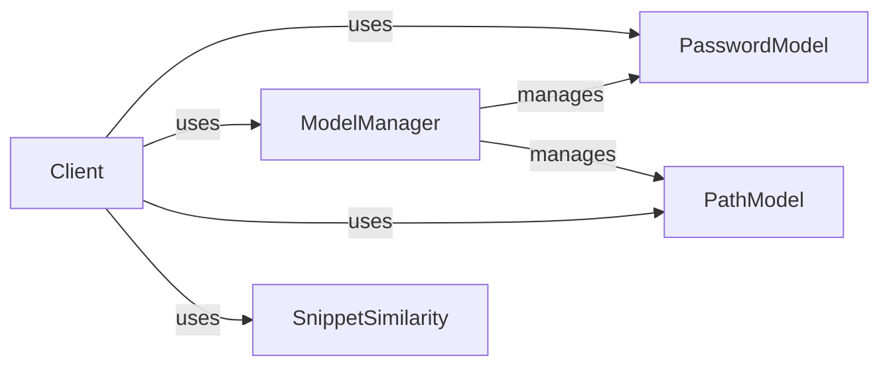

## Component Details

The Credential Analysis subsystem enhances the scanning process by incorporating machine learning models and snippet similarity analysis to improve the accuracy of credential detection. It utilizes ML models for password and path analysis, and computes the similarity between code snippets to identify potential credential reuse. The main flow involves the Client initiating the analysis, the ModelManager loading and managing the ML models (PasswordModel and PathModel), and SnippetSimilarity identifying potential credential reuse.

### PasswordModel
The PasswordModel class is responsible for analyzing code snippets to identify potential password leaks using machine learning models. It provides methods for analyzing individual snippets and batches of snippets.
- **Related Classes/Methods**: `credentialdigger.models.password_model.PasswordModel`

### PathModel
The PathModel class is responsible for analyzing file paths to identify potential credential leaks. It uses machine learning models to determine if a given file path is likely to contain sensitive information.
- **Related Classes/Methods**: `credentialdigger.models.path_model.PathModel`

### ModelManager
The ModelManager class is responsible for managing the password and path models. It handles loading, updating, and selecting the appropriate models for analysis. It also provides an interface for interacting with the models.
- **Related Classes/Methods**: `credentialdigger.models.model_manager.ModelManager`

### Client
The Client class provides the main interface for interacting with the credential-digger system. It includes methods for analyzing discoveries, updating similar snippets in the database, and utilizing the ModelManager to perform credential analysis.
- **Related Classes/Methods**: `credentialdigger.client.Client`

### SnippetSimilarity
The SnippetSimilarity module computes the similarity between code snippets to identify potential credential reuse. This helps in detecting instances where the same credential might be used in multiple locations.
- **Related Classes/Methods**: `credentialdigger.snippet_similarity`
