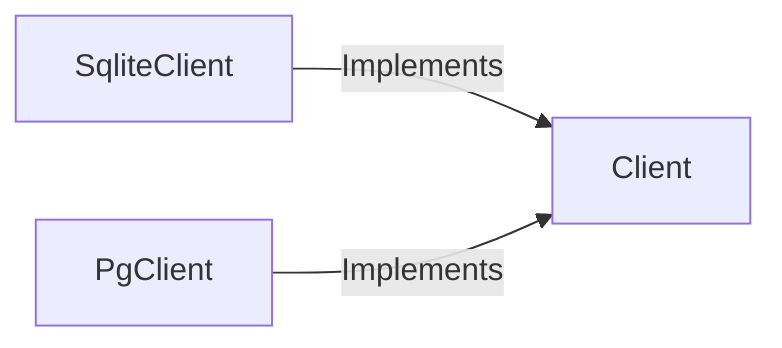

## Component Details

The Data Management component provides an abstraction layer for interacting with the data store, supporting both SQLite and PostgreSQL databases. It ensures a consistent API for data access, regardless of the underlying database implementation. The core of this component revolves around the `Client` abstract class, which defines the interface for data access operations. Concrete implementations, `SqliteClient` and `PgClient`, provide database-specific implementations for SQLite and PostgreSQL, respectively. This design promotes flexibility and maintainability by decoupling the application logic from the specific database being used.

### Client
Abstract base class that defines the interface for interacting with the data store. It provides methods for adding, retrieving, updating, and deleting data related to repositories, rules, discoveries, and embeddings. It serves as a contract for concrete client implementations.
- **Related Classes/Methods**: `credentialdigger.client.Client`

### SqliteClient
This class implements the `Client` interface for SQLite databases. It provides concrete implementations of the data access methods, using SQLite-specific queries and data types. It inherits from `Client` and overrides its methods to interact with an SQLite database.
- **Related Classes/Methods**: `credentialdigger.client_sqlite.SqliteClient`

### PgClient
This class implements the `Client` interface for PostgreSQL databases. It provides concrete implementations of the data access methods, using PostgreSQL-specific queries and data types. It inherits from `Client` and overrides its methods to interact with a PostgreSQL database.
- **Related Classes/Methods**: `credentialdigger.client_postgres.PgClient`
