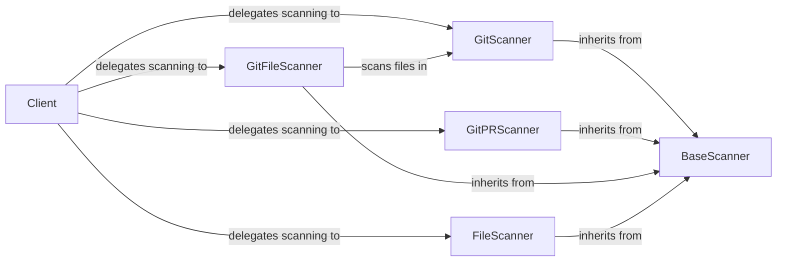

## Component Details

The Scanning Engine is responsible for scanning various data sources for potential credentials. It provides a base scanner class that can be extended to support different data source types, such as Git repositories, files, and directories. The scanning engine utilizes regular expressions and machine learning models to identify potential secrets and sensitive information. The Client class serves as the entry point, delegating scans to specific scanners like GitScanner, GitPRScanner, GitFileScanner, and FileScanner, all of which inherit from BaseScanner.

### Client
The Client class provides the main entry point for initiating scans. It offers methods to scan different sources, such as entire repositories, specific snapshots, file paths, pull requests, users, and wikis. It delegates the actual scanning process to the appropriate scanner based on the source type.
- **Related Classes/Methods**: `credentialdigger.src.credentialdigger.client.Client`

### BaseScanner
The BaseScanner class defines the interface for all scanners. It provides common functionality such as connecting to the database, loading rules, and processing results. All scanners inherit from this class.
- **Related Classes/Methods**: `credentialdigger.scanners.base_scanner.BaseScanner`

### GitScanner
The GitScanner class is responsible for scanning Git repositories for credentials. It can scan entire repositories or specific commits. It utilizes regular expressions to identify potential credentials within the code and commit messages. It interacts with git to get commit timestamps.
- **Related Classes/Methods**: `credentialdigger.scanners.git_scanner.GitScanner`

### GitPRScanner
The GitPRScanner class specializes in scanning Git pull requests for credentials. It focuses on the changes introduced in the pull request to identify potential security vulnerabilities.
- **Related Classes/Methods**: `credentialdigger.scanners.git_pr_scanner.GitPRScanner`

### GitFileScanner
The GitFileScanner class scans individual files within a Git repository. It can scan the entire file or focus on specific diffs. It uses regular expressions to detect credentials.
- **Related Classes/Methods**: `credentialdigger.scanners.git_file_scanner.GitFileScanner`

### FileScanner
The FileScanner class is designed to scan regular files for credentials. It reads the file content and applies regular expressions to identify potential secrets.
- **Related Classes/Methods**: `credentialdigger.scanners.file_scanner.FileScanner`
